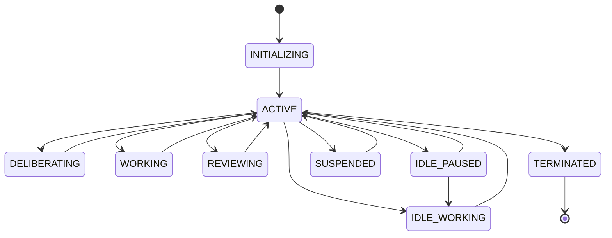
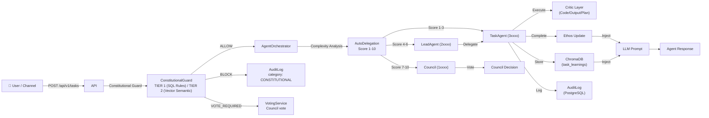
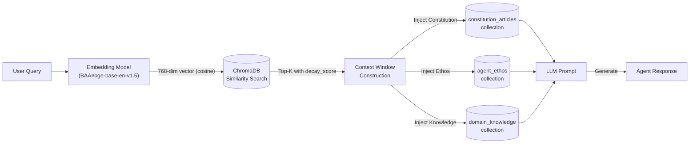
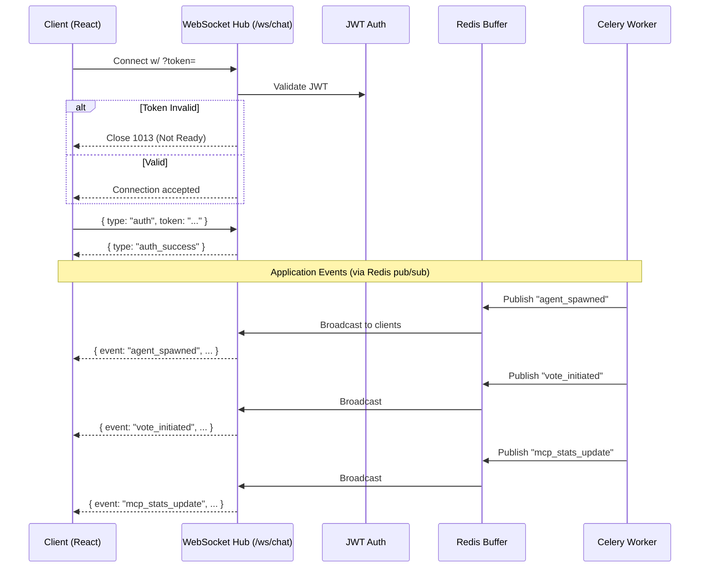
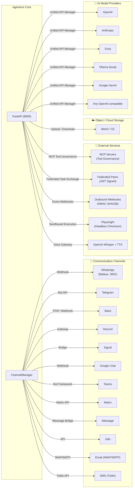
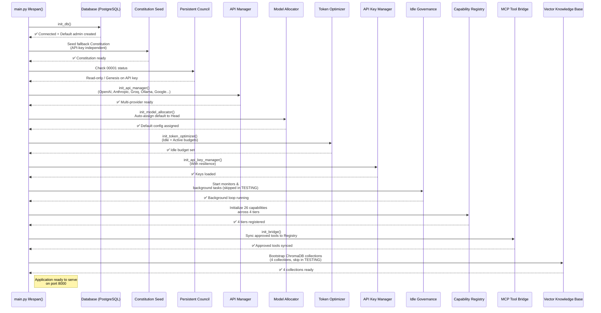

# Agentium Architecture

> Comprehensive architectural reference for the Agentium AI governance platform.
> Project: Agentium — Personal AI Agent Nation
> Version: 0.0.9-alpha

---

## Table of Contents

1. [Core System Architecture](#1-core-system-architecture)
2. [Agent Hierarchy](#2-agent-hierarchy)
3. [Data Flow](#3-data-flow)
4. [WebSocket Event Bus](#4-websocket-event-bus)
5. [Celery Beat Task Schedule](#5-celery-beat-task-schedule)
6. [External Integrations](#6-external-integrations)
7. [Application Startup Sequence](#7-application-startup-sequence)
8. [Directory Structure](#8-directory-structure)

---

## 1. Core System Architecture

```mermaid
graph TB
    subgraph UserInterface["👤 User Interface"]
        FE[React 18 + Vite<br/>Port: 3000]
    end

    subgraph WebSocketLayer["🔌 WebSocket Layer"]
        WS["WebSocket Hub<br/>/ws/chat"]
    end

    subgraph Security["🔒 Security Middleware"]
        direction TB
        Timing[TimingMiddleware]
        Observer[ObserverReadOnly]
        Sanitize[Input Sanitization]
        Session[Session Limit]
        Rate[Rate Limit (Redis)]
        ErrCount[Error Counter]
        Payload[Payload Size Limit]
        IPBlock[IP Blocklist]
    end

    subgraph FastAPI["⚡ FastAPI Gateway"]
        API["API Router<br/>Port: 8000"]
        Auth["Auth (JWT + RBAC)"]
        Routes["40+ Route Modules"]
    end

    subgraph CeleryWorkers["🔄 Celery Workers + Beat"]
        CW[Task Executor]
        WF[Workflow Engine]
        HC[Health Checks]
        MT[Maintenance Tasks]
        AS[Auto Scaling]
        AD[Anomaly Detection]
    end

    subgraph Data["📦 Data Layer"]
        PG[(PostgreSQL 15<br/>Port: 5432)]
        Chroma[(ChromaDB<br/>Port: 8001)]
        MinIO[(MinIO Object Store<br/>Port: 9000/9001)]
    end

    subgraph MessageBus["📡 Message Bus"]
        Redis[(Redis<br/>Port: 6379)]
    end

    subgraph Voice["🎙️ Voice Bridge"]
        Whisper[OpenAI Whisper STT]
        TTS[OpenAI TTS]
    end

    subgraph Bridges["🔗 External Bridges"]
        WhatsApp[WhatsApp Bridge<br/>Port: 3001]
        Slack[Slack]
        Telegram[Telegram]
        Discord[Discord]
        Signal[Signal]
        GoogleChat[Google Chat]
        Teams[Teams]
        Matrix[Matrix]
        iMessage[iMessage]
        Zalo[Zalo]
        Email[Email (IMAP/SMTP)]
        Twilio[SMS Twilio]
    end

    FE -->|"HTTP /api/v1"| API
    API -->|"SQLAlchemy 2"| PG
    API -->|"Chroma Client"| Chroma
    API -->|"S3 / local"| MinIO
    API -->|"Celery Producer"| Redis
    Redis -->|"Broker + Backend"| CW
    Redis -->|"Broker + Backend"| WF
    Redis -->|"Broker + Backend"| HC
    Redis -->|"Broker + Backend"| MT
    Redis -->|"Broker + Backend"| AS
    Redis -->|"Broker + Backend"| AD
    API -->|"WebSocket /ws"| WS
    WS -->|"Realtime events"| FE
    API -->|"Voice gateway"| Voice
    API -->|"Webhook"| WhatsApp
    API -->|"Webhook"| Slack
    API -->|"Bot API"| Telegram
    API -->|"Gateway"| Discord
    API -->|"Bridge"| Signal
    API -->|"Webhook"| GoogleChat
    API -->|"Bot Framework"| Teams
    API -->|"Matrix API"| Matrix
    API -->|"iMessage Bridge"| iMessage
    API -->|"API"| Zalo
    API -->|"IMAP/SMTP"| Email
    API -->|"Twilio API"| Twilio
```

### 1.1 Middleware Stack (Reverse Insertion Order)

The FastAPI middleware is applied in reverse insertion order — the **last added runs first**.

| Order | Middleware | Purpose | File |
|-------|-----------|---------|------|
| 1 | `TimingMiddleware` | Performance regression gate | `backend/core/timing_middleware.py` |
| 2 | `ObserverReadOnlyMiddleware` | Read-only observer enforcement | `backend/core/observer_middleware.py` |
| 3 | `InputSanitizationMiddleware` | XSS / injection sanitization | `backend/core/security_middleware.py` |
| 4 | `SessionLimitMiddleware` | Max concurrent session enforcement | `backend/core/security_middleware.py` |
| 5 | `RateLimitMiddleware` | Redis-backed unified rate limiting | `backend/core/middleware.py` |
| 6 | `ErrorCounterMiddleware` | Post-response 4xx weighted counter | `backend/core/security_middleware.py` |
| 7 | `PayloadSizeLimitMiddleware` | Content-Length check (→ 413) | `backend/core/security_middleware.py` |
| 8 | `IPBlocklistMiddleware` | Single EXISTS check (→ 403) | `backend/core/security_middleware.py` |

### 1.2 Infrastructure Services

| Service | Image | Port | Purpose |
|---------|-------|------|---------|
| **PostgreSQL** | `postgres:15-alpine` | 5432 | Relational DB (agents, tasks, votes, constitution) |
| **ChromaDB** | `chromadb/chroma:1.5.1` | 8001 | Vector store (RAG, embeddings, knowledge) |
| **Redis** | `redis:7.2.1-alpine` | 6379 | Message broker, cache, event buffer |
| **MinIO** | `minio/minio:latest` | 9000/9001 | Object storage (S3-compatible) |
| **WhatsApp Bridge** | Custom (Baileys) | 3001 | WhatsApp Web bridge |
| **Voice Auto-Install** | `ubuntu:22.04` | — | Host-level voice bridge installer |
| **Backend (FastAPI)** | Custom (privileged) | 8000 | Main API gateway |
| **Celery Worker** | Custom | — | Background task processing |
| **Celery Beat** | Custom | — | Periodic task scheduler |

---

## 2. Agent Hierarchy

```mermaid
graph TD
    subgraph Tier0["Tier 0 — Executive"]
        Head[Head of Council<br/>0xxxx — 00001–09999<br/>Veto power, emergency override]
    end

    subgraph Tier1["Tier 1 — Legislative"]
        Council[Council Members<br/>1xxxx — 10001–19999<br/>Voting, amendments, strategy]
    end

    subgraph Tier2["Tier 2 — Management"]
        Lead[Lead Agents<br/>2xxxx — 20001–29999<br/>Spawn Task agents, delegate work]
    end

    subgraph Tier3["Tier 3 — Execution"]
        Task[Task Agents<br/>3xxxx–6xxxx<br/>30001–69999<br/>Execute, code, learn]
    end

    subgraph Judicial["⚖️ Independent Judiciary (Critics)"]
        CodeCritic[Code Critic<br/>7xxxx — Review syntax/security]
        OutputCritic[Output Critic<br/>8xxxx — Verify intent alignment]
        PlanCritic[Plan Critic<br/>9xxxx — Validate DAG soundness]
    end

    subgraph Governance["Persistent Council Agents (Idle)"]
        Optimizer[System Optimizer<br/>(storage, vectors, archival)]
        Planner[Strategic Planner<br/>(prediction, scheduling)]
        Health[Health Monitor<br/>(oversight, monitoring)]
    end

    Head -->|"Can liquidate / veto"| Council
    Head -->|"Can override any decision"| Lead
    Head -->|"Genesis trigger"| Task
    Council -->|"Votes to allocate / audit"| Lead
    Lead -->|"Spawns & manages"| Task
    Head -.->|"Monitors (advisory)"| Judicial
    Task -.->|"Submits to review"| CodeCritic
    Task -.->|"Submits to review"| OutputCritic
    Task -.->|"Submits to review"| PlanCritic
    Head -.->|"Idle governance"| Optimizer
    Head -.->|"Idle governance"| Planner
    Head -.->|"Idle governance"| Health
```

### 2.1 Agent Types & Ranges

| Tier | ID Range |默示 Role | Description |
|------|----------|----------|-------------|
| **0 (Head)** | `0xxxx` (00001–09999) | Executive | `veto`, `amendment`, `liquidate_any`, `spawn_any`, `modify_constitution`, `browser_control`, `override_vote` |
| **1 (Council)** | `1xxxx` (10001–19999) | Legislative | `propose_amendment`, `allocate_resources`, `vote`, `escalate`, `audit`, `moderate_knowledge`, `spawn_lead` |
| **2 (Lead)** | `2xxxx` (20001–29999) | Management | `spawn_task_agent`, `delegate_work`, `request_resources`, `submit_knowledge`, `report_status` |
| **3 (Task)** | `3xxxx`–`6xxxx` (30001–69999) | Execution | `execute_command`, `generate_code`, `submit_learnings`, `use_tools` |
| **7 (Code Critic)** | `7xxxx` | Judiciary | Review syntax, security, logic of generated code |
| **8 (Output Critic)** | `8xxxx` | Judiciary | Verify output aligns with user intent |
| **9 (Plan Critic)** | `9xxxx` | Judiciary | Validate plan soundness and DAG validity |

### 2.2 Agent Status Lifecycle



### 2.3 Separation of Powers

| Power | Head (Executive) | Council (Legislative) | Critics (Judiciary) |
|-------|-------------------|----------------------|-------------------|
| **Propose Amendment** | ✅ | ✅ | ❌ |
| **Veto** | ✅ | ❌ | ❌ |
| **Vote on Amendment** | ❌ (ratifies) | ✅ (60% quorum) | ❌ |
| **Liquidate Agent** | ✅ (emergency) | ✅ (vote) | ❌ |
| **Spawn Tier 3** | ✅ | ❌ | ❌ |
| **Spawn Tier 2+** | ✅ | ✅ | ❌ |
| **Override Critic** | ✅ (rare) | ❌ | ❌ |
| **Validate Code** | ❌ | ❌ | ✅ (7xxxx) |
| **Validate Output** | ❌ | ❌ | ✅ (8xxxx) |
| **Validate Plan** | ❌ | ❌ | ✅ (9xxxx) |

**Model:** `backend/models/entities/agents.py`

---

## 3. Data Flow

### 3.1 Task Lifecycle Flow



### 3.2 RAG Pipeline Flow



### 3.3 Knowledge Retrieval Flow

| Step | Component | Action |
|------|-----------|--------|
| 1 | **User Query** → | Input text arrives at API |
| 2 | **Embedding** | `BAAI/bge-base-en-v1.5` (768-dim, cosine) |
| 3 | **ChromaDB** | `query_similar()` with `cosine_similarity × decay_score × citation_boost` |
| 4 | **Deduplication** | Skip if cosine ≥ 0.95 |
| 5 | **Context Window** | Top-K (K=5-7), relevance threshold ≥ 0.7 |
| 6 | **Constitution Injection** | Pull `constitution_articles` filtered by `agent_id` |
| 7 | **Ethos Injection** | Pull `agent_ethos` for the specific agent |
| 8 | **LLM Prompt** | Assemble with all context |
| 9 | **Response** | Generate and return |

**Services:**
- `backend/services/knowledge_service.py` — CRUD operations
- `backend/services/citation_graph_service.py` — Citation graph BFS
- `backend/rag_service.py` — RAG pipeline (embedding, query, dedup)

---

## 4. WebSocket Event Bus

### 4.1 Connection Flow



### 4.2 Event Types Reference

| Event Type | Source | Trigger | Description |
|-----------|--------|---------|-------------|
| `agent_spawned` | Celery / API | New agent created | Notify clients of new agent |
| `agent_liquidated` | Celery | Agent terminated | Notify of agent removal |
| `agent_status_changed` | API | State transition | Update client UI |
| `task_escalated` | AutoDelegation | Stuck task re-routed | Alert on escalation |
| `vote_initiated` | VotingService | New vote started | Prompt users to vote |
| `constitutional_violation` | ConstitutionalGuard | Rule breach | Show violation severity |
| `amendment_proposed` | AmendmentService | Constitution change | Alert of new proposal |
| `knowledge_submitted` | KnowledgeService | New learning | Pending approval notice |
| `mcp_stats_update` | Celery beat (30s) | Periodic | Real-time tool stats |
| `channel_health_update` | Celery beat (5min) | Periodic | Channel status change |
| `system_mode_change` | SelfHealing | Degradation | Normal / Degraded / Critical |
| `browser_frame` | BrowserService | Live screenshot | Screenshot frame (base64) |
| `anomaly_detected` | Monitoring | Z-score > 2.5 | Anomaly alert |
| `auto_remediated` | SelfHealing | Auto-fix applied | Healing action logged |
| `budget_exceeded` | TokenOptimizer | Daily cap hit | Budget warning |
| `sla_breach` | SLA Monitor | Timeout exceeded | SLA violation alert |
| `scaling_event` | PredictiveScaling | Spawn / liquidate | Scaling decision notification |

### 4.3 Event Replay

- **Buffer key:** `agentium:ws:buffer`
- **Max size:** 100 events
- **TTL:** 60 seconds
- **Endpoint:** `GET /ws/replay?since=<timestamp>`
- **Usage:** Replay missed events after WebSocket reconnection

---

## 5. Celery Beat Task Schedule

### 5.1 Gantt Chart

```mermaid
gantt
    title Celery Beat Periodic Tasks (intervals in seconds)
    dateFormat X
    axisFormat %s

    section Health & Monitoring
    health-check-every-5-minutes           :crit, 0, 300
    channel-heartbeat                      :0, 300
    agent-heartbeat                        :0, 60
    crash-detection                        :crit, 0, 30
    anomaly-detection                      :0, 300
    sla-monitor                            :0, 60
    reasoning-watchdog                     :0, 60

    section Data & Cleanup
    cleanup-old-messages-daily             :0, 86400
    sovereign-data-retention               :0, 86400
    log-slow-query-summary-daily           :0, 86400
    cleanup-citation-edges-weekly          :0, 604800

    section Events & Alerts
    threshold-event-check                  :0, 60
    external-api-poll                      :0, 60
    suspicious-pattern-detection           :0, 300
    channel-health-broadcast               :0, 300
    mcp-stats-broadcast                    :0, 30

    section Scaling & Delegation
    auto-scale-check                       :0, 600
    auto-escalation-timer                  :0, 60
    dependency-graph-processor             :0, 30
    load-metrics-snapshot                  :0, 300
    predictive-scaling-check               :0, 300
    critical-path-guardian                 :0, 120

    section Knowledge & Learning
    constitution-daily-review              :0, 86400
    knowledge-consolidation-weekly         :0, 604800
    performance-optimization-weekly        :0, 604800
    decay-learnings                        :0, 604800
    update-citation-boosts                 :0, 21600

    section Federation & Diagnostics
    federation-heartbeat                   :0, 300
    federation-cleanup-stale             :0, 3600
    poll-wait-conditions                   :0, 30
    self-diagnostic-daily                  :0, 86400
```



### 5.2 Beat Schedule Table

| Task Name | Interval | Description | Phase |
|-----------|----------|-------------|-------|
| `health-check-every-5-minutes` | 300s | Check channel health | 9 |
| `cleanup-old-messages-daily` | 86400s | Prune messages > 30 days | 4 |
| `imap-receiver-check` | 60s | Poll IMAP for new emails | 4 |
| `channel-heartbeat` | 300s | Send channel keepalive | 4 |
| `constitution-daily-review` | 86400s | Daily constitution scan | 2 |
| `idle-task-processor` | 60s | Process idle tasks | 13 |
| `handle-task-escalation` | 300s | Escalation timeout check | 13 |
| `sovereign-data-retention` | 86400s | Enforce data retention | 9 |
| `auto-scale-check` | 600s | Predictive auto-scaling | 13 |
| `reasoning-watchdog` | 60s | Detect stalled reasoning | 10 |
| `federation-heartbeat` | 300s | Peer health probe | 11 |
| `federation-cleanup-stale` | 3600s | Remove stale peers | 11 |
| `auto-escalation-timer` | 60s | Task timeout re-assignment | 13 |
| `dependency-graph-processor` | 30s | Dispatch DAG branches | 13 |
| `agent-heartbeat` | 60s | Write `last_heartbeat_at` | 13 |
| `crash-detection` | 30s | Detect `working` + stale heartbeat | 13 |
| `self-diagnostic-daily` | 86400s | Full system health check | 13 |
| `critical-path-guardian` | 120s | Protect CRITICAL/SOVEREIGN chains | 13 |
| `load-metrics-snapshot` | 300s | Time-series metrics to Redis | 13 |
| `predictive-scaling-check` | 300s | Pre-spawn / pre-liquidate | 13 |
| `knowledge-consolidation-weekly` | 604800s | Merge duplicate learnings | 10 |
| `performance-optimization-weekly` | 604800s | Weekly optimization pass | 13 |
| `threshold-event-check` | 60s | Evaluate event thresholds | 13 |
| `external-api-poll` | 60s | Poll external API for changes | 13 |
| `anomaly-detection` | 300s | Z-score anomaly detection | 13 |
| `sla-monitor` | 60s | SLA compliance tracking | 13 |
| `mcp-stats-broadcast` | 30s | Push live MCP tool stats | 15 |
| `poll-wait-conditions` | 30s | Poll wait / delay steps | 16 |
| `log-slow-query-summary-daily` | 86400s | Parse PG slow query logs | 16 |
| `decay-learnings` | 604800s | Apply learning decay factor | 16 |
| `update-citation-boosts` | 21600s | Recalculate citation weights | 16 |
| `cleanup-citation-edges-weekly` | 604800s | Remove stale citation edges | 16 |
| `channel-health-broadcast` | 300s | Emit health WS events | 15 |
| `suspicious-pattern-detection` | 300s | DDoS / abuse detection | 17 |

**File:** `backend/celery_app.py`

---

## 6. External Integrations



### 6.1 Integration Reference Table

| Category | Service | Technology | Connection | File |
|---------|---------|-----------|------------|------|
| **AI** | OpenAI | `openai` SDK | Unified API Manager | `backend/services/api_manager.py` |
| **AI** | Anthropic | `anthropic` SDK | Unified API Manager | `backend/services/api_manager.py` |
| **AI** | Groq | `groq` SDK | Unified API Manager | `backend/services/api_manager.py` |
| **AI** | Ollama | `requests` to local | Unified API Manager | `backend/services/api_manager.py` |
| **AI** | Google GenAI | `google.generativeai` | Unified API Manager | `backend/services/api_manager.py` |
| **AI** | Any OpenAI-compatible | `httpx` | Unified API Manager | `backend/services/api_manager.py` |
| **Storage** | MinIO / S3 | `boto3` | Object storage | `backend/services/storage_service
| **Tool** | MCP Servers | MCP SDK | Constitutional tool governance | `backend/services/mcp_tool_bridge.py` |
| **Federation** | Peer instances | HMAC-signed HTTP | Cross-instance task/vote exchange | `backend/services/federation_service.py` |
| **Webhooks** | Outbound events | HMAC-SHA256, retry 5x | Task/vote/constitution events | `backend/services/webhook_dispatch_service.py` |
| **Browser** | Playwright | `playwright` | Sandbox: headless Chromium | `backend/services/browser_service.py` |
| **Voice** | OpenAI Whisper + TTS | WebSocket streaming | Real-time STT + TTS | `voice-bridge/`, `backend/services/audio_service.py` |
| **WhatsApp** | Baileys (Node.js) | Webhook (3001) | Inbound/outbound messages | `bridges/whatsapp/` |
| **Telegram** | Bot API | WebSocket / polling | Bot messaging | `backend/services/channel_manager.py` |
| **Slack** | Slack SDK | RTM / Webhook | Workspace integration | `backend/services/channel_manager.py` |
| **Discord** | discord.py | Gateway | Bot + voice | `backend/services/channel_manager.py` |
| **Signal** | signal-cli | Bridge | Private messaging | `backend/services/channel_manager.py` |
| **Google Chat** | Chat API | Webhook | Workspace messages | `backend/services/channel_manager.py` |
| **Teams** | Bot Framework | REST API | Enterprise chat | `backend/services/channel_manager.py` |
| **Matrix** | matrix-nio | Matrix API | Decentralized chat | `backend/services/channel_manager.py` |
| **iMessage** | imessage-bridge | Bridge | Apple ecosystem | `backend/services/channel_manager.py` |
| **Zalo** | Zalo API | REST | Regional messaging | `backend/services/channel_manager.py` |
| **Email** | IMAP/SMTP | `imaplib` / `smtplib` | Inbox/outbox | `backend/services/channel_manager.py` |
| **SMS** | Twilio API | `twilio` SDK | SMS gateway | `backend/services/channel_manager.py` |

---

## 7. Application Startup Sequence



### 7.1 Startup Sequence Table

| Step | Service | Function | Condition |
|------|---------|----------|-----------|
| 1 | **Database** | `init_db()` — create tables, seed admin | Always |
| 2 | **Constitution** | Seed fallback constitution | If none exists |
| 3 | **Persistent Council** | Check 00001 (Head) status | Read-only check |
| 4 | **API Manager** | `init_api_manager()` — register all providers | Always |
| 5 | **Model Allocator** | `init_model_allocator()` — assign default to Head | Always |
| 6 | **Token Optimizer** | `init_token_optimizer()` — set idle/active budgets | Always |
| 7 | **API Key Manager** | `init_api_key_manager()` — load keys with resilience | Always |
| 8 | **Idle Governance** | Start background monitors | Skip if `TESTING=true` |
| 9 | **Capability Registry** | Register 26 capabilities across 4 tiers | Always |
| 10 | **MCP Tool Bridge** | `init_bridge()` — sync approved tools | Always |
| 11 | **Vector Knowledge** | Bootstrap ChromaDB (4 collections) | Skip if `TESTING=true` |

**File:** `backend/main.py` (lifespan context manager)

---

## 8. Directory Structure

```
agentium/
├── ARCHITECTURE.md                # ← This document
├── README.md
├── docker-compose.yml             # Full stack orchestration
├── docker-compose.test.yml        # Ephemeral test infrastructure
├── docker-compose.remote-executor.yml # Sandboxed code exec
├── backend/                       # Python / FastAPI application
│   ├── main.py                   # FastAPI entry point + lifespan
│   ├── celery_app.py             # Celery + Beat configuration
│   ├── core/                     # Security, auth, middleware, DB
│   │   ├── auth.py               # JWT, bcrypt, get_current_user
│   │   ├── database.py           # SQLAlchemy 2 engine, get_db
│   │   ├── middleware.py         # RateLimitMiddleware (Phase 17)
│   │   ├── security_middleware.py  # IP/Payload/Error/Sanitization
│   │   ├── observer_middleware.py    # ObserverReadOnlyMiddleware
│   │   ├── timing_middleware.py     # Performance timing gate
│   │   ├── llm_client.py            # Shared LLM abstraction
│   │   ├── tool_registry.py         # Tool registry (Phase 6)
│   │   └── exceptions.py            # Typed HTTP exceptions
│   ├── api/
│   │   ├── routes/                # 40+ FastAPI route modules
│   │   │   ├── auth.py
│   │   │   ├── tasks.py
│   │   │   ├── chat.py
│   │   │   ├── websocket.py      # WebSocket hub
│   │   │   ├── workflows.py       # Phase 13.5
│   │   │   ├── events.py          # Phase 13.6
│   │   │   ├── scaling.py         # Phase 13.3
│   │   │   ├── improvements.py  # Phase 13.4
│   │   │   ├── monitoring_routes.py
│   │   │   ├── critics.py
│   │   │   ├── checkpoints.py
│   │   │   ├── voting.py
│   │   │   ├── knowledge.py       # Phase 16.3
│   │   │   └── ...
│   │   ├── schemas/               # Pydantic 2 request/response models
│   │   └── sovereign.py          # Sovereign (admin) endpoints
│   ├── models/
│   │   ├── entities/              # SQLAlchemy ORM models
│   │   │   ├── agents.py          # Agent types, hierarchy, status
│   │   │   ├── constitution.py    # Constitution, articles, versions
│   │   │   ├── voting.py          # Votes, proposals, delegations
│   │   │   ├── task.py            # Tasks, dependencies, priorities
│   │   │   ├── audit.py           # AuditLog entries
│   │   │   ├── user.py            # Users, roles, RBAC
│   │   │   ├── workflow.py        # Phase 13.5 workflows
│   │   │   ├── event_trigger.py   # Phase 13.6 events
│   │   │   └── ...
│   │   └── database.py           # init_db, get_db, check_health
│   ├── services/                  # 60+ business logic modules
│   │   ├── agent_orchestrator.py        # Central routing, governance
│   │   ├── constitutional_guard.py    # Tier 1 + Tier 2 guard
│   │   ├── auto_delegation_service.py # Phase 13.1 complexity scoring
│   │   ├── reincarnation_service.py   # Phase 13.2 crash detection
│   │   ├── self_healing_service.py      # Phase 13.2 healing
│   │   ├── predictive_scaling.py      # Phase 13.3 auto-scaling
│   │   ├── self_improvement_service.py  # Phase 13.4 learning
│   │   ├── workflow_engine.py           # Phase 13.5 engine
│   │   ├── event_processor.py           # Phase 13.6 event triggers
│   │   ├── monitoring_service.py        # Phase 13.7 ZTO dashboard
│   │   ├── auto_delegation_service.py   # Phase 13.1 delegation
│   │   ├── browser_service.py           # Phase 10.1 browser control
│   │   ├── audio_service.py             # Phase 10.3 voice interface
│   │   ├── autonomous_learning.py       # Phase 10.4 learning engine
│   │   ├── federation_service.py        # Phase 11.2 federation
│   │   ├── plugin_marketplace_service.py  # Phase 11.3 marketplace
│   │   ├── channel_manager.py           # Multi-channel integration
│   │   ├── api_manager.py               # Multi-provider AI models
│   │   ├── model_allocation.py          # Model assigner
│   │   ├── token_optimizer.py           # Budget + token management
│   │   ├── monitoring_service.py        # Health, metrics, alerts
│   │   ├── mcp_tool_bridge.py           # Phase 6 MCP integration
│   │   ├── capability_registry.py       # Permission system
│   │   ├── persistent_council.py        # Idle governance engine
│   │   ├── idle_governance.py           # Background patrols
│   │   ├── kb_maintenance.py            # Knowledge DB maintenance
│   │   ├── fact_checker.py              # Semantic fact checking
│   │   ├── context_manager.py           # Context window management
│   │   ├── prompt_manager.py            # Prompt templates
│   │   ├── tool_analytics.py            # Tool usage analytics
│   │   ├── citation_graph_service.py    # Phase 16.3 citations
│   │   ├── config_versioning.py         # Phase 16.4 git versioning
│   │   ├── slow_query_service.py        # Phase 16.1 query logging
│   │   └── ...
│   ├── alembic/                   # Database migrations
│   │   ├── env.py
│   │   ├── script.py.mako
│   │   └── versions/              # 010+ migration files
│   ├── tests/
│   │   ├── integration/           # Full E2E test suite
│   │   │   ├── conftest.py        # Test fixtures (Phase 18.1)
│   │   │   ├── test_agent_lifecycle.py
│   │   │   ├── test_governance.py
│   │   │   ├── test_orchestration.py
│   │   │   ├── test_workflow_engine.py
│   │   │   ├── test_rag.py
│   │   │   ├── test_channels.py
│   │   │   └── test_security.py
│   │   └── unit/                   # Unit tests
│   └── .env                       # Environment variables
├── frontend/                      # React 18 + Vite + TypeScript
│   ├── src/
│   │   ├── App.tsx               # React Router + lazy-loaded pages
│   │   ├── pages/                 # Route-level page components
│   │   │   ├── Dashboard.tsx
│   │   │   ├── ChatPage.tsx
│   │   │   ├── AgentsPage.tsx
│   │   │   ├── TasksPage.tsx
│   │   │   ├── MonitoringPage.tsx
│   │   │   ├── VotingPage.tsx
│   │   │   ├── ConstitutionPage.tsx
│   │   │   ├── ModelsPage.tsx
│   │   │   ├── ChannelsPage.tsx
│   │   │   ├── SovereignDashboard.tsx
│   │   │   ├── WorkflowsPage.tsx          # Phase 13.5
│   │   │   ├── WorkflowDesigner.tsx       # Phase 13.5
│   │   │   ├── WorkflowExecutionMonitor.tsx # Phase 13.5
│   │   │   ├── ScalingDashboard.tsx     # Phase 13.3
│   │   │   ├── LearningImpactDashboard.tsx # Phase 13.4
│   │   │   └── EventTriggerManager.tsx  # Phase 13.6
│   │   ├── components/            # Reusable UI components
│   │   │   ├── ui/                # shadcn/ui, LoadingSpinner, etc.
│   │   │   ├── layout/            # MainLayout, Sidebar, Header
│   │   │   ├── common/            # ErrorBoundary, HealthRing
│   │   │   ├── ChatWindow.tsx
│   │   │   ├── AgentTree.tsx
│   │   │   ├── TaskCard.tsx
│   │   │   ├── VoteCard.tsx
│   │   │   ├── AutoDelegationPanel.tsx  # Phase 13.1
│   │   │   ├── BrowserTaskViewer.tsx    # Phase 14.1
│   │   │   └── ...
│   │   ├── store/                 # Zustand state
│   │   │   ├── authStore.ts
│   │   │   ├── backendStore.ts
│   │   │   ├── websocketStore.ts
│   │   │   └── ...
│   │   ├── services/              # API client module
│   │   │   └── api.ts
│   │   └── hooks/                 # React hooks
│   │       └── useRealtimeData.ts
│   │       └── ...
│   └── package.json
├── bridges/
│   └── whatsapp/                  # Baileys WhatsApp bridge
│       ├── Dockerfile
│       ├── package.json
│       └── src/
├── voice-bridge/                  # STT + TTS service (Phase 10.3)
│   ├── start.sh
│   ├── service.py
│   └── requirements.txt
├── scripts/                       # Utility scripts
│   ├── voice-autoinstall.sh       # Voice bridge auto-installer
│   ├── windows-bootstrap.cmd      # Windows bootstrap
│   └── agentium-voice-startup.cmd # Windows startup script
├── sdk/                           # Software Development Kits
│   └── pyproject.toml            # Python SDK (Phase 12)
├── celery-worker/                 # Celery worker Dockerfile
│   └── Dockerfile
├── celery-beat/                   # Celery beat Dockerfile
│   └── Dockerfile
├── test/                          # Additional test utilities
├── docs/                          # Documentation
│   ├── adr/                       # Architecture Decision Records
│   │   ├── 001-dual-storage.md
│   │   ├── 002-constitutional-guard-two-tier.md
│   │   ├── 003-celery-over-asyncio.md
│   │   ├── 004-agent-id-numbering.md
│   │   └── 005-rag-decay-scoring.md
│   ├── documents/                 # Markdown documents
│   │   ├── todo.md                # Implementation roadmap (all 18 phases)
│   │   ├── CONTRIBUTING.md        # Phase 18.4 contributor guide
│   │   ├── agentium_guide.md
│   │   │   ├── doc.docx
│   │   ├── architectural_breakdown.md
│   │   ├── folder_structure.md
│   │   └── selfhost.md
│   ├── superpowers/
│   │   └── plans/                 # Implementation plans
│   └── workflow/                  # Workflow documentation
│       ├── channel_verification.md
│       ├── dev_workflow.md
│       ├── multimodel_chat.md
│       ├── system_workflow.md
│       ├── task_execution.md
│       │   ├── inbox.md
│       │   ├── URG.md
│       │   ├── docs/
│       │   │   ├── all-in-one.jpg
│       │   │   ├── architecture.jpg
│       │   │   ├── database.dart
│       │   │   ├── logic.dblt
│       │   │   ├── pubspec.yaml
│       │   │   ├── scheme.dbml
│       │   ├── todo.todo
│       │   └── user_stories.md
│       └── ...
│   ├── folders/
│   │   └── folder_structure.md
│   ├── documents/
│   │   ├── agentium_architecture.png
│   │   ├── user_stories.md
│   │   └── constitution.yaml
│       ├── constitutional_core.md
│       ├── integration_test_guide.md
│       ├── mermaid_architecture.md       ├── ref.md
│       ├── security_requirements.md
│       ├── API_SPEC.md
│       └── API_SCHEMA.md
├── compose.yml
├── Dockerfile.remote-executor       # Sandboxed code execution
├── Makefile                         # Common dev commands
├── nginx.conf                       # Production reverse proxy
└── CLAUDE.md                        # Claude Code project instructions
```

---

*Generated for Agentium v0.0.9-alpha · Phase 18.4*

*Architecture diagrams rendered with [Mermaid](https://mermaid.js.org/)*

