# Agentium Architecture

> **Comprehensive Architectural Reference for the Agentium AI Governance Platform**  
> **Project:** Agentium — Personal AI Agent Nation  
> **Version:** `v0.21.0-beta`  
> **Scale Capacity:** Up to 99,999 AI Agents · Up to 9,999 Concurrent Tasks · 4 Administrative Tiers + 3 Independent Judiciary Tiers  

---

## Table of Contents

1. [Core System Architecture](#1-core-system-architecture)
   - [1.1 Architectural Overview](#11-architectural-overview)
   - [1.2 Middleware Stack (Reverse Insertion Order)](#12-middleware-stack-reverse-insertion-order)
   - [1.3 Infrastructure & Container Topology](#13-infrastructure--container-topology)
   - [1.4 Dual-Backend Storage Architecture](#14-dual-backend-storage-architecture)
2. [Agent Hierarchy & Democratic Governance](#2-agent-hierarchy--democratic-governance)
   - [2.1 Operational Tiers & Agent ID Ranges](#21-operational-tiers--agent-id-ranges)
   - [2.2 Capability Registry (26 Capabilities across 4 Tiers)](#22-capability-registry-26-capabilities-across-4-tiers)
   - [2.3 Separation of Powers Matrix](#23-separation-of-powers-matrix)
   - [2.4 Agent Status Lifecycle](#24-agent-status-lifecycle)
   - [2.5 Independent Judiciary (Critic Agents 7xxxx–9xxxx)](#25-independent-judiciary-critic-agents-7xxxx9xxxx)
3. [Data Flow & Orchestration Pipelines](#3-data-flow--orchestration-pipelines)
   - [3.1 Task Lifecycle & Constitutional Guard Flow](#31-task-lifecycle--constitutional-guard-flow)
   - [3.2 Two-Tier Constitutional Guard Engine](#32-two-tier-constitutional-guard-engine)
   - [3.3 RAG Pipeline & Semantic Memory (BAAI/bge-base-en-v1.5)](#33-rag-pipeline--semantic-memory-baaibge-base-en-v15)
   - [3.4 Workflow Automation DAG Engine](#34-workflow-automation-dag-engine)
4. [Tooling Engine, Skills & Sandboxed Execution](#4-tooling-engine-skills--sandboxed-execution)
   - [4.1 Built-in Tool Architecture](#41-built-in-tool-architecture)
   - [4.2 Dynamic Tool Creation Factory & Marketplace](#42-dynamic-tool-creation-factory--marketplace)
   - [4.3 Sandboxed Remote Execution (agentium-remote-executor)](#43-sandboxed-remote-execution-agentium-remote-executor)
   - [4.4 Skills System & On-Demand RAG Injection](#44-skills-system--on-demand-rag-injection)
5. [WebSocket Real-Time Event Bus](#5-websocket-real-time-event-bus)
   - [5.1 Connection Flow, Heartbeats & Event Replay](#51-connection-flow-heartbeats--event-replay)
   - [5.2 Complete WebSocket Event Reference](#52-complete-websocket-event-reference)
6. [Celery Asynchronous Processing & Beat Schedule](#6-celery-asynchronous-processing--beat-schedule)
   - [6.1 Worker Topology & Queue Distribution](#61-worker-topology--queue-distribution)
   - [6.2 Complete Celery Beat Periodic Task Schedule](#62-complete-celery-beat-periodic-task-schedule)
7. [Multi-Channel Mesh & External Integrations](#7-multi-channel-mesh--external-integrations)
   - [7.1 Supported Communication Channels (12 Channels)](#71-supported-communication-channels-12-channels)
   - [7.2 Voice Bridge Architecture (STT, TTS, VAD, Wake-Word)](#72-voice-bridge-architecture-stt-tts-vad-wake-word)
   - [7.3 Universal Multi-Model LLM Routing & API Key Resilience](#73-universal-multi-model-llm-routing--api-key-resilience)
   - [7.4 Model Context Protocol (MCP) Tool Bridge & Governance](#74-model-context-protocol-mcp-tool-bridge--governance)
8. [Mobile Client Architecture (Android & iOS)](#8-mobile-client-architecture-android--ios)
   - [8.1 Native Client Overview](#81-native-client-overview)
   - [8.2 Mobile REST API Contract & Offline Delta Sync](#82-mobile-rest-api-contract--offline-delta-sync)
9. [Application Lifespan & Startup Sequence](#9-application-lifespan--startup-sequence)
   - [9.1 Comprehensive Lifespan Sequence](#91-comprehensive-lifespan-sequence)
   - [9.2 Startup Steps & Health Invariants](#92-startup-steps--health-invariants)
10. [Security, DDoS Hardening & Observability](#10-security-ddos-hardening--observability)
    - [10.1 Application-Layer DDoS Hardening](#101-application-layer-ddos-hardening)
    - [10.2 Role-Based Access Control (RBAC) & Observer Enforcement](#102-role-based-access-control-rbac--observer-enforcement)
    - [10.3 Zero-Touch Operations (ZTO) & Anomaly Detection](#103-zero-touch-operations-zto--anomaly-detection)
11. [Complete Directory Structure & Repository Map](#11-complete-directory-structure--repository-map)
12. [Accessibility, Quality & CI Gates](#12-accessibility-quality--ci-gates)

---

## 1. Core System Architecture

### 1.1 Architectural Overview

Agentium transforms artificial intelligence workloads into a sovereign, digital constitutional democracy. The platform orchestrates autonomous AI agents bound by a codified Constitution, governed by a legislative Council, directed by management agents, verified by an independent judiciary of critic agents, and monitored by background operational scanners.

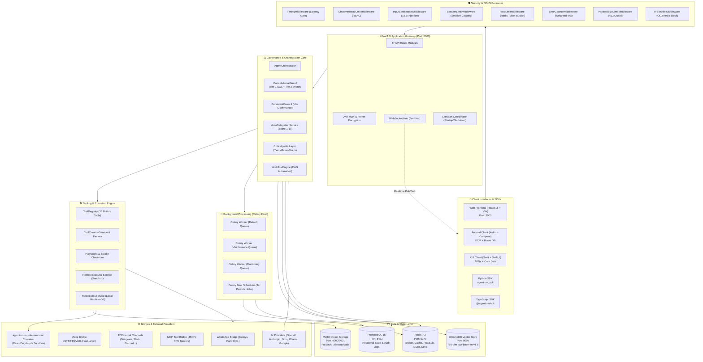
```mermaid
graph TB
    subgraph Clients["📱 Client Interfaces & SDKs"]
        FE["Web Frontend (React 18 + Vite)<br/>Port: 3000"]
        Android["Android Client (Kotlin + Compose)<br/>FCM + Room DB"]
        iOS["iOS Client (Swift + SwiftUI)<br/>APNs + Core Data"]
        SDK_PY["Python SDK<br/>agentium_sdk"]
        SDK_TS["TypeScript SDK<br/>@agentium/sdk"]
    end

    subgraph SecurityGateway["🛡️ Security & DDoS Perimeter"]
        direction TB
        Timing["TimingMiddleware (Latency Gate)"]
        Observer["ObserverReadOnlyMiddleware (RBAC)"]
        Sanitize["InputSanitizationMiddleware (XSS/Injection)"]
        Session["SessionLimitMiddleware (Session Capping)"]
        Rate["RateLimitMiddleware (Redis Token Bucket)"]
        ErrCount["ErrorCounterMiddleware (Weighted 4xx)"]
        Payload["PayloadSizeLimitMiddleware (413 Guard)"]
        IPBlock["IPBlocklistMiddleware (O(1) Redis Block)"]
    end

    subgraph FastAPICore["⚡ FastAPI Application Gateway (Port: 8000)"]
        Router["47 API Route Modules"]
        Auth["JWT Auth & Fernet Encryption"]
        WSHub["WebSocket Hub (/ws/chat)"]
        Lifespan["Lifespan Coordinator (Startup/Shutdown)"]
    end

    subgraph GovernanceEngine["⚖️ Governance & Orchestration Core"]
        Orchestrator["AgentOrchestrator"]
        Guard["ConstitutionalGuard<br/>(Tier 1 SQL + Tier 2 Vector)"]
        Council["PersistentCouncil (Idle Governance)"]
        Delegation["AutoDelegationService (Score 1-10)"]
        CriticLayer["Critic Agents Layer (7xxxx/8xxxx/9xxxx)"]
        WorkflowEng["WorkflowEngine (DAG Automation)"]
    end

    subgraph ToolingSubsystem["🛠️ Tooling & Execution Engine"]
        ToolReg["ToolRegistry (33 Built-in Tools)"]
        ToolFact["ToolCreationService & Factory"]
        BrowserService["Playwright & Stealth Chromium"]
        RemoteExec["RemoteExecutor Service (Sandbox)"]
        HostAccess["HostAccessService (Local Machine OS)"]
    end

    subgraph AsyncWorkers["🔄 Background Processing (Celery Fleet)"]
        WorkerDefault["Celery Worker (Default Queue)"]
        WorkerMaint["Celery Worker (Maintenance Queue)"]
        WorkerMonitor["Celery Worker (Monitoring Queue)"]
        BeatScheduler["Celery Beat Scheduler (34 Periodic Jobs)"]
    end

    subgraph Persistence["📦 Data & State Layer"]
        PG[("PostgreSQL 15<br/>Port: 5432<br/>Relational State & Audit Logs")]
        Chroma[("ChromaDB Vector Store<br/>Port: 8001<br/>768-dim bge-base-en-v1.5")]
        RedisStore[("Redis 7.2<br/>Port: 6379<br/>Broker, Cache, Pub/Sub, DDoS Keys")]
        MinIOStore[("MinIO Object Storage<br/>Port: 9000/9001<br/>Fallback: ./data/uploads")]
    end

    subgraph ExternalEcosystem["🌐 Bridges & External Providers"]
        WhatsAppBridge["WhatsApp Bridge (Baileys, Port: 3001)"]
        VoiceBridge["Voice Bridge (STT/TTS/VAD, Host-Level)"]
        ChannelMesh["12 External Channels (Telegram, Slack, Discord...)"]
        MCPBridge["MCP Tool Bridge (JSON-RPC Servers)"]
        LLMProviders["AI Providers (OpenAI, Anthropic, Groq, Ollama, Google)"]
        SandboxContainer["agentium-remote-executor Container<br/>(Read-Only tmpfs Sandbox)"]
    end

    Clients --> SecurityGateway
    SecurityGateway --> FastAPICore
    FastAPICore --> GovernanceEngine
    GovernanceEngine --> ToolingSubsystem
    GovernanceEngine --> AsyncWorkers
    FastAPICore --> WSHub
    WSHub -.->|"Realtime Pub/Sub"| Clients

    GovernanceEngine --> PG
    GovernanceEngine --> Chroma
    GovernanceEngine --> RedisStore
    ToolingSubsystem --> MinIOStore
    AsyncWorkers --> RedisStore
    AsyncWorkers --> PG

    ToolingSubsystem --> SandboxContainer
    ToolingSubsystem --> ExternalEcosystem
    GovernanceEngine --> LLMProviders
```

---

### 1.2 Middleware Stack (Reverse Insertion Order)

FastAPI executes ASGI middleware in **reverse order of insertion** (the last middleware added via `app.add_middleware` is the first to process an incoming HTTP request).

| Order of Execution | Middleware Class | Purpose | Source File |
|:------------------:|:-----------------|:--------|:------------|
| **1 (First)** | `TimingMiddleware` | Records total request duration, sets `X-Response-Time`, and alerts if performance regression thresholds are exceeded. | [timing_middleware.py](file:///e:/Ongoing%20Projects/Agentium/backend/core/timing_middleware.py) |
| **2** | `ObserverReadOnlyMiddleware` | Rejects state-mutating requests (`POST`, `PUT`, `DELETE`, `PATCH`) from users assigned the `observer` role with `403 Forbidden`. | [observer_middleware.py](file:///e:/Ongoing%20Projects/Agentium/backend/core/observer_middleware.py) |
| **3** | `InputSanitizationMiddleware` | Inspects query strings and bodies for XSS strings, script injections, and invalid Unicode patterns. | [security_middleware.py](file:///e:/Ongoing%20Projects/Agentium/backend/core/security_middleware.py) |
| **4** | `SessionLimitMiddleware` | Caps concurrent active sessions per user account to prevent credential flooding. | [security_middleware.py](file:///e:/Ongoing%20Projects/Agentium/backend/core/security_middleware.py) |
| **5** | `RateLimitMiddleware` | Redis-backed sliding window / token bucket rate limiter providing tier-based request throttling. | [middleware.py](file:///e:/Ongoing%20Projects/Agentium/backend/core/middleware.py) |
| **6** | `ErrorCounterMiddleware` | Evaluates post-response 4xx HTTP codes with weighted penalty points. When score reaches 100 within 5 minutes, triggers an automated 1-hour IP ban. | [security_middleware.py](file:///e:/Ongoing%20Projects/Agentium/backend/core/security_middleware.py) |
| **7** | `PayloadSizeLimitMiddleware` | Inspects incoming `Content-Length` headers and streaming byte sizes; rejects payloads over the configured limit with `413 Request Entity Too Large`. | [security_middleware.py](file:///e:/Ongoing%20Projects/Agentium/backend/core/security_middleware.py) |
| **8 (Last Gate)**| `IPBlocklistMiddleware` | Performs an $O(1)$ Redis `EXISTS` check on `agentium:ip_block:<ip>`. Aborts blacklisted traffic immediately with `403 Forbidden`. | [security_middleware.py](file:///e:/Ongoing%20Projects/Agentium/backend/core/security_middleware.py) |
| **Boundary** | `CORSMiddleware` | Evaluates HTTP origins against `ALLOWED_ORIGINS` settings. | FastAPI Built-in |
| **Exception Filter** | `register_error_handlers` | Standardizes all unhandled exceptions and domain errors into consistent RFC 7807 JSON responses. | [error_responses.py](file:///e:/Ongoing%20Projects/Agentium/backend/core/error_responses.py) |

---

### 1.3 Infrastructure & Container Topology

The complete production system is composed of containerized micro-services managed via [docker-compose.yml](file:///e:/Ongoing%20Projects/Agentium/docker-compose.yml) and companion compose manifests:

| Service Name | Base Image / Build Context | Exposed Ports | Network & Privileges | Primary Responsibilities |
|:-------------|:---------------------------|:--------------|:---------------------|:--------------------------|
| **`postgres`** | `postgres:15-alpine` | `5432:5432` | `agentium-network` | Relational storage for agents, tasks, audit logs, constitution versions, workflows, and RBAC tables. Configured with `pg_stat_statements` for query analysis. |
| **`chromadb`** | `chromadb/chroma:1.5.1` | `8001:8000` | `agentium-network` (1GB-2GB RAM) | Vector database hosting 4 collections (`constitution_articles`, `domain_knowledge`, `task_learnings`, `skills`) with 768-dim embeddings. |
| **`redis`** | `redis:7.2.1-alpine` | `6379:6379` | `agentium-network` | Celery message broker, pub/sub realtime message bus, WebSocket event replay buffer, and DDoS rate-limiting store. |
| **`minio`** | `minio/minio:latest` | `9000:9000`<br/>`9001:9001` | `agentium-network` | S3-compatible object store for artifacts, generated files, uploads, and media. Features automated fallback to container disk if credentials are weak or host unreachable. |
| **`backend`** | `./backend/Dockerfile.privileged` | `8000:8000` | `agentium-network` (Privileged: true) | Main FastAPI gateway, WebSocket hub, Playwright browser coordinator, and orchestrator. |
| **`celery-worker`** | `./backend/Dockerfile.privileged` | None (Internal) | `agentium-network` (Privileged: true) | High-concurrency background task processor executing long-running agent reasoning, tool tasks, workflows, and integrations. |
| **`celery-beat`** | `./backend/Dockerfile.privileged` | None (Internal) | `agentium-network` (Privileged: true) | Cron scheduler dispatching 34 periodic maintenance, health check, decay, and scaling tasks into the Redis broker. |
| **`whatsapp-bridge`** | `./bridges/whatsapp` | `3001:3001` | `agentium-network` | Node.js bridge using `@whiskeysockets/baileys` to communicate with the WhatsApp Web multi-device network. |
| **`voice-autoinstall`** | `ubuntu:22.04` | None (Host net) | `network_mode: host` | Idempotent installer configuring host-level Python voice services on Linux, macOS, or generating Windows startup scripts. |
| **`frontend`** | `./frontend/Dockerfile` | `3000:80` | `agentium-network` | Production Nginx server serving the React 18 + Vite SPA client with 27 interactive administrative views. |
| **`remote-executor`** | `./backend/Dockerfile.remote-executor` | None (Internal) | `cap_drop: ALL`, `read_only: true`, `no-new-privileges` | Hardened, sandboxed container for untrusted Python and bash code execution with zero network access and ephemeral tmpfs. |

---

### 1.4 Dual-Backend Storage Architecture

The platform guarantees uninterrupted file operations via a dual-backend storage architecture in [storage_service.py](file:///e:/Ongoing%20Projects/Agentium/backend/services/storage_service.py):

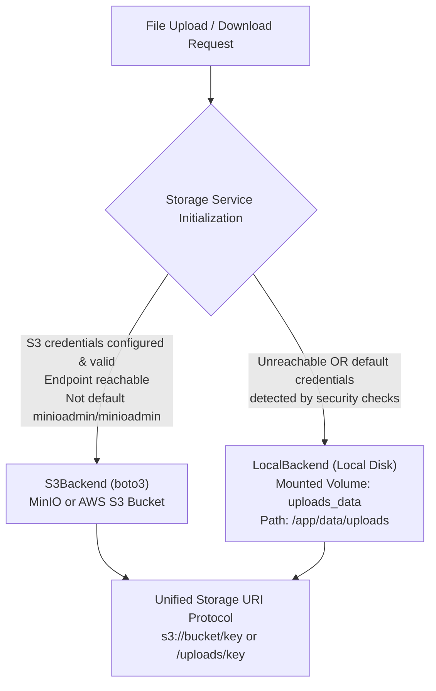
```mermaid
flowchart TD
    Req["File Upload / Download Request"] --> Detect{"Storage Service Initialization"}
    Detect -->|"S3 credentials configured & valid<br/>Endpoint reachable<br/>Not default minioadmin/minioadmin"| S3["S3Backend (boto3)<br/>MinIO or AWS S3 Bucket"]
    Detect -->|"Unreachable OR default credentials<br/>detected by security checks"| Local["LocalBackend (Local Disk)<br/>Mounted Volume: uploads_data<br/>Path: /app/data/uploads"]
    S3 --> Final["Unified Storage URI Protocol<br/>s3://bucket/key or /uploads/key"]
    Local --> Final
```

> [!IMPORTANT]
> **Default Credential Refusal:** To prevent security vulnerabilities, `StorageService` strictly refuses to communicate with MinIO if default credentials (`minioadmin/minioadmin`) are detected. In that scenario, the system automatically falls back to local disk storage (`STORAGE_LOCAL_PATH`) and logs an explicit warning instructing the operator to set unique credentials.

---

## 2. Agent Hierarchy & Democratic Governance

### 2.1 Operational Tiers & Agent ID Ranges

Agentium enforces an immutable hierarchical identity scheme defined in [agents.py](file:///e:/Ongoing%20Projects/Agentium/backend/models/entities/agents.py) and [004-agent-id-numbering.md](file:///e:/Ongoing%20Projects/Agentium/docs/adr/004-agent-id-numbering.md). The five-digit identifier defines an agent's tier, responsibilities, and constitutional permissions:

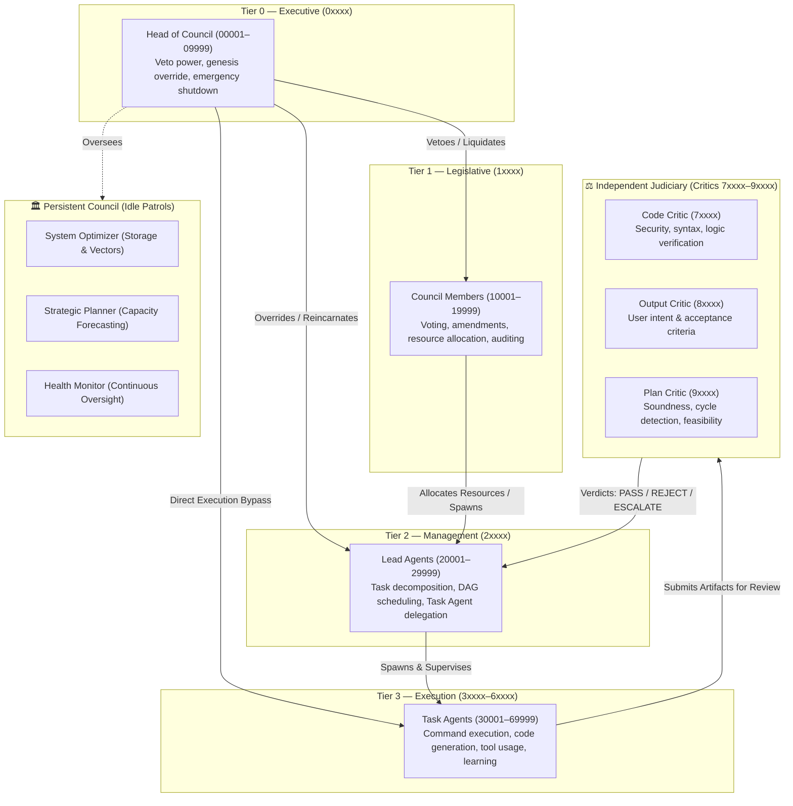
```mermaid
graph TD
    subgraph Tier0["Tier 0 — Executive (0xxxx)"]
        Head["Head of Council (00001–09999)<br/>Veto power, genesis override, emergency shutdown"]
    end

    subgraph Tier1["Tier 1 — Legislative (1xxxx)"]
        Council["Council Members (10001–19999)<br/>Voting, amendments, resource allocation, auditing"]
    end

    subgraph Tier2["Tier 2 — Management (2xxxx)"]
        Lead["Lead Agents (20001–29999)<br/>Task decomposition, DAG scheduling, Task Agent delegation"]
    end

    subgraph Tier3["Tier 3 — Execution (3xxxx–6xxxx)"]
        Task["Task Agents (30001–69999)<br/>Command execution, code generation, tool usage, learning"]
    end

    subgraph Judiciary["⚖️ Independent Judiciary (Critics 7xxxx–9xxxx)"]
        CodeCritic["Code Critic (7xxxx)<br/>Security, syntax, logic verification"]
        OutputCritic["Output Critic (8xxxx)<br/>User intent & acceptance criteria"]
        PlanCritic["Plan Critic (9xxxx)<br/>Soundness, cycle detection, feasibility"]
    end

    subgraph Persistent["🏛️ Persistent Council (Idle Patrols)"]
        Optimizer["System Optimizer (Storage & Vectors)"]
        Planner["Strategic Planner (Capacity Forecasting)"]
        Health["Health Monitor (Continuous Oversight)"]
    end

    Head -->|"Vetoes / Liquidates"| Council
    Head -->|"Overrides / Reincarnates"| Lead
    Head -->|"Direct Execution Bypass"| Task
    Council -->|"Allocates Resources / Spawns"| Lead
    Lead -->|"Spawns & Supervises"| Task
    Task -->|"Submits Artifacts for Review"| Judiciary
    Judiciary -->|"Verdicts: PASS / REJECT / ESCALATE"| Lead
    Head -.->|"Oversees"| Persistent
```

| Tier | Agent Range | Constitutional Role | Default Capabilities | Target Responsibilities |
|:----:|:------------|:-------------------|:---------------------|:------------------------|
| **Tier 0** | `00001`–`09999` | **Executive** | `veto`, `amend_constitution`, `liquidate_any`, `admin_vector_db`, `override_budget`, `emergency_shutdown`, `grant_capability`, `revoke_capability`, `spawn_council` (+ all lower) | Supreme sovereign authority. Held by `Head of Council` (ID: `00001`). Holds emergency override, genesis initiation, and constitutional veto. |
| **Tier 1** | `10001`–`19999` | **Legislative** | `propose_amendment`, `allocate_resources`, `audit_system`, `moderate_knowledge`, `spawn_lead`, `vote_on_amendment`, `review_violations`, `manage_channels` (+ all lower) | Parliamentary council. Deliberates on resource budgets, ratifies constitutional amendments by 60% quorum, audits logs, and approves knowledge promotions. |
| **Tier 2** | `20001`–`29999` | **Management** | `spawn_task_agent`, `delegate_work`, `request_resources`, `submit_knowledge`, `liquidate_task_agent`, `escalate_to_council` (+ all lower) | Team leads and project directors. Decomposes user goals into execution subtasks, assigns work to Task Agents, and reviews output. |
| **Tier 3** | `30001`–`69999` | **Execution** | `execute_task`, `report_status`, `escalate_blocker`, `query_knowledge`, `use_tools`, `request_clarification` | Worker agents specializing in domain execution (coding, research, database querying, tool running, web search, scraping). |
| **Judiciary** | `70001`–`79999` | **Code Critic** | Ephemeral evaluation | Inspects code syntax, detects security vulnerabilities, verifies safe execution parameters. |
| **Judiciary** | `80001`–`89999` | **Output Critic** | Ephemeral evaluation | Verifies that task responses meet defined acceptance criteria and align with user intent. |
| **Judiciary** | `90001`–`99999` | **Plan Critic** | Ephemeral evaluation | Validates execution DAGs for cycles, deadlocks, missing dependencies, and computational feasibility. |

---

### 2.2 Capability Registry (26 Capabilities across 4 Tiers)

Agentium enforces runtime permissions through the `CapabilityRegistry` in [capability_registry.py](file:///e:/Ongoing%20Projects/Agentium/backend/services/capability_registry.py). Every capability check evaluates the agent's tier:

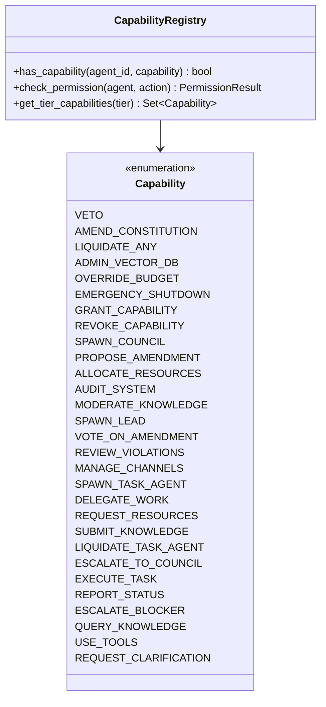
```mermaid
classDiagram
    class CapabilityRegistry {
        +has_capability(agent_id, capability) bool
        +check_permission(agent, action) PermissionResult
        +get_tier_capabilities(tier) Set~Capability~
    }
    class Capability {
        <<enumeration>>
        VETO
        AMEND_CONSTITUTION
        LIQUIDATE_ANY
        ADMIN_VECTOR_DB
        OVERRIDE_BUDGET
        EMERGENCY_SHUTDOWN
        GRANT_CAPABILITY
        REVOKE_CAPABILITY
        SPAWN_COUNCIL
        PROPOSE_AMENDMENT
        ALLOCATE_RESOURCES
        AUDIT_SYSTEM
        MODERATE_KNOWLEDGE
        SPAWN_LEAD
        VOTE_ON_AMENDMENT
        REVIEW_VIOLATIONS
        MANAGE_CHANNELS
        SPAWN_TASK_AGENT
        DELEGATE_WORK
        REQUEST_RESOURCES
        SUBMIT_KNOWLEDGE
        LIQUIDATE_TASK_AGENT
        ESCALATE_TO_COUNCIL
        EXECUTE_TASK
        REPORT_STATUS
        ESCALATE_BLOCKER
        QUERY_KNOWLEDGE
        USE_TOOLS
        REQUEST_CLARIFICATION
    }
    CapabilityRegistry --> Capability
```

---

### 2.3 Separation of Powers Matrix

Democratic stability is maintained through constitutional checks and balances:

| Action / Privilege | Head (Executive `0xxxx`) | Council (Legislative `1xxxx`) | Lead (Management `2xxxx`) | Critics (Judiciary `7–9xxxx`) |
|:-------------------|:------------------------:|:----------------------------:|:-------------------------:|:-----------------------------:|
| **Propose Amendment** | ✅ | ✅ | ❌ | ❌ |
| **Vote on Amendment** | ❌ (Ratifies/Vetoes) | ✅ (60% Quorum Required) | ❌ | ❌ |
| **Emergency Veto** | ✅ | ❌ | ❌ | ❌ |
| **Spawn Council Agents**| ✅ | ❌ | ❌ | ❌ |
| **Spawn Lead Agents** | ✅ | ✅ | ❌ | ❌ |
| **Spawn Task Agents** | ✅ | ❌ | ✅ | ❌ |
| **Liquidate Task Agent**| ✅ (Emergency) | ✅ (Via Vote) | ✅ (Direct Supervisor) | ❌ |
| **Audit Log Inspection**| ✅ | ✅ | ❌ | ❌ |
| **Verdict on Artifacts**| ❌ (Can override rarely) | ❌ | ❌ | ✅ (PASS / REJECT / ESCALATE) |

---

### 2.4 Agent Status Lifecycle

Every agent moves through a state machine tracked in [agents.py](file:///e:/Ongoing%20Projects/Agentium/backend/models/entities/agents.py) and broadcasted in real time over WebSockets:

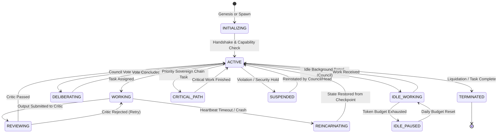
```mermaid
stateDiagram-v2
    [*] --> INITIALIZING: Genesis or Spawn
    INITIALIZING --> ACTIVE: Handshake & Capability Check
    
    ACTIVE --> WORKING: Task Assigned
    WORKING --> REVIEWING: Output Submitted to Critic
    REVIEWING --> ACTIVE: Critic Passed
    REVIEWING --> WORKING: Critic Rejected (Retry)
    
    ACTIVE --> DELIBERATING: Council Vote Initiated
    DELIBERATING --> ACTIVE: Vote Concluded
    
    ACTIVE --> IDLE_WORKING: Idle Background Patrol (Council)
    IDLE_WORKING --> IDLE_PAUSED: Token Budget Exhausted
    IDLE_PAUSED --> IDLE_WORKING: Daily Budget Reset
    IDLE_WORKING --> ACTIVE: Work Received
    
    ACTIVE --> CRITICAL_PATH: Priority Sovereign Chain Task
    CRITICAL_PATH --> ACTIVE: Critical Work Finished
    
    ACTIVE --> SUSPENDED: Violation / Security Hold
    SUSPENDED --> ACTIVE: Reinstated by Council/Head
    
    WORKING --> REINCARNATING: Heartbeat Timeout / Crash
    REINCARNATING --> ACTIVE: State Restored from Checkpoint
    
    ACTIVE --> TERMINATED: Liquidation / Task Complete
    TERMINATED --> [*]
```

---

### 2.5 Independent Judiciary (Critic Agents 7xxxx–9xxxx)

Critic agents are **ephemeral, task-scoped judges** implemented in [critic_agents.py](file:///e:/Ongoing%20Projects/Agentium/backend/services/critic_agents.py). Unlike worker agents, they possess no tools for state modification and act solely as validation gates:

- **Code Critic (`7xxxx`):** Compiles code in memory, runs AST parsers, checks against known injection vectors and OWASP rules.
- **Output Critic (`8xxxx`):** Evaluates whether the generated response meets the task's formal acceptance criteria.
- **Plan Critic (`9xxxx`):** Evaluates multi-step DAG workflows for cycles, deadlocks, and unrealistic resource limits.

If a critic issues a `REJECT` verdict, the Task Agent is given the critique feedback and up to 3 retry attempts. If retries are exhausted, the critic escalates the failure to the supervising Lead Agent with an `ESCALATE` verdict.

---

## 3. Data Flow & Orchestration Pipelines

### 3.1 Task Lifecycle & Constitutional Guard Flow

Every task, whether originating from the Web Dashboard, REST API, or an external chat bridge, follows a strict constitutional pipeline:

```mermaid
flowchart TD
    User["👤 User Query / Webhook / Channel Event"] --> Intake["API Gateway: POST /api/v1/tasks"]
    Intake --> CG["ConstitutionalGuard Inspection"]
    
    CG -->|BLOCK| BlockLog["AuditLog: CONSTITUTIONAL_VIOLATION<br/>Return 403 Forbidden"]
    CG -->|VOTE_REQUIRED| CouncilVote["VotingService: Create Legislative Ballot"]
    CouncilVote -->|Rejected| BlockLog
    CouncilVote -->|Approved| Orchestrator
    
    CG -->|ALLOW| Orchestrator["AgentOrchestrator: Routing & Context Prep"]
    
    Orchestrator --> Score["AutoDelegationService: Complexity Analysis (1–10)"]
    Score -->|Score 1–3: Simple| Worker["Task Agent (3xxxx)"]
    Score -->|Score 4–6: Moderate| Lead["Lead Agent (2xxxx)"]
    Score -->|Score 7–10: High / Novel| CouncilPlan["Council Deliberation (1xxxx)"]
    
    Lead --> Worker
    CouncilPlan --> Lead
    
    Worker --> Exec["Execution Layer (Host Tools / Sandbox / LLM)"]
    Exec --> CriticVerify{"Critic Judiciary Review"}
    
    CriticVerify -->|REJECT (Retries < 3)| Worker
    CriticVerify -->|ESCALATE| LeadEscalate["Escalate to Lead / Human In Loop"]
    CriticVerify -->|PASS| Finalize["Task Finalization"]
    
    Finalize --> Learning["Extract Learnings → ChromaDB (task_learnings)"]
    Finalize --> EthosUpdate["Update Agent Ethos Score (Postgres ethos table)"]
    Finalize --> WSNotice["WebSocket Broadcast: task_completed"]
    Finalize --> Output["Return Response to Caller"]
```

---

### 3.2 Two-Tier Constitutional Guard Engine

The `ConstitutionalGuard` in [constitutional_guard.py](file:///e:/Ongoing%20Projects/Agentium/backend/core/constitutional_guard.py) ensures agents operate within democratic boundaries:

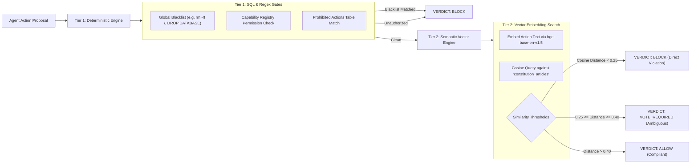
```mermaid
flowchart LR
    Action["Agent Action Proposal"] --> TIER1["Tier 1: Deterministic Engine"]
    
    subgraph Tier1Engine["Tier 1: SQL & Regex Gates"]
        R1["Global Blacklist (e.g. rm -rf /, DROP DATABASE)"]
        R2["Capability Registry Permission Check"]
        R3["Prohibited Actions Table Match"]
    end
    
    TIER1 --> Tier1Engine
    Tier1Engine -->|Blacklist Matched| Block1["VERDICT: BLOCK"]
    Tier1Engine -->|Unauthorized| Block1
    Tier1Engine -->|Clean| TIER2["Tier 2: Semantic Vector Engine"]
    
    subgraph Tier2Engine["Tier 2: Vector Embedding Search"]
        Embed["Embed Action Text via bge-base-en-v1.5"]
        ChromaQuery["Cosine Query against 'constitution_articles'"]
        EvalSim{"Similarity Thresholds"}
    end
    
    TIER2 --> Tier2Engine
    EvalSim -->|Cosine Distance < 0.25| Block2["VERDICT: BLOCK (Direct Violation)"]
    EvalSim -->|0.25 <= Distance <= 0.40| Vote["VERDICT: VOTE_REQUIRED (Ambiguous)"]
    EvalSim -->|Distance > 0.40| Allow["VERDICT: ALLOW (Compliant)"]
```

---

### 3.3 RAG Pipeline & Semantic Memory (BAAI/bge-base-en-v1.5)

Agentium migrated from `MiniLM` to `BAAI/bge-base-en-v1.5` as detailed in [021-embedding-model-migration.md](file:///e:/Ongoing%20Projects/Agentium/docs/adr/021-embedding-model-migration.md):

- **Vector Dimensions:** 768 dimensions (normalized cosine similarity).
- **Active Collections:**
  1. `constitution_articles`: Constitutional tenets, amendments, and governance bylaws.
  2. `domain_knowledge`: Curated system knowledge and user-injected documentation.
  3. `task_learnings`: Autonomous post-task reflections and validated problem solutions.
  4. `skills`: Registered procedural execution playbooks.

#### Decay Scoring & Citation Graph Integration

Retrieved knowledge chunks are ranked dynamically:

$$\text{Final Relevance} = \text{Cosine Similarity} \times \text{Decay Factor} \times \text{Citation Boost}$$

- **Decay Factor:** Enforced by `backend/celery_app.py` weekly task. Older learnings gently decay: $\text{Decay} = 0.5^{(\text{age\_days} / \text{half\_life})}$.
- **Citation Boost:** Maintained by [citation_graph_service.py](file:///e:/Ongoing%20Projects/Agentium/backend/services/citation_graph_service.py). Chunks cited frequently by successful tasks receive a graph BFS boost factor ($1.0 \le \text{boost} \le 1.5$).

---

### 3.4 Workflow Automation DAG Engine

The `WorkflowEngine` in [workflow_engine.py](file:///e:/Ongoing%20Projects/Agentium/backend/services/workflow_engine.py) provides complex multi-agent DAG execution:

- **Step Types:**
  - `task`: Dispatches an action to an allocated Task Agent.
  - `condition`: Evaluates expressions (Python or JSONPath) against previous step outputs.
  - `approval`: Pauses workflow execution until an authorized human or Council vote approves.
  - `wait`: Asynchronously pauses until a specific timestamp, duration, or external event condition is satisfied via [wait_poll_service.py](file:///e:/Ongoing%20Projects/Agentium/backend/services/wait_poll_service.py).
  - `parallel`: Executes multiple non-dependent sub-branches concurrently across worker threads.
  - `transform`: Formats, filters, or aggregates intermediate data.
  - `subworkflow`: Recursively executes a nested workflow template.

---

## 4. Tooling Engine, Skills & Sandboxed Execution

### 4.1 Built-in Tool Architecture

Agentium houses a rich library of 33 built-in tools located in [backend/tools/](file:///e:/Ongoing%20Projects/Agentium/backend/tools):

```
backend/tools/
├── browser_router.py          # Intelligent routing between Playwright and Stealth Nodriver
├── browser_tool.py            # Playwright headless browser automation
├── clarification_tool.py      # Requests structured user clarification mid-task
├── code_analyzer_tool.py      # Static code syntax and AST security analysis
├── code_execution_tool.py     # Local execution wrapper
├── data_transform_tool.py     # JSON/CSV/Text transformation utilities
├── deep_think_tool.py         # Multi-step reasoning trace scratchpad
├── desktop_tool.py            # Desktop automation, screenshot capturing, mouse/keyboard input
├── embedding_tool.py          # On-demand text vectorization
├── ethos_tool.py              # Agent ethos query and update interface
├── file_tool.py               # Local file system read/write/list operations
├── git_tool.py                # Git clone, checkout, commit, diff, and log commands
├── governance_tool.py         # Council voting, proposal initiation, and status queries
├── host_os_tool.py            # Host OS system command execution
├── http_api_tool.py           # Universal REST API HTTP request executor
├── mcp_agent_tools.py         # External Model Context Protocol tool client
├── nodriver_tool.py           # Stealth Chrome automation bypassing Cloudflare/Bot-detection
├── remote_exec_tool.py        # Sandboxed code runner via agentium-remote-executor
├── shell_tool.py              # Subprocess shell command runner
├── skill_creator_tool.py      # Automated generation of reusable skill folders
├── task_management_tool.py    # Child task spawning and dependency tracking
├── text_editor_tool.py        # Chunk-based precise text/code file editing
├── tool_creator_tool.py       # Runtime tool creation and test harness
├── tool_search_tool.py        # Vector search over available tool capabilities
├── user_preference_tool.py    # User personal preference storage and retrieval
├── vector_db_tool.py          # Direct querying and upserting into ChromaDB
├── web_crawler_tool.py        # Recursive website spidering and link extraction
├── web_fetch_tool.py          # Single-page HTML extraction and markdown conversion
└── web_search_tool.py         # Web search integration (Tavily / Brave / SerpAPI)
```

---

### 4.2 Dynamic Tool Creation Factory & Marketplace

Agents can autonomously expand their capabilities through the Tool Creation Engine:

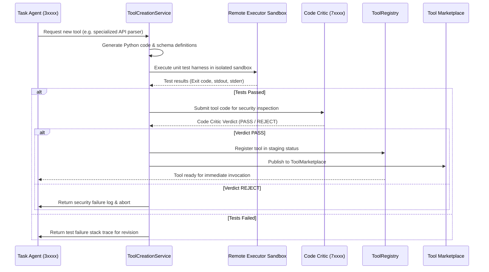
```mermaid
sequenceDiagram
    participant Agent as Task Agent (3xxxx)
    participant Factory as ToolCreationService
    participant Sandbox as Remote Executor Sandbox
    participant Critic as Code Critic (7xxxx)
    participant Registry as ToolRegistry
    participant Market as Tool Marketplace

    Agent->>Factory: Request new tool (e.g. specialized API parser)
    Factory->>Factory: Generate Python code & schema definitions
    Factory->>Sandbox: Execute unit test harness in isolated sandbox
    Sandbox-->>Factory: Test results (Exit code, stdout, stderr)
    
    alt Tests Passed
        Factory->>Critic: Submit tool code for security inspection
        Critic-->>Factory: Code Critic Verdict (PASS / REJECT)
        
        alt Verdict PASS
            Factory->>Registry: Register tool in staging status
            Factory->>Market: Publish to ToolMarketplace
            Registry-->>Agent: Tool ready for immediate invocation
        else Verdict REJECT
            Factory->>Agent: Return security failure log & abort
        end
    else Tests Failed
        Factory->>Agent: Return test failure stack trace for revision
    end
```

---

### 4.3 Sandboxed Remote Execution (`agentium-remote-executor`)

For executing untrusted or agent-generated scripts, Agentium provides a dedicated sandbox defined in [docker-compose.remote-executor.yml](file:///e:/Ongoing%20Projects/Agentium/docker-compose.remote-executor.yml):

- **Security Profile:**
  - `read_only: true` (Root filesystem is completely non-writable).
  - `cap_drop: ALL` (Drops all Linux capabilities; selectively retains `CHOWN`, `SETUID`, `SETGID`).
  - `security_opt: [no-new-privileges:true]`.
  - `ALLOW_NETWORK=false` (Completely air-gapped from internal and external networks).
  - Memory limit: 1 GB (Reservations: 256 MB); CPU limit: 2.0 cores.
  - Ephemeral execution storage mounted strictly as memory-backed `tmpfs` (`/tmp:noexec,nosuid,size=100m`).

---

### 4.4 Skills System & On-Demand RAG Injection

Skills represent structured procedural knowledge stored in `.agentium/skills/`. Each skill directory contains:
- `SKILL.md`: Frontmatter containing name, description, capabilities, and detailed workflow instructions.
- Supporting scripts and reference data.

During task intake, `skill_rag.py` performs a semantic search over registered skills and dynamically injects the most relevant playbooks directly into the Task Agent's LLM context window.

---

## 5. WebSocket Real-Time Event Bus

### 5.1 Connection Flow, Heartbeats & Event Replay

Real-time bidirectional communication is managed by `ConnectionManager` in [websocket.py](file:///e:/Ongoing%20Projects/Agentium/backend/api/routes/websocket.py):

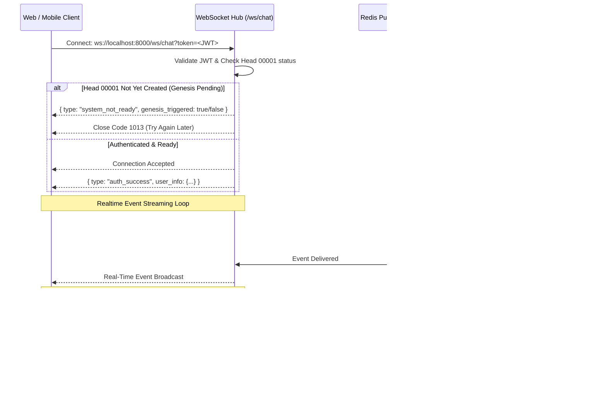
```mermaid
sequenceDiagram
    participant Client as Web / Mobile Client
    participant WS as WebSocket Hub (/ws/chat)
    participant Redis as Redis Pub/Sub & Buffer
    participant Celery as Celery Workers / Beat

    Client->>WS: Connect: ws://localhost:8000/ws/chat?token=<JWT>
    WS->>WS: Validate JWT & Check Head 00001 status
    
    alt Head 00001 Not Yet Created (Genesis Pending)
        WS-->>Client: { type: "system_not_ready", genesis_triggered: true/false }
        WS-->>Client: Close Code 1013 (Try Again Later)
    else Authenticated & Ready
        WS-->>Client: Connection Accepted
        WS-->>Client: { type: "auth_success", user_info: {...} }
    end

    Note over Client,WS: Realtime Event Streaming Loop
    Celery->>Redis: LPUSH "agentium:ws:buffer" (Event Payload)
    Celery->>Redis: PUBLISH "agentium:events"
    Redis->>WS: Event Delivered
    WS-->>Client: Real-Time Event Broadcast

    Note over Client,WS: Reconnection & Event Replay
    Client->>WS: GET /ws/replay?since=<timestamp>
    WS->>Redis: LRANGE "agentium:ws:buffer" (Last 100 events)
    WS-->>Client: Missed Events Returned
```

---

### 5.2 Complete WebSocket Event Reference

| Event Name | Originating Source | Event Payload Highlights | Purpose in UI / Clients |
|:-----------|:-------------------|:-------------------------|:------------------------|
| **`agent_spawned`** | Orchestrator / API | `agent_id`, `agent_name`, `agent_type`, `parent_id` | Animates new agent node in the live hierarchy tree. |
| **`agent_liquidated`**| Council / Head | `agent_id`, `liquidated_by`, `reason`, `tasks_reassigned` | Removes node and updates status to terminated. |
| **`agent_promoted`** | Governance Engine | `old_agentium_id`, `new_agentium_id`, `promoted_by` | Displays promotion alert (e.g. Task Agent $\to$ Lead Agent). |
| **`agent_status_changed`**| State Machine | `agent_id`, `old_status`, `new_status` | Updates agent health rings and status badges in real-time. |
| **`task_escalated`** | AutoDelegation | `task_id`, `escalated_by`, `reason` | Emits high-priority alert to council/lead dashboards. |
| **`vote_initiated`** | VotingService | `vote_id`, `subject`, `initiated_by`, `quorum_required` | Displays active voting ballot modal to sovereign users. |
| **`constitutional_violation`**| ConstitutionalGuard | `violator_id`, `article`, `severity`, `requires_vote` | Triggers violation indicator on governance dashboard. |
| **`amendment_proposed`**| AmendmentService | `proposer_id`, `article`, `description`, `requires_vote` | Notifies users of proposed constitutional amendments. |
| **`knowledge_submitted`**| KnowledgeService | `agent_id`, `topic`, `requires_vote` | Queues knowledge item for moderation review. |
| **`knowledge_approved`** | KnowledgeService | `topic`, `approved_by` | Broadcasts promotion of knowledge to canonical status. |
| **`message_routed`** | ChannelManager | `channel`, `sender`, `task_id`, `requires_approval` | Displays incoming multi-channel message badge. |
| **`browser_frame`** | BrowserService | `task_id`, `frame` (base64 PNG), `url`, `title`, `frame_number` | Streams live Chromium viewport to `BrowserTaskViewer`. |
| **`mcp_stats_update`** | Celery Beat (30s) | Array of `{tool_id, invocation_count, latency_ms, errors}` | Updates MCP metrics columns without page reload. |
| **`mcp_tool_revoked`** | MCP Router | `tool_id`, `tool_name`, `reason`, `revoked_by` | Disables tool buttons across client interfaces instantly. |
| **`channel_health_update`**| Celery Beat (5m) | Array of `{channel_id, status, error_message, latency}` | Updates channel connection health indicators. |
| **`provider_metrics_update`**| Celery Beat (30s)| Per-provider latency, token consumption, and cost | Updates model provider analytics charts. |
| **`system_mode_change`**| SelfHealingService | `old_mode`, `new_mode` (`NORMAL` / `DEGRADED` / `CRITICAL`) | Alerts operator of system degradation or failover. |
| **`anomaly_detected`** | MonitoringService | `metric`, `z_score`, `threshold`, `timestamp` | Emits warning when metrics exceed standard deviation. |
| **`system_not_ready`** | WebSocket Hub | `genesis_triggered`, `content` | Displays initialization progress bar during genesis. |

---

## 6. Celery Asynchronous Processing & Beat Schedule

### 6.1 Worker Topology & Queue Distribution

Celery workers are deployed with process concurrency and queue isolation configured in [celery_app.py](file:///e:/Ongoing%20Projects/Agentium/backend/celery_app.py):

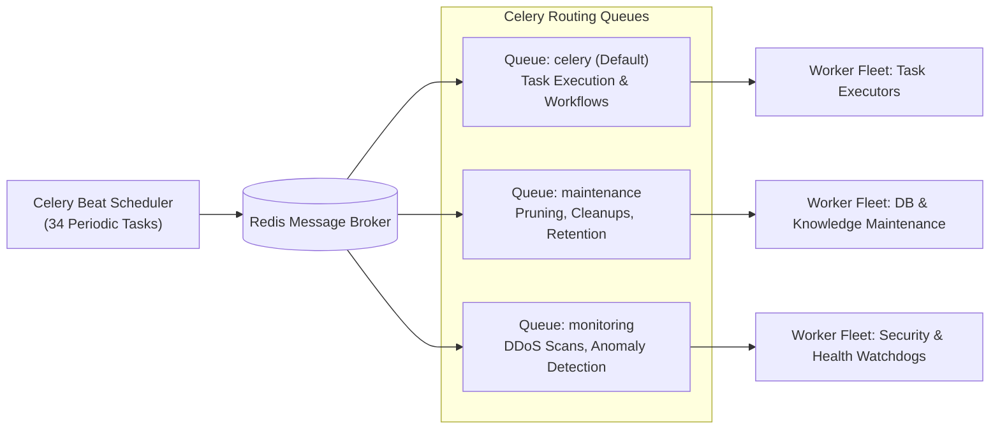
```mermaid
graph LR
    Beat["Celery Beat Scheduler<br/>(34 Periodic Tasks)"] --> RedisQ[("Redis Message Broker")]
    
    subgraph Queues["Celery Routing Queues"]
        Q_Default["Queue: celery (Default)<br/>Task Execution & Workflows"]
        Q_Maint["Queue: maintenance<br/>Pruning, Cleanups, Retention"]
        Q_Monitor["Queue: monitoring<br/>DDoS Scans, Anomaly Detection"]
    end

    RedisQ --> Q_Default
    RedisQ --> Q_Maint
    RedisQ --> Q_Monitor

    Q_Default --> W1["Worker Fleet: Task Executors"]
    Q_Maint --> W2["Worker Fleet: DB & Knowledge Maintenance"]
    Q_Monitor --> W3["Worker Fleet: Security & Health Watchdogs"]
```

---

### 6.2 Complete Celery Beat Periodic Task Schedule

The system runs **34 automated background tasks** to ensure autonomous maintenance, security, health, and evolution:

| Periodic Task Identifier | Schedule Interval | Target Queue | Subsystem & Purpose |
|:-------------------------|:-----------------:|:------------:|:--------------------|
| `scheduled-task-dispatcher` | Every 15s | `celery` | Dispatches due user-scheduled tasks using CAS-claims to prevent double-firing. |
| `schedule-trigger-check` | Every 15s | `celery` | Checks event trigger conditions against active schedule rules. |
| `poll-execution-conditions`| Every 20s | `celery` | Evaluates execution wait timers for delayed workflow steps. |
| `dependency-graph-processor`| Every 30s | `celery` | Evaluates completed DAG nodes and unblocks downstream tasks. |
| `crash-detection` | Every 30s | `monitoring` | Detects agents marked `WORKING` whose heartbeats have stalled; initiates reincarnation. |
| `poll-wait-conditions` | Every 30s | `celery` | Evaluates external polling wait conditions in active workflows. |
| `mcp-stats-broadcast` | Every 30s | `monitoring` | Gathers MCP tool invocation metrics and pushes real-time WebSocket updates. |
| `provider-metrics-broadcast`| Every 30s | `monitoring` | Broadcasts per-provider LLM resilience and latency metrics. |
| `agent-heartbeat` | Every 60s | `monitoring` | Writes current timestamp to `last_heartbeat_at` for active agents. |
| `auto-escalation-timer` | Every 60s | `celery` | Identifies tasks exceeding timeout thresholds and reassigns or escalates them. |
| `idle-task-processor` | Every 60s | `celery` | Assigns background optimization and housekeeping tasks to idle Council agents. |
| `reasoning-watchdog` | Every 60s | `monitoring` | Detects paused or circular reasoning traces and applies ethos compression. |
| `threshold-event-check` | Every 60s | `celery` | Evaluates sensor and event threshold triggers against external conditions. |
| `external-api-poll` | Every 60s | `celery` | Polls external web endpoints for registered webhooks. |
| `sla-monitor` | Every 60s | `monitoring` | Tracks task completion SLAs and records compliance metrics. |
| `imap-receiver-check` | Every 60s | `celery` | Polls configured IMAP mailboxes for inbound tasks and commands. |
| `critical-path-guardian` | Every 120s | `celery` | Inspects high-priority CRITICAL/SOVEREIGN chains to prevent bottlenecks. |
| `health-check-every-5-minutes` | Every 300s (5m) | `monitoring` | Evaluates communication channel connectivity and reports health. |
| `channel-heartbeat` | Every 300s (5m) | `monitoring` | Dispatches keepalive pings across external bridges (WhatsApp, Telegram, etc.). |
| `handle-task-escalation` | Every 300s (5m) | `celery` | Manages escalation timeouts and alerts supervising agents. |
| `load-metrics-snapshot` | Every 300s (5m) | `monitoring` | Records system throughput, token consumption, and active agent snapshots to Redis. |
| `predictive-scaling-check` | Every 300s (5m) | `celery` | Forecasts upcoming workload spikes and pre-spawns Task Agents. |
| `anomaly-detection` | Every 300s (5m) | `monitoring` | Computes Z-scores on latency and error rates to flag operational anomalies. |
| `channel-health-broadcast` | Every 300s (5m) | `monitoring` | Emits consolidated channel health updates over WebSocket. |
| `suspicious-pattern-detection`| Every 300s (5m) | `monitoring` | Scans weighted 4xx Redis counters and executes automated IP blocklisting. |
| `verify-agents-every-5-minutes`| Every 300s (5m) | `celery` | Verifies genesis council agents exist; automatically repairs missing agents. |
| `federation-heartbeat` | Every 300s (5m) | `celery` | Exchanges health probes with registered peer Agentium instances. |
| `auto-scale-check` | Every 600s (10m) | `celery` | Evaluates queue depths and scales task agent pool up or down. |
| `federation-cleanup-stale` | Every 3600s (1h) | `maintenance`| Removes uncommunicative federated instances from peer tables. |
| `update-citation-boosts` | Every 21600s (6h) | `celery` | Traverses the cross-document citation graph and recalculates relevance boosts. |
| `cleanup-old-messages-daily` | Every 86400s (24h)| `maintenance`| Prunes channel and chat messages older than retention limits (default: 30 days). |
| `constitution-daily-review` | Every 86400s (24h)| `celery` | Runs a daily constitutional consistency scan to verify rules have not drifted. |
| `chat-history-prune-daily` | Every 86400s (24h)| `maintenance`| Prunes expired ephemeral chat sessions based on user preferences. |
| `sovereign-data-retention` | Every 86400s (24h)| `maintenance`| Enforces GDPR/sovereignty data retention rules and deletes expired artifacts. |
| `self-diagnostic-daily` | Every 86400s (24h)| `monitoring` | Executes a full system diagnostic pass over database integrity and storage health. |
| `log-slow-query-summary-daily`| Every 86400s (24h)| `maintenance`| Analyzes PostgreSQL `pg_stat_statements` and records top slow queries. |
| `weekly-knowledge-reindex` | Every 604800s (7d)| `maintenance`| Re-indexes and compacts ChromaDB vector collections to optimize memory. |
| `knowledge-consolidation-weekly`| Every 604800s (7d)| `celery` | Merges duplicate learnings and synthesizes high-confidence knowledge nodes. |
| `performance-optimization-weekly`| Every 604800s (7d)| `celery` | Computes historical performance metrics to tune agent routing weights. |
| `generate-auto-tools-weekly`| Every 604800s (7d)| `celery` | Identifies repetitive manual task sequences and proposes automated tools. |
| `decay-learnings` | Every 604800s (7d)| `maintenance`| Applies decay coefficients to outdated knowledge patterns. |
| `cleanup-citation-edges-weekly`| Every 604800s (7d)| `maintenance`| Prunes broken or deprecated citation graph edges. |

---

## 7. Multi-Channel Mesh & External Integrations

### 7.1 Supported Communication Channels (12 Channels)

The `ChannelManager` in [channel_manager.py](file:///e:/Ongoing%20Projects/Agentium/backend/services/channel_manager.py) unifies inbound queries and outbound notifications across 12 distinct communication protocols:

| Channel Protocol | Driver / Library | Connection Mode | Key Architectural Features |
|:-----------------|:-----------------|:----------------|:---------------------------|
| **WhatsApp** | Baileys (`bridges/whatsapp`) | WebSocket RPC (`:3001`) | Multi-device web bridge, automated QR code session pairing, image/voice audio processing. |
| **Telegram** | `python-telegram-bot` / REST | Long-Polling / Webhook | Interactive keyboard menus, file streaming, direct command parsing. |
| **Slack** | `@slack/web-api` | Events API / Webhook | Thread-scoped replies, interactive Slack blocks, mentions routing. |
| **Discord** | `discord.py` | Gateway WebSocket | Server channel listener, direct messaging, slash command handling. |
| **Signal** | `signal-cli` | Local JSON-RPC Daemon | End-to-end encrypted sovereign channel for security-critical environments. |
| **Google Chat** | Google Chat API | HTTP Webhook | Google Workspace integration with card formatting. |
| **Microsoft Teams** | Bot Framework | REST Webhook | Enterprise directory integration, Adaptive Card rendering. |
| **Matrix** | `matrix-nio` | Matrix Client-Server API | Decentralized, federated sovereign chat integration. |
| **iMessage** | `imessage-bridge` | AppleScript Bridge | Native macOS message bridge integration. |
| **Zalo** | Zalo Bot API | Webhook REST | Regional messaging integration for Southeast Asian operators. |
| **Email** | `imaplib` + `smtplib` | IMAP Polling + SMTP | Inbound email parsing to tasks; outbound email delivery with DKIM. |
| **SMS** | `twilio` SDK | REST API | Outbound emergency alerts and SMS two-factor verification. |

---

### 7.2 Voice Bridge Architecture (STT, TTS, VAD, Wake-Word)

The Voice Bridge in [voice-bridge/](file:///e:/Ongoing%20Projects/Agentium/voice-bridge) enables natural voice interaction:

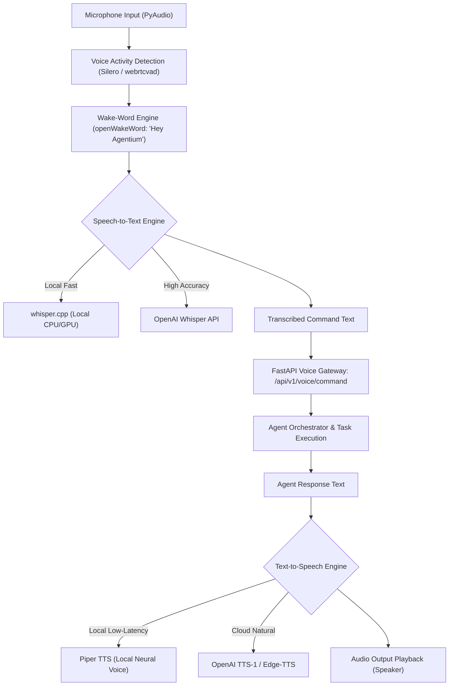
```mermaid
graph TD
    Mic["Microphone Input (PyAudio)"] --> VAD["Voice Activity Detection (Silero / webrtcvad)"]
    VAD --> WakeWord["Wake-Word Engine (openWakeWord: 'Hey Agentium')"]
    WakeWord --> STT{"Speech-to-Text Engine"}
    
    STT -->|"Local Fast"| WhisperCPP["whisper.cpp (Local CPU/GPU)"]
    STT -->|"High Accuracy"| OpenAIWhisper["OpenAI Whisper API"]
    
    STT --> Transcribed["Transcribed Command Text"]
    Transcribed --> FastAPIVoice["FastAPI Voice Gateway: /api/v1/voice/command"]
    FastAPIVoice --> AgentBrain["Agent Orchestrator & Task Execution"]
    AgentBrain --> TextResponse["Agent Response Text"]
    
    TextResponse --> TTS{"Text-to-Speech Engine"}
    TTS -->|"Local Low-Latency"| PiperLocal["Piper TTS (Local Neural Voice)"]
    TTS -->|"Cloud Natural"| OpenAITTS["OpenAI TTS-1 / Edge-TTS"]
    
    TTS --> Speaker["Audio Output Playback (Speaker)"]
```

---

### 7.3 Universal Multi-Model LLM Routing & API Key Resilience

Agentium features a multi-provider model routing layer managed by `ApiManager` in [api_manager.py](file:///e:/Ongoing%20Projects/Agentium/backend/services/api_manager.py):

- **Supported Model Providers:**
  - **OpenAI:** GPT-4o, GPT-4o-mini, o1, o3-mini.
  - **Anthropic:** Claude 3.5 Sonnet, Claude 3.5 Haiku, Claude 3 Opus.
  - **Groq:** Llama-3.3-70b-versatile, Mixtral-8x7b (ultra-low latency execution).
  - **Google GenAI:** Gemini 2.0 Flash, Gemini 1.5 Pro.
  - **Ollama:** Completely local and air-gapped models (DeepSeek-R1, Llama-3, Qwen-2.5).
  - **OpenAI-Compatible:** Any third-party endpoint (vLLM, LMStudio, Together, OpenRouter).
- **Resilience & Key Failover:**
  - Configured in [api_key_manager.py](file:///e:/Ongoing%20Projects/Agentium/backend/services/api_key_manager.py).
  - Supports multiple API keys per provider with round-robin load distribution.
  - Automatically isolates keys returning `429 Too Many Requests` or `insufficient_quota` and falls back to secondary keys or backup providers seamlessly.
- **Budget Tracking:**
  - Configured in [token_optimizer.py](file:///e:/Ongoing%20Projects/Agentium/backend/services/token_optimizer.py).
  - Enforces two distinct daily spending caps: **Active Mode Budget** and **Idle Mode Budget**.

---

### 7.4 Model Context Protocol (MCP) Tool Bridge & Governance

The platform natively implements the Anthropic Model Context Protocol (MCP) in [mcp_tool_bridge.py](file:///e:/Ongoing%20Projects/Agentium/backend/services/mcp_tool_bridge.py):

- Discovers external tools exposed by local or remote MCP servers via JSON-RPC.
- Applies constitutional governance: Tools require sovereign or Council approval before registration.
- Broadcasts real-time MCP invocation statistics every 30 seconds via Celery beat task `broadcast_mcp_stats`.
- Instantaneous revocation: Revoking an MCP tool immediately broadcasts `mcp_tool_revoked` over WebSockets and clears cached schemas from the active registry.

---

## 8. Mobile Client Architecture (Android & iOS)

Agentium includes full native client architectures for mobile administration located in [mobile/](file:///e:/Ongoing%20Projects/Agentium/mobile):

### 8.1 Native Client Overview

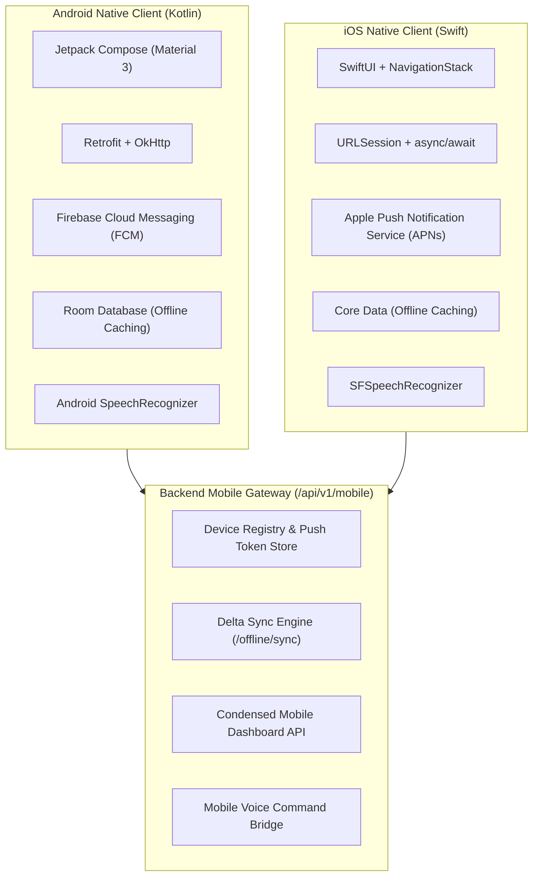
```mermaid
graph TB
    subgraph Android["Android Native Client (Kotlin)"]
        A_UI["Jetpack Compose (Material 3)"]
        A_Net["Retrofit + OkHttp"]
        A_Push["Firebase Cloud Messaging (FCM)"]
        A_DB["Room Database (Offline Caching)"]
        A_Voice["Android SpeechRecognizer"]
    end

    subgraph iOS["iOS Native Client (Swift)"]
        I_UI["SwiftUI + NavigationStack"]
        I_Net["URLSession + async/await"]
        I_Push["Apple Push Notification Service (APNs)"]
        I_DB["Core Data (Offline Caching)"]
        I_Voice["SFSpeechRecognizer"]
    end

    subgraph BackendGateway["Backend Mobile Gateway (/api/v1/mobile)"]
        DevReg["Device Registry & Push Token Store"]
        SyncEngine["Delta Sync Engine (/offline/sync)"]
        CondDash["Condensed Mobile Dashboard API"]
        VoiceGW["Mobile Voice Command Bridge"]
    end

    Android --> BackendGateway
    iOS --> BackendGateway
```

---

### 8.2 Mobile REST API Contract & Offline Delta Sync

Mobile devices interact via optimized endpoints defined in [mobile.py](file:///e:/Ongoing%20Projects/Agentium/backend/api/routes/mobile.py):

| HTTP Method | Route Endpoint | Purpose & Payload Notes |
|:------------|:---------------|:------------------------|
| `POST` | `/api/v1/mobile/register-device` | Registers FCM (Android) or APNs (iOS) device token for push alerts. |
| `DELETE` | `/api/v1/mobile/register-device/{token}` | Unregisters device token on logout. |
| `GET` | `/api/v1/mobile/dashboard` | Returns condensed system status (active agents, pending votes, recent tasks). |
| `GET` | `/api/v1/mobile/tasks` | Paginated task list with compact metadata. |
| `GET` | `/api/v1/mobile/agents` | Active agent list with status and tier indicators. |
| `GET` | `/api/v1/mobile/votes/active` | Active ballots requiring user vote. |
| `GET` | `/api/v1/mobile/offline/constitution` | Full constitution snapshot cached locally in Room / Core Data. |
| `GET` | `/api/v1/mobile/offline/task-queue` | Queued tasks for offline inspection. |
| `POST` | `/api/v1/mobile/offline/sync` | Bidirectional delta sync: pushes actions taken offline and receives updates. |
| `POST` | `/api/v1/mobile/voice-command` | Bridges on-device speech-to-text transcriptions directly into task execution. |
| `GET` / `PUT` | `/api/v1/mobile/notifications/preferences`| Manages push notification category toggles. |

---

## 9. Application Lifespan & Startup Sequence

### 9.1 Comprehensive Lifespan Sequence

FastAPI application lifespan is orchestrated via the asynchronous context manager in [main.py](file:///e:/Ongoing%20Projects/Agentium/backend/main.py):

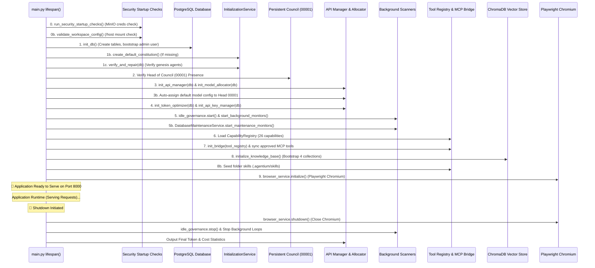
```mermaid
sequenceDiagram
    participant Main as main.py lifespan()
    participant Sec as Security Startup Checks
    participant DB as PostgreSQL Database
    participant Init as InitializationService
    participant Council as Persistent Council (00001)
    participant Models as API Manager & Allocator
    participant Monitors as Background Scanners
    participant Tools as Tool Registry & MCP Bridge
    participant Chroma as ChromaDB Vector Store
    participant Browser as Playwright Chromium

    Main->>Sec: 0. run_security_startup_checks() (MinIO creds check)
    Main->>Sec: 0b. validate_workspace_config() (/host mount check)
    
    Main->>DB: 1. init_db() (Create tables, bootstrap admin user)
    Main->>Init: 1b. create_default_constitution() (If missing)
    Main->>Init: 1c. verify_and_repair(db) (Verify genesis agents)
    
    Main->>Council: 2. Verify Head of Council (00001) Presence
    
    Main->>Models: 3. init_api_manager(db) & init_model_allocator(db)
    Main->>Models: 3b. Auto-assign default model config to Head 00001
    Main->>Models: 4. init_token_optimizer(db) & init_api_key_manager(db)
    
    Main->>Monitors: 5. idle_governance.start() & start_background_monitors()
    Main->>Monitors: 5b. DatabaseMaintenanceService.start_maintenance_monitors()
    
    Main->>Tools: 6. Load CapabilityRegistry (26 capabilities)
    Main->>Tools: 7. init_bridge(tool_registry) & sync approved MCP tools
    Main->>Chroma: 8. initialize_knowledge_base() (Bootstrap 4 collections)
    Main->>Tools: 8b. Seed folder skills (.agentium/skills)
    
    Main->>Browser: 9. browser_service.initialize() (Playwright Chromium)
    
    Note over Main: 🎉 Application Ready to Serve on Port 8000
    
    Note over Main: Application Runtime (Serving Requests)...
    
    Note over Main: 🛑 Shutdown Initiated
    Main->>Browser: browser_service.shutdown() (Close Chromium)
    Main->>Monitors: idle_governance.stop() & Stop Background Loops
    Main->>Models: Output Final Token & Cost Statistics
```

---

### 9.2 Startup Steps & Health Invariants

| Step | Subsystem | Action & Invariant Check | Failure Behavior |
|:----:|:----------|:-------------------------|:-----------------|
| **0** | **Security Checks** | Executes `run_security_startup_checks()`. Detects insecure defaults (e.g. `minioadmin`). | Logs warning; if `MINIO_BLOCK_DEFAULT_CREDS=true`, aborts boot. |
| **0b**| **Workspace Config**| Validates host workspace paths resolve under `/host` or `/host_home`. | Logs warning (artifacts will not persist to host). |
| **1** | **Database Init** | Calls `init_db()`. Creates tables, creates default `admin` user if missing, pre-loads pricing cache. | Fatal error: Backend terminates if PostgreSQL is unreachable. |
| **1b**| **Constitution Seed**| Calls `create_default_constitution()`. Seeds version 1.0.0 if table is empty. | Non-fatal: Logs error and proceeds. |
| **1c**| **Genesis Agent Repair**| Calls `verify_and_repair()`. Recreates any missing core genesis agents. | Non-fatal: Logs warning. |
| **2** | **Persistent Council**| Checks if `HeadOfCouncil` (`00001`) exists. | Read-only: If missing, sets system to await initial API key genesis. |
| **3** | **API Manager** | Calls `init_api_manager()`. Instantiates multi-provider LLM clients. | Fatal error if database configuration is broken. |
| **3b**| **Head Config Auto-Assign**| Auto-assigns first active model config to Head `00001`. | Non-fatal warning if no model configs exist yet. |
| **4** | **Model & Token Optimizers**| Initializes model allocations, active budgets, and idle budgets. | Non-fatal: Defaults to system fallbacks. |
| **5** | **API Key Manager**| Initializes key manager with failover resilience. | Non-fatal. |
| **6** | **Idle Governance** | Launches background patrol monitors (skipped when `TESTING=true`). | Non-fatal: Continues without background loops. |
| **7** | **Capability Registry**| Registers all 26 capabilities across 4 tiers. | Fatal if capability enum is corrupted. |
| **8** | **MCP Tool Bridge** | Initializes MCP bridge and syncs approved tools into registry. | Non-fatal: MCP tools remain manageable via UI. |
| **9** | **Vector Knowledge** | Bootstraps ChromaDB collections and embeds initial constitution. | Non-fatal: Vector operations retry on first search. |
| **10**| **Browser Service** | Launches headless Chromium instance for screenshot streaming. | Non-fatal: Browser features disabled if Chromium fails. |

---

## 10. Security, DDoS Hardening & Observability

### 10.1 Application-Layer DDoS Hardening

Agentium implements multi-stage application-layer protection configured in [security_middleware.py](file:///e:/Ongoing%20Projects/Agentium/backend/core/security_middleware.py) and [celery_app.py](file:///e:/Ongoing%20Projects/Agentium/backend/celery_app.py):

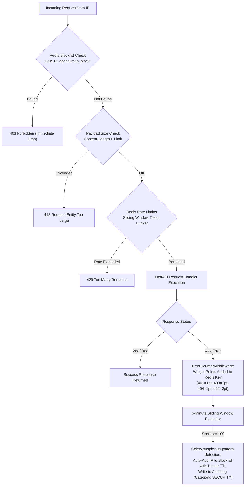
```mermaid
flowchart TD
    Req["Incoming Request from IP"] --> BlockCheck{"Redis Blocklist Check<br/>EXISTS agentium:ip_block:<ip>"}
    BlockCheck -->|Found| Dropped["403 Forbidden (Immediate Drop)"]
    
    BlockCheck -->|Not Found| SizeCheck{"Payload Size Check<br/>Content-Length > Limit"}
    SizeCheck -->|Exceeded| TooLarge["413 Request Entity Too Large"]
    
    SizeCheck -->|OK| RateCheck{"Redis Rate Limiter<br/>Sliding Window Token Bucket"}
    RateCheck -->|Rate Exceeded| Throttled["429 Too Many Requests"]
    
    RateCheck -->|Permitted| App["FastAPI Request Handler Execution"]
    App --> Resp{"Response Status"}
    
    Resp -->|2xx / 3xx| Normal["Success Response Returned"]
    Resp -->|4xx Error| ErrorTrack["ErrorCounterMiddleware:<br/>Weight Points Added to Redis Key<br/>(401=1pt, 403=2pt, 404=1pt, 422=2pt)"]
    
    ErrorTrack --> Window["5-Minute Sliding Window Evaluator"]
    Window -->|Score >= 100| AutoBlock["Celery suspicious-pattern-detection:<br/>Auto-Add IP to Blocklist with 1-Hour TTL<br/>Write to AuditLog (Category: SECURITY)"]
```

---

### 10.2 Role-Based Access Control (RBAC) & Observer Enforcement

The system implements four user roles tracked in [user.py](file:///e:/Ongoing%20Projects/Agentium/backend/models/entities/user.py):

1. **`sovereign` (Super-Admin):** Complete system authority; can create users, modify constitutional parameters, override council votes, and configure infrastructure credentials.
2. **`admin`:** Can manage agents, create workflows, inspect system monitoring dashboards, and configure channels.
3. **`member`:** Can submit tasks, converse with agents, and participate in delegated votes.
4. **`observer`:** Strictly read-only access enforced by `ObserverReadOnlyMiddleware`. Any attempt to trigger state-mutating requests (`POST`, `PUT`, `DELETE`, `PATCH`) is rejected with `403 Forbidden`.

---

### 10.3 Zero-Touch Operations (ZTO) & Anomaly Detection

System reliability is continuously validated by automated background services:

- **Z-Score Anomaly Detection:** The `anomaly_detection` periodic task samples request latencies and error rates every 5 minutes. If metrics deviate by $\mathbf{Z > 2.5}$ from the rolling mean, an anomaly event is broadcast over WebSockets and logged to the `AuditLog`.
- **Reasoning Watchdog:** Scans active agent reasoning traces. If an agent is trapped in repetitive output or stalls for $> 60$ seconds, the watchdog triggers ethos compression, truncates the reasoning loop, and prompts the agent to attempt recovery.
- **Reincarnation Engine:** If a worker process terminates abruptly while executing a task, the `crash-detection` task identifies the stale heartbeat, restores the agent's memory and ethos from the latest checkpoint in PostgreSQL, and re-dispatches the task.

---

## 11. Complete Directory Structure & Repository Map

```
agentium/
├── ARCHITECTURE.md                  # Master Architectural Reference (This document)
├── CONTRIBUTING.md                  # Contributor and developer onboarding guidelines
├── LICENSE                          # Open Source License (Apache 2.0)
├── Makefile                         # Common developer automation commands
├── README.md                        # Project overview and quick start guide
├── docker-compose.yml               # Production multi-container composition
├── docker-compose.test.yml          # Ephemeral test stack composition
├── docker-compose.remote-executor.yml # Hardened sandboxed execution container
├── nginx.conf                       # Production reverse proxy configuration
│
├── backend/                         # Core Python / FastAPI Application
│   ├── main.py                      # Application entry point, lifespan, & router registration
│   ├── celery_app.py                # Celery configuration & 34 beat schedules
│   ├── alembic.ini                  # Database migration configuration
│   ├── requirements.txt             # Production dependencies
│   ├── requirements-dev.txt         # Testing and development dependencies
│   │
│   ├── alembic/                     # Database migrations
│   │   ├── env.py                   # Migration environment setup
│   │   └── versions/                # Versioned SQL migration scripts
│   │
│   ├── api/                         # Presentation Layer (FastAPI Routers)
│   │   ├── routes/                  # 47 Modular API route controllers
│   │   │   ├── ab_testing.py        # Model and prompt A/B testing endpoints
│   │   │   ├── admin.py             # Administrative configuration routes
│   │   │   ├── agents.py            # Agent query and management routes
│   │   │   ├── api_keys.py          # Provider API key management
│   │   │   ├── audio.py             # Audio upload and transcription
│   │   │   ├── audit_routes.py      # Sovereign audit log queries
│   │   │   ├── auth.py              # User registration, login, JWT token issuance
│   │   │   ├── browser.py           # Playwright live streaming endpoints
│   │   │   ├── capability_routes.py # Tier-based permission queries
│   │   │   ├── channels.py          # External communication channel configuration
│   │   │   ├── chat.py              # Conversational chat APIs
│   │   │   ├── checkpoints.py       # Agent memory state checkpoints
│   │   │   ├── constitution.py      # Constitution viewing and amendment proposals
│   │   │   ├── critics.py           # Critic review inspection endpoints
│   │   │   ├── dashboard.py         # Primary administrative dashboard stats
│   │   │   ├── events.py            # Event trigger management
│   │   │   ├── federation.py        # Peer-to-peer instance federation
│   │   │   ├── files.py             # File uploads and downloads (S3/local)
│   │   │   ├── genesis.py           # First-boot Genesis Protocol controller
│   │   │   ├── improvements.py      # Self-improvement learning metrics
│   │   │   ├── inbox.py             # External inbound message routing
│   │   │   ├── knowledge.py         # Knowledge base curation and queries
│   │   │   ├── lifecycle_routes.py  # Agent state lifecycle transitions
│   │   │   ├── mcp_tools.py         # Model Context Protocol tools router
│   │   │   ├── mobile.py            # Mobile client API (FCM/APNs/Delta sync)
│   │   │   ├── models.py            # LLM provider configuration
│   │   │   ├── monitoring_routes.py # System metrics, health, and logs
│   │   │   ├── outbound_webhooks.py # Outbound event webhook dispatchers
│   │   │   ├── plugins.py           # Third-party plugin manager
│   │   │   ├── provider_analytics.py# Provider latency, cost, and usage stats
│   │   │   ├── rbac.py              # User roles and permissions
│   │   │   ├── reassign_routes.py   # Task reassignment controllers
│   │   │   ├── remote_executor.py   # Sandboxed code execution gateway
│   │   │   ├── scaling.py           # Predictive scaling dashboard APIs
│   │   │   ├── scheduled_tasks.py   # Scheduled task dispatch endpoints
│   │   │   ├── skills.py            # Skill registry and playbook management
│   │   │   ├── tasks.py             # Core task intake and execution APIs
│   │   │   ├── tool_creation.py     # Runtime dynamic tool creation
│   │   │   ├── tools.py             # Tool discovery and registry APIs
│   │   │   ├── user_preferences.py  # User settings and personalized preferences
│   │   │   ├── users.py             # User account management
│   │   │   ├── voice.py             # Voice token and command gateway
│   │   │   ├── voting.py            # Council voting and ballot APIs
│   │   │   ├── wait_poll.py         # Workflow wait-and-poll evaluation
│   │   │   ├── webhooks.py          # Inbound webhook intake
│   │   │   ├── websocket.py         # WebSocket connection manager & hub
│   │   │   └── workflows.py         # DAG workflow definition and executions
│   │   ├── dependencies/            # FastAPI route dependency injection
│   │   └── schemas/                 # Pydantic 2 request and response contracts
│   │
│   ├── core/                        # System Foundation & Middlewares
│   │   ├── auth.py                  # JWT decoding, password hashing, user context
│   │   ├── chunking.py              # Document chunking for vector ingestion
│   │   ├── config.py                # Pydantic BaseSettings environment loader
│   │   ├── constitutional_guard.py  # Two-tier constitutional enforcement engine
│   │   ├── database.py              # SQLAlchemy 2 engine, SessionLocal, healthcheck
│   │   ├── error_responses.py       # RFC 7807 standardized error handlers
│   │   ├── exceptions.py            # Typed domain HTTP exceptions
│   │   ├── llm_client.py            # Provider-agnostic LLM interface
│   │   ├── middleware.py            # Redis RateLimitMiddleware
│   │   ├── observer_middleware.py   # Read-only observer enforcement gate
│   │   ├── security_checks.py       # Startup credential and configuration checks
│   │   ├── security_middleware.py   # DDoS, payload size, session, & error counter
│   │   ├── timing_middleware.py     # Performance timing regression gate
│   │   ├── tool_registry.py         # Central tool registry
│   │   └── vector_store.py          # ChromaDB vector store client
│   │
│   ├── models/                      # Persistence Domain Models
│   │   ├── database.py              # Database engine setup and session helper
│   │   └── entities/                # 40+ SQLAlchemy ORM model entities
│   │       ├── agents.py            # Agent models, status enums, tier definitions
│   │       ├── audit.py             # Tamper-evident AuditLog entity
│   │       ├── channels.py          # External channel credentials & configs
│   │       ├── constitution.py      # Constitution articles, versions, rules
│   │       ├── critics.py           # Critic review verdicts and review records
│   │       ├── remote_execution.py  # Sandboxed execution logs and outcomes
│   │       ├── scheduled_task.py    # Scheduled task execution definitions
│   │       ├── task.py              # Tasks, dependencies, priorities, status
│   │       ├── user.py              # Users, authentication, roles (RBAC)
│   │       ├── voting.py            # Legislative ballots, votes, quorum checks
│   │       └── workflow.py          # Workflow definitions, steps, executions
│   │
│   ├── services/                    # Business Logic Layer (85+ modules)
│   │   ├── agent_orchestrator.py    # Central routing coordinator & circuit breakers
│   │   ├── api_manager.py           # Multi-provider LLM interface
│   │   ├── auto_delegation_service.py # Complexity scoring (1–10) & routing
│   │   ├── browser_service.py       # Playwright browser controller
│   │   ├── capability_registry.py   # Runtime tier-based permission checker
│   │   ├── channel_manager.py       # Unified multi-channel routing mesh
│   │   ├── citation_graph_service.py# Cross-document citation graph BFS
│   │   ├── critic_agents.py         # Independent Judiciary critic service
│   │   ├── idle_governance.py       # Council idle background patrol engine
│   │   ├── knowledge_service.py     # RAG pipeline and vector curation
│   │   ├── mcp_tool_bridge.py       # Model Context Protocol integration
│   │   ├── model_allocation.py      # Automatic model-to-tier assigner
│   │   ├── persistent_council.py    # Persistent Council management
│   │   ├── push_notification_service.py # FCM & APNs push notification dispatcher
│   │   ├── reincarnation_service.py # Crash detection and state checkpoint recovery
│   │   ├── storage_service.py       # S3 primary / local disk fallback storage
│   │   ├── token_optimizer.py       # Token consumption & daily budget tracking
│   │   ├── tool_creation_service.py # Autonomous tool generation & test harness
│   │   └── workflow_engine.py       # DAG workflow execution state machine
│   │
│   └── tools/                       # 33 Built-in Tool Implementations
│       ├── browser_router.py        # Playwright vs Nodriver router
│       ├── desktop_tool.py          # Mouse, keyboard, screenshot automation
│       ├── host_os_tool.py          # System shell command execution
│       ├── nodriver_tool.py         # Bot-detection bypass browser
│       └── web_search_tool.py       # Multi-provider web search
│
├── frontend/                        # React 18 + Vite + TypeScript Client SPA
│   ├── package.json                 # Frontend dependencies and scripts
│   ├── vite.config.ts               # Vite bundler configuration
│   └── src/
│       ├── App.tsx                  # Root routing & dynamic page loading
│       ├── components/              # Modular UI components & design system
│       │   ├── layout/              # MainLayout, Sidebar, Header, Navigation
│       │   ├── ui/                  # Accessible design tokens & UI components
│       │   ├── AgentTree.tsx        # Live interactive agent hierarchy tree
│       │   ├── BrowserTaskViewer.tsx# Live Playwright viewport stream viewer
│       │   └── ChatWindow.tsx       # Conversational agent chat window
│       ├── pages/                   # 27 Route-Level Administrative Views
│       │   ├── ABTestingPage.tsx    # Model & prompt A/B testing
│       │   ├── AgentsPage.tsx       # Agent fleet management & status
│       │   ├── ChannelsPage.tsx     # 12-channel integration dashboard
│       │   ├── ChatPage.tsx         # Multi-agent conversation view
│       │   ├── ConstitutionPage.tsx # Constitution articles & amendment ballots
│       │   ├── Dashboard.tsx        # Executive summary dashboard
│       │   ├── DeveloperPortalPage.tsx # Developer API keys & documentation
│       │   ├── FederationPage.tsx   # Cross-instance peer federation
│       │   ├── LearningImpactDashboard.tsx # Learning & RAG impact metrics
│       │   ├── LoginPage.tsx        # User authentication
│       │   ├── MessageLogPage.tsx   # Communication message audit logs
│       │   ├── MobilePage.tsx       # Mobile device management & sync status
│       │   ├── ModelsPage.tsx       # LLM provider configuration & API keys
│       │   ├── MonitoringPage.tsx   # Realtime ZTO observability & metrics
│       │   ├── RBACManagement.tsx   # Role-based access control editor
│       │   ├── ScalingDashboard.tsx # Predictive auto-scaling monitor
│       │   ├── SettingsPage.tsx     # System settings & preferences
│       │   ├── SignupPage.tsx       # Account registration
│       │   ├── SkillsPage.tsx       # Skill catalog & playbook viewer
│       │   ├── SovereignDashboard.tsx # Executive sovereign control view
│       │   ├── TasksPage.tsx        # Task management, intake, and status
│       │   ├── ToolMarketplacePage.tsx # Tool catalog and dynamic factory
│       │   ├── Usermanagement.tsx   # User directory and permissions
│       │   ├── VotingPage.tsx       # Legislative Council voting floor
│       │   ├── WebhookManagementPage.tsx # Outbound webhook management
│       │   ├── WorkflowDesignerPage.tsx # Visual DAG workflow builder
│       │   └── WorkflowsPage.tsx    # Workflow execution monitoring
│       └── store/                   # Zustand global state stores
│           ├── authStore.ts         # User authentication & tokens
│           └── websocketStore.ts    # WebSocket connection & event streams
│
├── bridges/                         # External Bridge Microservices
│   └── whatsapp/                    # WhatsApp Web Baileys Bridge
│       ├── Dockerfile               # Node.js container build file
│       ├── package.json             # Baileys dependencies
│       └── src/index.ts             # WebSocket bridge server
│
├── voice-bridge/                    # Host-Level Voice Service
│   ├── main.py                      # Voice bridge entry point & WebSocket client
│   ├── wake_word.py                 # OpenWakeWord engine
│   ├── vad.py                       # Silero Voice Activity Detection
│   ├── audio_source.py              # PyAudio microphone stream capture
│   ├── tts_engine.py                # Neural TTS playback engine
│   ├── run_voice_ui.py              # Desktop voice UI helper
│   └── install.sh                   # Linux/macOS installation script
│
├── mobile/                          # Mobile Client Applications
│   ├── android/                     # Native Android Client (Kotlin / Compose)
│   └── ios/                         # Native iOS Client (Swift / SwiftUI)
│
├── sdk/                             # Software Development Kits
│   ├── python/                      # Official Python SDK (`agentium_sdk`)
│   │   ├── pyproject.toml           # Package configuration
│   │   └── agentium_sdk/            # Client library
│   └── typescript/                  # Official TypeScript SDK (`@agentium/sdk`)
│       ├── package.json             # NPM package configuration
│       └── src/                     # Client library & auto-generated types
│
├── docs/                            # Documentation
│   ├── adr/                         # Architecture Decision Records
│   │   ├── 001-dual-storage.md
│   │   ├── 002-constitutional-guard-two-tier.md
│   │   ├── 003-celery-over-asyncio.md
│   │   ├── 004-agent-id-numbering.md
│   │   ├── 005-rag-decay-scoring.md
│   │   ├── 009-error-response-standardization.md
│   │   └── 021-embedding-model-migration.md
│   ├── documents/                   # In-depth architectural guides
│   │   ├── TODO.md                  # Comprehensive implementation roadmap
│   │   ├── agentium_guide.md        # User and operator handbook
│   │   ├── architectural_breakdown.md # Detailed subsystem specifications
│   │   ├── folder_structure.md      # Detailed repository layout
│   │   ├── selfhost.md              # Self-hosting deployment instructions
│   │   ├── tool_and_skill_creation.md # Guide to extending tools & skills
│   │   └── voice-bridge-setup.md    # Voice bridge configuration guide
│   └── ALEMBIC_MIGRATIONS.md        # Database migration guidelines
│
└── tests/                           # Test Suites
    ├── api/                         # API route integration tests
    ├── integration/                 # End-to-end multi-agent governance tests
    ├── services/                    # Core business logic unit tests
    ├── tasks/                       # Celery worker task tests
    └── unit/                        # Unit tests
```

---

## 12. Accessibility, Quality & CI Gates

Agentium enforces automated quality and accessibility gates to prevent regressions across its web interfaces:

### 12.1 Fast Pull Request Gate (`frontend-a11y.yml`)
- **Trigger:** Any push or PR affecting `frontend/**`.
- **Scope:** Component-level tests (`src/components/**/*.a11y.browser.test.tsx`) executed via Vitest and Playwright Chromium.
- **Execution Time:** ~2 minutes.
- **Purpose:** Rapidly detects keyboard navigation traps, missing ARIA attributes, and structural HTML violations before merge.

### 12.2 Deep Integration Merge Gate (`integration-a11y.yml`)
- **Trigger:** Pull request merge to `main` or `develop`.
- **Scope:** Full stack integration across all **27 route-level pages** (`src/pages/*.a11y.browser.test.tsx`) tested against live backend data across **both Dark and Light themes** (54 comprehensive test cases).
- **Execution Time:** ~8 minutes.
- **Purpose:** Detects computed color-contrast regressions (via `axe-core`) across real tables, status badges, and dynamic charts rendered with live backend responses.

### 12.3 Automated Performance Regression Gate
- Managed by `TimingMiddleware` in [timing_middleware.py](file:///e:/Ongoing%20Projects/Agentium/backend/core/timing_middleware.py).
- Captures millisecond-level execution latencies across all 47 route modules.
- Generates automatic slow-query alerts and audit entries whenever API latencies exceed defined performance budgets.

---

*Agentium Architecture Specification · Version `v0.21.0-beta`*  
*Verified and Aligned with the Active Codebase Repository*
