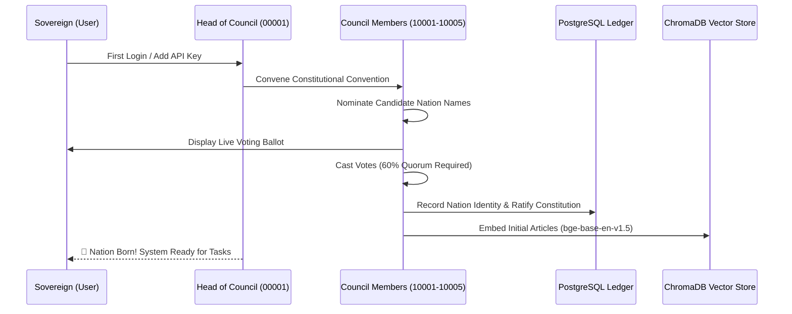
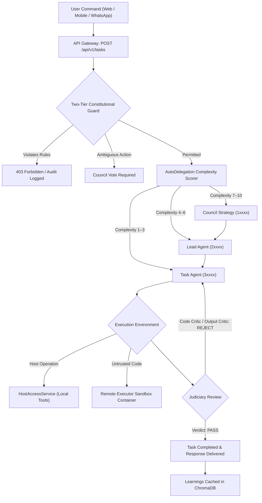

# Navigating the Agentium Stack: The Definitive Operator & Citizen Guide

> **Official Guide to the Sovereign AI Nation**  
> **Version:** `v0.21.0-beta`  
> **Audience:** Operators, Developers, and Sovereign Administrators  

---

## Table of Contents

1. [Introduction: The Vision of a Sovereign AI Nation](#1-introduction-the-vision-of-a-sovereign-ai-nation)
   - [1.1 The Problem with Monolithic AI](#11-the-problem-with-monolithic-ai)
   - [1.2 The AI Nation Philosophy](#12-the-ai-nation-philosophy)
   - [1.3 Core Tenets of Knowledge Sovereignty](#13-core-tenets-of-knowledge-sovereignty)
2. [Quickstart & The Genesis Protocol](#2-quickstart--the-genesis-protocol)
   - [2.1 Deploying the Stack](#21-deploying-the-stack)
   - [2.2 Initial Login & Credentials](#22-initial-login--credentials)
   - [2.3 The Genesis Protocol (First Boot Ritual)](#23-the-genesis-protocol-first-boot-ritual)
   - [2.4 Adding API Keys & Auto-Configuring Models](#24-adding-api-keys--auto-configuring-models)
3. [The Governance Layer: The Parliamentary Hierarchy](#3-the-governance-layer-the-parliamentary-hierarchy)
   - [3.1 The 4 Administrative Tiers](#31-the-4-administrative-tiers)
   - [3.2 The Independent Judiciary (Critic Agents 7xxxx–9xxxx)](#32-the-independent-judiciary-critic-agents-7xxxx9xxxx)
   - [3.3 Democratic Voting & Quorum Rules](#33-democratic-voting--quorum-rules)
   - [3.4 Cognitive Discipline & The Ethos System](#34-cognitive-discipline--the-ethos-system)
4. [The Interface Layer: Portals to the Nation](#4-the-interface-layer-portals-to-the-nation)
   - [4.1 The Web Dashboard (React 18 + Vite)](#41-the-web-dashboard-react-18--vite)
   - [4.2 The 12 External Communication Channels](#42-the-12-external-communication-channels)
   - [4.3 Native Mobile Clients (Android & iOS)](#43-native-mobile-clients-android--ios)
   - [4.4 The Voice Bridge (STT, TTS, Wake-Word)](#44-the-voice-bridge-stt-tts-wake-word)
5. [Task Lifecycle: How Work Gets Done](#5-task-lifecycle-how-work-gets-done)
   - [5.1 Intake & Complexity Scoring (Auto-Delegation 1–10)](#51-intake--complexity-scoring-auto-delegation-110)
   - [5.2 Two-Tier Constitutional Guard Inspection](#52-two-tier-constitutional-guard-inspection)
   - [5.3 Execution: Host Tools vs. Sandboxed Remote Executor](#53-execution-host-tools-vs-sandboxed-remote-executor)
   - [5.4 Judicial Critique, Retries & Escalation](#54-judicial-critique-retries--escalation)
   - [5.5 Knowledge Extraction & Memory Decay](#55-knowledge-extraction--memory-decay)
6. [Extending the Nation: Tools, MCP & Skills](#6-extending-the-nation-tools-mcp--skills)
   - [6.1 The 33 Built-in System Tools](#61-the-33-built-in-system-tools)
   - [6.2 The Dynamic Tool Creation Factory](#62-the-dynamic-tool-creation-factory)
   - [6.3 Model Context Protocol (MCP) Tool Integration](#63-model-context-protocol-mcp-tool-integration)
   - [6.4 Folder-Based Skills (`.agentium/skills`)](#64-folder-based-skills-agentiumskills)
7. [System Resilience & Zero-Touch Operations](#7-system-resilience--zero-touch-operations)
   - [7.1 Automated Reincarnation & Crash Recovery](#71-automated-reincarnation--crash-recovery)
   - [7.2 Application-Layer DDoS Defense](#72-application-layer-ddos-defense)
   - [7.3 Celery Periodic Patrol Fleet (34 Tasks)](#73-celery-periodic-patrol-fleet-34-tasks)
8. [Conclusion: The Cohesive Ecosystem](#8-conclusion-the-cohesive-ecosystem)

---

## 1. Introduction: The Vision of a Sovereign AI Nation

### 1.1 The Problem with Monolithic AI

Mainstream artificial intelligence products force users into a centralized, black-box paradigm. In traditional setups:
- Single models operate without checks or balances.
- Prompts, internal reasoning, and corporate proprietary data are shipped to opaque third-party cloud servers.
- When an assistant hallucinates or takes destructive actions, there is no audit log, no constitutional boundaries, and no democratic remediation.

### 1.2 The AI Nation Philosophy

**Agentium** fundamentally redesigns AI task execution by treating orchestration as a **sovereign digital democracy**:
- Up to **99,999 AI agents** act as specialized *citizens* of the nation.
- Up to **9,999 concurrent tasks** are processed simultaneously without state collision.
- The human user is the **Sovereign** — the supreme executive authority.
- The agents operate under a written, codified **Constitution** enforced by deterministic code and semantic vector checks.
- Major decisions (allocating budgets, modifying constitutional articles, liquidating rogue agents) require **Council votes** with a 60% quorum.

### 1.3 Core Tenets of Knowledge Sovereignty

1. **Docker-First & Local-First:** The entire stack runs on your own hardware (local PC, private server, or air-gapped private cloud).
2. **Dual-Backend Storage:** Relational truth is retained in PostgreSQL; vector embeddings in ChromaDB; artifacts in S3/MinIO or local persistent storage.
3. **Channel Agnosticism:** Whether you issue a command via WhatsApp, Slack, voice command, or the web dashboard, the conversation state is unified, auditable, and sovereign.

---

## 2. Quickstart & The Genesis Protocol

### 2.1 Deploying the Stack

Agentium is containerized with Docker Compose. Ensure you have Docker Desktop or Docker Engine installed with at least 8 GB RAM (16 GB recommended).

```bash
# 1. Clone the repository
git clone https://github.com/AshminDhungana/Agentium.git
cd Agentium

# 2. Launch the container stack in detached mode
docker compose up -d

# 3. Monitor initialization logs
docker compose logs -f backend
```

Once the logs display `🎉 Agentium startup complete!`, open your browser to **`http://localhost:3000`**.

### 2.2 Initial Login & Credentials

Upon fresh installation, the system bootstraps a default sovereign administrator:
- **URL:** `http://localhost:3000`
- **Username:** `admin`
- **Password:** `admin`

> [!TIP]
> After logging in, immediately navigate to the **Settings Page** (`/settings`) to update your password and generate administrative API keys.

---

### 2.3 The Genesis Protocol (First Boot Ritual)

When you first launch Agentium, the **Genesis Protocol** initiates automatically:
1. The **Head of Council** (Agent `00001`) awakens and establishes contact.
2. The foundational **Persistent Council Members** are created (`10001`–`10005`).
3. The Council presents candidate names for your new AI Nation.
4. An inaugural Council vote takes place in real time on your dashboard.
5. The winning name is recorded into the PostgreSQL database, the fallback Constitution is ratified, and the AI Nation becomes operational!



---

### 2.4 Adding API Keys & Auto-Configuring Models

To grant your agents reasoning capabilities:
1. Navigate to the **Models Page** (`/models`).
2. Select your preferred provider (**OpenAI**, **Anthropic**, **Groq**, **Google GenAI**, or **Ollama** for local air-gapped execution).
3. Enter your API key and click **Save & Test Connection**.
4. The system automatically assigns your active configuration to the **Head of Council** (`00001`) and sets up default routing for task workers.

---

## 3. The Governance Layer: The Parliamentary Hierarchy

### 3.1 The 4 Administrative Tiers

Agentium identifies every agent with an immutable 5-digit ID that determines its authority:

```
[0xxxx] Executive Tier (Head of Council: 00001)
   │
   ├── [1xxxx] Legislative Tier (Council Members: 10001–19999)
   │      │
   │      └── [2xxxx] Management Tier (Lead Agents: 20001–29999)
   │             │
   │             └── [3xxxx–6xxxx] Execution Tier (Task Agents: 30001–69999)
   │
   └── [7xxxx–9xxxx] Independent Judiciary (Critic Agents)
```

1. **Tier 0: Executive (`0xxxx`):** Led by the `Head of Council` (`00001`). Holds emergency veto authority, triggers system-wide shutdowns if compromised, and represents the Sovereign user.
2. **Tier 1: Legislative (`1xxxx`):** The Council. Proposes constitutional amendments, allocates daily token budgets, audits system activity, and moderates knowledge submissions.
3. **Tier 2: Management (`2xxxx`):** Lead Agents. Breaks down large goals into execution DAGs, requests resource allocations, and spawns Task Agents.
4. **Tier 3: Execution (`3xxxx`–`6xxxx`):** Task Agents. The workforce that executes bash scripts, writes Python code, performs RAG retrieval, queries databases, and browses the web.

---

### 3.2 The Independent Judiciary (Critic Agents `7xxxx`–`9xxxx`)

Unlike conventional multi-agent systems where workers grade their own work, Agentium separates execution from evaluation:

- **Plan Critic (`9xxxx`):** Reviews execution DAGs *before* work starts. Checks for cyclical deadlocks, missing steps, and unreasonable resource limits.
- **Code Critic (`7xxxx`):** Inspects generated code for AST security vulnerabilities, syntax errors, and injection risks.
- **Output Critic (`8xxxx`):** Evaluates completed task outputs against the Sovereign's original prompt and formal acceptance criteria.

Critics can issue three binding verdicts:
1. **`PASS`:** The artifact is certified and returned to the caller.
2. **`REJECT`:** The artifact is returned to the worker with critique instructions (up to 3 retries).
3. **`ESCALATE`:** When retries fail, work is escalated to the supervising Lead Agent or the human Sovereign.

---

### 3.3 Democratic Voting & Quorum Rules

Major actions within the AI Nation cannot be taken unilaterally:
- **Constitutional Amendments:** Require a formal proposal, a 24-hour deliberation window, and a **60% supermajority vote** by the Council.
- **Agent Liquidation:** If an agent consistently violates rules or remains idle for $> 7$ days, the Council votes to liquidate the agent and reassign its tasks.
- **Resource Reallocation:** Budget increases across departments require legislative allocation.

---

### 3.4 Cognitive Discipline & The Ethos System

To prevent context bloat and hallucination accumulation:
- Every agent maintains a compressed working memory profile called its **Ethos**.
- **Before Task Execution:** The agent reads its minimal ethos from the PostgreSQL database.
- **During Task Execution:** The agent updates its reasoning scratchpad.
- **Post-Task Completion:** The orchestrator compresses the learnings, discards ephemeral conversational debris, and saves the updated ethos.

---

## 4. The Interface Layer: Portals to the Nation

### 4.1 The Web Dashboard (React 18 + Vite)

The primary graphical command center runs at `http://localhost:3000` with 27 interactive views:
- **Agent Tree (`/agents`):** Live hierarchy visualization showing real-time agent states, health rings, and current task assignments.
- **Voting Floor (`/voting`):** Active legislative ballots where sovereign users can vote or observe Council tallies.
- **Constitution Editor (`/constitution`):** View active constitutional articles, proposed amendments, and historical revisions.
- **Monitoring & ZTO (`/monitoring`):** Zero-Touch Operations telemetry displaying request latencies, token consumption, and system health.
- **Browser Task Viewer:** Watch Playwright and stealth Chromium instances browse the web in real-time via streaming base64 screenshots.

---

### 4.2 The 12 External Communication Channels

Connect your AI Nation to your everyday communication apps via [channel_manager.py](file:///e:/Ongoing%20Projects/Agentium/backend/services/channel_manager.py):

| Channel | Setup Location | Highlights |
|:--------|:---------------|:-----------|
| **WhatsApp** | `/channels` $\to$ WhatsApp | Built-in Baileys bridge; scan the QR code to chat with your Nation. |
| **Telegram** | `/channels` $\to$ Telegram | Paste your bot token from `@BotFather`; supports inline buttons and commands. |
| **Slack** | `/channels` $\to$ Slack | Configure Webhook and App Token; thread-scoped conversational memory. |
| **Discord** | `/channels` $\to$ Discord | Add bot token; listens in specific server channels or DMs. |
| **Signal** | `/channels` $\to$ Signal | E2E encrypted sovereign communication using `signal-cli`. |
| **Email** | `/channels` $\to$ Email | Configure IMAP/SMTP; send tasks by email and receive formatted reports. |
| **Teams, Google Chat, Matrix, iMessage, Zalo, SMS (Twilio)** | `/channels` | Modular webhook and API connectors. |

---

### 4.3 Native Mobile Clients (Android & iOS)

Agentium features native mobile client architectures in [mobile/](file:///e:/Ongoing%20Projects/Agentium/mobile):
- **Android (Kotlin + Jetpack Compose):** Push notifications via Firebase Cloud Messaging (FCM), on-device voice transcription, and offline caching with Room DB.
- **iOS (Swift + SwiftUI):** Apple Push Notification service (APNs), biometric auth via Keychain, and offline caching with Core Data.
- **Offline Delta Sync:** Queue commands offline; the app automatically syncs via `POST /api/v1/mobile/offline/sync` when reconnected.

---

### 4.4 The Voice Bridge (STT, TTS, Wake-Word)

Agentium includes a native voice bridge in [voice-bridge/](file:///e:/Ongoing%20Projects/Agentium/voice-bridge):
- **Wake-Word Detection:** Say *"Hey Agentium"* to activate voice listening (powered by `openWakeWord`).
- **Voice Activity Detection (VAD):** Automatically detects speech boundaries with Silero VAD.
- **Speech-to-Text (STT):** Ultra-fast local transcription with `whisper.cpp` or high-accuracy cloud transcription via OpenAI Whisper.
- **Text-to-Speech (TTS):** Natural speech feedback using local Piper neural voices or cloud TTS.

---

## 5. Task Lifecycle: How Work Gets Done



---

### 5.1 Intake & Complexity Scoring (Auto-Delegation 1–10)

When a task enters the system, `AutoDelegationService` analyzes its scope and assigns a complexity score from 1 to 10:
- **Score 1–3 (Simple):** Dispatched directly to a specialized Task Agent (`3xxxx`).
- **Score 4–6 (Moderate):** Assigned to a Lead Agent (`2xxxx`) who constructs a small execution tree.
- **Score 7–10 (Complex / Architectural):** Escalated to the Council (`1xxxx`) for deliberative multi-agent decomposition.

### 5.2 Two-Tier Constitutional Guard Inspection

Before an agent executes any tool or command, the `ConstitutionalGuard` runs:
1. **Tier 1 (Deterministic):** Regex check against banned commands (e.g. `rm -rf /`, `DROP DATABASE`) and capability permissions.
2. **Tier 2 (Semantic):** ChromaDB vector similarity query against constitutional articles. If the action contradicts constitutional spirit, it is blocked or held for Council review.

### 5.3 Execution: Host Tools vs. Sandboxed Remote Executor

- **Host Access:** Authorized agents can interact with local files and run system commands via [host_os_tool.py](file:///e:/Ongoing%20Projects/Agentium/backend/tools/host_os_tool.py).
- **Sandboxed Execution:** Untrusted code runs in the `agentium-remote-executor` Docker container with dropped Linux capabilities, zero network access, and memory-backed temporary storage.

### 5.4 Judicial Critique, Retries & Escalation

Artifacts (code, plans, reports) must pass independent Critic inspection:
- If rejected, the critic provides line-by-line feedback.
- The worker agent corrects the errors and resubmits.
- If 3 retries fail, the task escalates to human-in-the-loop review.

### 5.5 Knowledge Extraction & Memory Decay

Upon task success:
- High-value learnings and code snippets are vectorized and indexed into the ChromaDB `task_learnings` collection.
- An automated weekly decay algorithm reduces the weight of stale learnings over time to keep RAG queries fast and accurate.

---

## 6. Extending the Nation: Tools, MCP & Skills

### 6.1 The 33 Built-in System Tools

Located in [backend/tools/](file:///e:/Ongoing%20Projects/Agentium/backend/tools), agents have native access to:
- **Web & Scraping:** `web_search_tool`, `web_crawler_tool`, `web_fetch_tool`, `browser_tool`, `nodriver_tool`.
- **System & Automation:** `host_os_tool`, `desktop_tool`, `shell_tool`, `file_tool`, `text_editor_tool`.
- **Coding & Execution:** `code_analyzer_tool`, `code_execution_tool`, `git_tool`, `remote_exec_tool`.
- **Governance & State:** `governance_tool`, `task_management_tool`, `vector_db_tool`, `ethos_tool`.

### 6.2 The Dynamic Tool Creation Factory

Need a tool that doesn't exist yet?
1. An agent can request a new tool via `ToolCreationService`.
2. The factory generates the Python code and test harness.
3. Tests are executed inside the isolated `agentium-remote-executor` container.
4. The **Code Critic** audits the code for security vulnerabilities.
5. Upon approval, the tool is dynamically added to the live `ToolRegistry` and published to the Tool Marketplace!

### 6.3 Model Context Protocol (MCP) Tool Integration

Agentium natively supports Anthropic's Model Context Protocol (MCP):
- Connect any MCP server via JSON-RPC.
- MCP tools are governed by the Council and require approval before registration.
- Telemetry, error rates, and latencies are tracked and displayed in real time.

### 6.4 Folder-Based Skills (`.agentium/skills`)

Create modular, reusable agent playbooks by dropping markdown skills into `.agentium/skills/`:
- Each skill includes instructions and metadata in a `SKILL.md` file.
- The system embeds and discovers skills using vector semantic search (`skill_rag.py`).

---

## 7. System Resilience & Zero-Touch Operations

### 7.1 Automated Reincarnation & Crash Recovery

If a server reboot or container crash interrupts an active agent:
1. Celery beat's `crash-detection` identifies the stalled heartbeat within 30 seconds.
2. The `ReincarnationService` loads the agent's memory and ethos from the latest PostgreSQL checkpoint.
3. A replacement agent is spawned, assigned the original ID, and resumes the task without data loss!

### 7.2 Application-Layer DDoS Defense

The system includes automated threat defense in [security_middleware.py](file:///e:/Ongoing%20Projects/Agentium/backend/core/security_middleware.py):
- **Rate Limiting:** Redis-backed sliding window token bucket.
- **Error Counting:** Malicious 4xx errors add penalty points to an IP counter.
- **Automated Blacklisting:** Reaching 100 penalty points within 5 minutes triggers an automated 1-hour IP ban enforced in $O(1)$ time at the ASGI perimeter.

### 7.3 Celery Periodic Patrol Fleet (34 Tasks)

A dedicated Celery Beat scheduler runs **34 background tasks** in [celery_app.py](file:///e:/Ongoing%20Projects/Agentium/backend/celery_app.py) to manage health checks, database pruning, anomaly detection, vector re-indexing, and auto-scaling around the clock.

---

## 8. Conclusion: The Cohesive Ecosystem

Agentium reconciles the raw capability of autonomous AI with the absolute need for human safety, data privacy, and organizational accountability. By organizing AI into a sovereign constitutional democracy, you gain the power of an entire workforce of AI agents — while maintaining total transparency, auditability, and control.

Welcome to your AI Nation.
