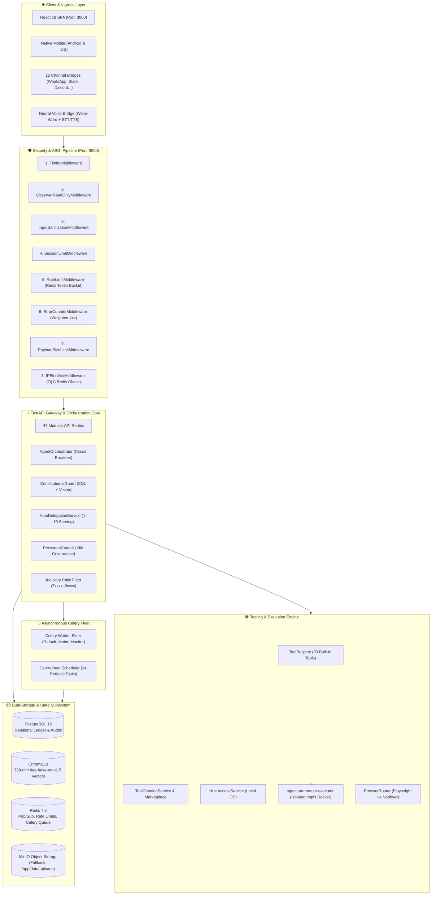
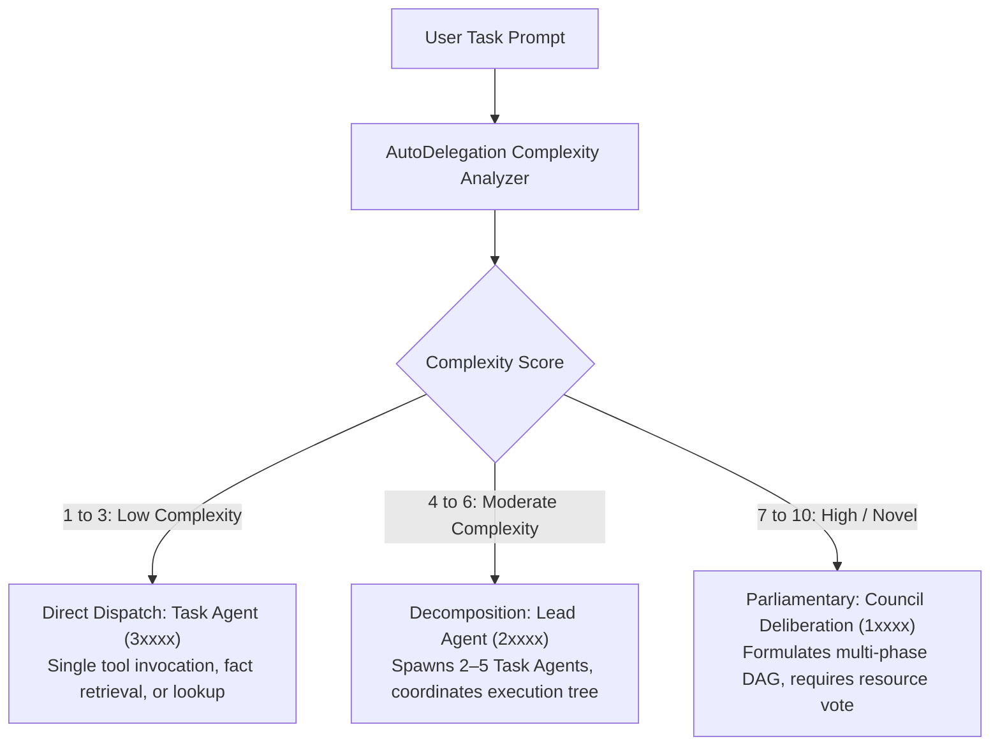
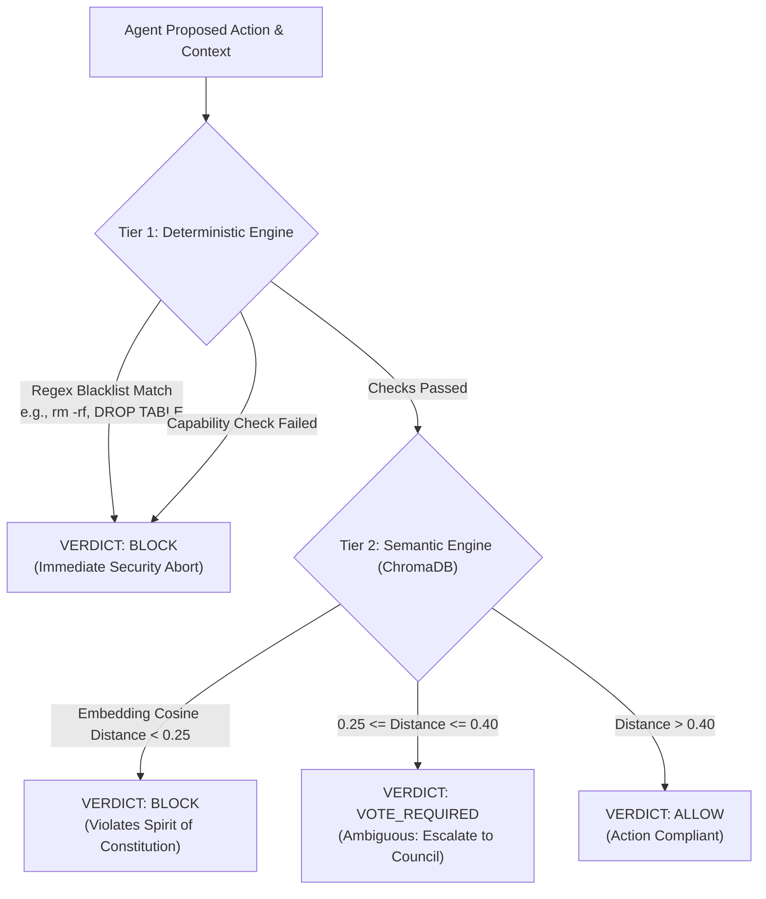
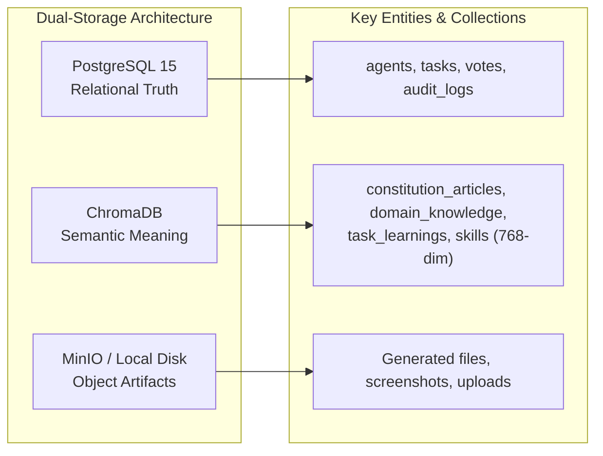
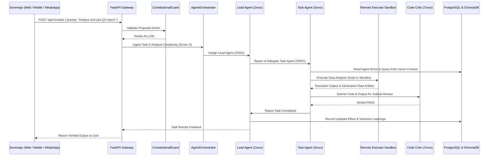

# Agentium Architectural Breakdown: Deep Technical Specification

> **Exhaustive Subsystem Engineering Breakdown for the Agentium AI Governance Platform**  
> **Target Version:** `v0.21.0-beta`  
> **Document Purpose:** Engineering Reference, Component Interaction Specifications, and System Internals  

---

## Table of Contents

1. [Architectural Foundations & System Topology](#1-architectural-foundations--system-topology)
2. [The Gateway & Security Perimeter](#2-the-gateway--security-perimeter)
   - [2.1 The 8-Layer Reverse ASGI Middleware Stack](#21-the-8-layer-reverse-asgi-middleware-stack)
   - [2.2 DDoS Hardening & Weighted Error Scoring](#22-ddos-hardening--weighted-error-scoring)
   - [2.3 Role-Based Access Control (RBAC) & Observer Enforcement](#23-role-based-access-control-rbac--observer-enforcement)
3. [The Orchestration & Control Layer](#3-the-orchestration--control-layer)
   - [3.1 The Agent Orchestrator Engine](#31-the-agent-orchestrator-engine)
   - [3.2 Complexity Scoring & Auto-Delegation Protocol](#32-complexity-scoring--auto-delegation-protocol)
   - [3.3 Per-Agent Circuit Breakers & Fault Isolation](#33-per-agent-circuit-breakers--fault-isolation)
4. [The Democratic Governance & Legal Framework](#4-the-democratic-governance--legal-framework)
   - [4.1 Hierarchical Identity Scheme (Tiers 0xxxx–9xxxx)](#41-hierarchical-identity-scheme-tiers-0xxxx9xxxx)
   - [4.2 The 26 Runtime Capabilities Matrix](#42-the-26-runtime-capabilities-matrix)
   - [4.3 Two-Tier Constitutional Guard Engine](#43-two-tier-constitutional-guard-engine)
   - [4.4 Legislative Deliberation & 60% Supermajority Voting](#44-legislative-deliberation--60-supermajority-voting)
5. [The Execution & Tooling Subsystem](#5-the-execution--tooling-subsystem)
   - [5.1 Host OS Access vs. Sandboxed Execution](#51-host-os-access-vs-sandboxed-execution)
   - [5.2 Hardened Remote Executor Container (`agentium-remote-executor`)](#52-hardened-remote-executor-container-agentium-remote-executor)
   - [5.3 Dual-Mode Browser Automation (Playwright vs. Stealth Nodriver)](#53-dual-mode-browser-automation-playwright-vs-stealth-nodriver)
   - [5.4 Autonomous Tool Creation Factory & Verification Lifecycle](#54-autonomous-tool-creation-factory--verification-lifecycle)
6. [The Dual-Storage & Semantic Memory Subsystem](#6-the-dual-storage--semantic-memory-subsystem)
   - [6.1 Relational Ledger (PostgreSQL 15)](#61-relational-ledger-postgresql-15)
   - [6.2 Vector Brain (ChromaDB + `BAAI/bge-base-en-v1.5`)](#62-vector-brain-chromadb--baaibge-base-en-v15)
   - [6.3 Temporal Decay Scoring & Citation Graph BFS Boosting](#63-temporal-decay-scoring--citation-graph-bfs-boosting)
   - [6.4 Dual-Backend Object Storage (S3/MinIO Primary with Local Fallback)](#64-dual-backend-object-storage-s3minio-primary-with-local-fallback)
7. [The Asynchronous Processing & Self-Healing Fleet](#7-the-asynchronous-processing--self-healing-fleet)
   - [7.1 Celery Queue Isolation Architecture](#71-celery-queue-isolation-architecture)
   - [7.2 The 34 Periodic Maintenance Tasks](#72-the-34-periodic-maintenance-tasks)
   - [7.3 Autonomous Reincarnation Engine & State Restoration](#73-autonomous-reincarnation-engine--state-restoration)
   - [7.4 Stalled Reasoning Watchdog & Ethos Compression](#74-stalled-reasoning-watchdog--ethos-compression)
8. [Client & Integration Layer](#8-client--integration-layer)
   - [8.1 React 18 SPA (27 Specialized Administrative Pages)](#81-react-18-spa-27-specialized-administrative-pages)
   - [8.2 Multi-Channel Communication Mesh (12 Protocols)](#82-multi-channel-communication-mesh-12-protocols)
   - [8.3 Native Mobile Synchronous Delta Protocol (Android & iOS)](#83-native-mobile-synchronous-delta-protocol-android--ios)
   - [8.4 Host-Level Neural Voice Bridge](#84-host-level-neural-voice-bridge)
9. [End-to-End Task Execution Flow](#9-end-to-end-task-execution-flow)

---

## 1. Architectural Foundations & System Topology

Agentium bridges high-capacity autonomous agent orchestration with strict democratic accountability. Designed to coordinate up to **99,999 agents** managing up to **9,999 concurrent tasks**, the system guarantees that no model operates in an unmonitored vacuum.



---

## 2. The Gateway & Security Perimeter

### 2.1 The 8-Layer Reverse ASGI Middleware Stack

FastAPI executes middleware in **reverse insertion order**. Incoming requests traverse layers in the following order:

```mermaid
flowchart LR
    Ingress["HTTP / WS Ingress"] --> MW1["1. TimingMiddleware<br/>(Performance Regression Gate)"]
    MW1 --> MW2["2. ObserverReadOnlyMiddleware<br/>(Enforces 403 on State Mutation)"]
    MW2 --> MW3["3. InputSanitizationMiddleware<br/>(XSS & Injection Inspection)"]
    MW3 --> MW4["4. SessionLimitMiddleware<br/>(Caps Concurrent User Sessions)"]
    MW4 --> MW5["5. RateLimitMiddleware<br/>(Redis Sliding Window Token Bucket)"]
    MW5 --> MW6["6. ErrorCounterMiddleware<br/>(Penalizes 4xx Responses)"]
    MW6 --> MW7["7. PayloadSizeLimitMiddleware<br/>(Rejects > Max Payload with 413)"]
    MW7 --> MW8["8. IPBlocklistMiddleware<br/>(O(1) Redis Blocklist Verification)"]
    MW8 --> Handler["FastAPI Route Handler Execution"]
```



1. **`TimingMiddleware`:** High-resolution monotonic timers measure request durations and append `X-Response-Time` headers; logs warnings on regression thresholds.
2. **`ObserverReadOnlyMiddleware`:** Rejects non-idempotent HTTP methods (`POST`, `PUT`, `DELETE`, `PATCH`) from users assigned the `observer` role.
3. **`InputSanitizationMiddleware`:** Strips malicious script payloads and validates Unicode bounds.
4. **`SessionLimitMiddleware`:** Queries active session tokens in Redis to prevent credential stuffing.
5. **`RateLimitMiddleware`:** Enforces tier-based requests-per-minute limits backed by Redis.
6. **`ErrorCounterMiddleware`:** Inspects downstream responses and accumulates weighted penalty points in Redis for 4xx errors.
7. **`PayloadSizeLimitMiddleware`:** Validates `Content-Length` before loading request bodies into RAM.
8. **`IPBlocklistMiddleware`:** Checks `agentium:ip_block:<ip>` in Redis in $O(1)$ time; aborts blacklisted clients immediately with `403 Forbidden`.

### 2.2 DDoS Hardening & Weighted Error Scoring

The security architecture automatically neutralizes suspicious scanners:
- Penalty Weights: `401 Unauthorized` (1 point), `403 Forbidden` (2 points), `404 Not Found` (1 point), `422 Unprocessable Entity` (2 points).
- Sliding Window: 5 minutes.
- Auto-Block Action: If cumulative points exceed **100**, the periodic Celery task `suspicious-pattern-detection` adds the IP to Redis with a 1-hour expiration and logs an entry in `AuditLog`.

---

## 3. The Orchestration & Control Layer

### 3.1 The Agent Orchestrator Engine

The `AgentOrchestrator` in [agent_orchestrator.py](file:///e:/Ongoing%20Projects/Agentium/backend/services/agent_orchestrator.py) coordinates request parsing, routing decisions, context enrichment, and tool dispatching.

### 3.2 Complexity Scoring & Auto-Delegation Protocol

Incoming tasks are analyzed by `AutoDelegationService` to assign a complexity score from 1 to 10:



### 3.3 Per-Agent Circuit Breakers & Fault Isolation

To prevent cascading failures across the 99,999-agent network, the orchestrator maintains a **circuit breaker** per active agent:
- **`CLOSED` (Normal):** Requests pass through unimpeded.
- **`OPEN` (Tripped):** After 5 consecutive failures, the breaker opens for 60 seconds; incoming tasks are immediately routed to a standby agent.
- **`HALF-OPEN` (Probe):** Dispatches a single probe task; if successful, the breaker resets to `CLOSED`; if failed, it trips back to `OPEN`.

---

## 4. The Democratic Governance & Legal Framework

### 4.1 Hierarchical Identity Scheme (Tiers 0xxxx–9xxxx)

```
00001–09999 : Tier 0 (Executive — Head of Council)
10001–19999 : Tier 1 (Legislative — Council Members)
20001–29999 : Tier 2 (Management — Lead Agents)
30001–69999 : Tier 3 (Execution — Task Agents)
70001–79999 : Judiciary (Code Critics)
80001–89999 : Judiciary (Output Critics)
90001–99999 : Judiciary (Plan Critics)
```

### 4.2 The 26 Runtime Capabilities Matrix

Enforced by [capability_registry.py](file:///e:/Ongoing%20Projects/Agentium/backend/services/capability_registry.py):

| Capability Identifier | Minimum Tier Required | Operational Description |
|:----------------------|:---------------------:|:------------------------|
| `veto` | Tier 0 (Head) | Unconditionally halts any active task or vote. |
| `amend_constitution` | Tier 0 (Head) | Proposes or signs off on constitutional amendments. |
| `liquidate_any` | Tier 0 (Head) | Forces immediate termination of any agent. |
| `admin_vector_db` | Tier 0 (Head) | Direct administrative collection modification in ChromaDB. |
| `override_budget` | Tier 0 (Head) | Bypasses daily token and USD spending ceilings. |
| `emergency_shutdown` | Tier 0 (Head) | Halts all background workers and locks execution. |
| `grant_capability` | Tier 0 (Head) | Grants dynamic capabilities to lower-tier agents. |
| `revoke_capability` | Tier 0 (Head) | Revokes capabilities from lower-tier agents. |
| `spawn_council` | Tier 0 (Head) | Creates new permanent Council members. |
| `propose_amendment` | Tier 1 (Council) | Drafts a formal constitutional amendment ballot. |
| `allocate_resources` | Tier 1 (Council) | Allocates compute and token budgets to Lead departments. |
| `audit_system` | Tier 1 (Council) | Queries raw audit logs and security violation reports. |
| `moderate_knowledge` | Tier 1 (Council) | Approves promotion of task learnings into canonical knowledge. |
| `spawn_lead` | Tier 1 (Council) | Spawns a new Lead Agent for departmental management. |
| `vote_on_amendment` | Tier 1 (Council) | Casts legislative ballots on active constitutional proposals. |
| `review_violations` | Tier 1 (Council) | Reviews reports emitted by the Constitutional Guard. |
| `manage_channels` | Tier 1 (Council) | Configures external communication bridges. |
| `spawn_task_agent` | Tier 2 (Lead) | Spawns worker agents to execute specific tasks. |
| `delegate_work` | Tier 2 (Lead) | Assigns tasks and DAG branches to Task Agents. |
| `request_resources` | Tier 2 (Lead) | Petitions the Council for token budget expansion. |
| `submit_knowledge` | Tier 2 (Lead) | Submits validated task insights for canonical promotion. |
| `liquidate_task_agent`| Tier 2 (Lead) | Terminates subordinate Task Agents upon completion. |
| `escalate_to_council` | Tier 2 (Lead) | Escalates blocked or unresolvable tasks to the Council. |
| `execute_task` | Tier 3 (Task) | Executes code, scripts, or LLM reasoning. |
| `report_status` | Tier 3 (Task) | Transmits progress and intermediate checkpoints. |
| `escalate_blocker` | Tier 3 (Task) | Signals an execution blocker to supervising Lead. |
| `query_knowledge` | Tier 3 (Task) | Reads vector embeddings and domain documents. |
| `use_tools` | Tier 3 (Task) | Dispatches tool calls to the ToolRegistry. |
| `request_clarification`| Tier 3 (Task) | Solicits structured clarification from the user. |

---

### 4.3 Two-Tier Constitutional Guard Engine

Before any command is executed by an agent, it must receive an `ALLOW` verdict from the `ConstitutionalGuard`:



---

## 5. The Execution & Tooling Subsystem

### 5.1 Host OS Access vs. Sandboxed Execution

Agentium implements a strict dual-boundary execution policy:

1. **Host Execution:** Configured via [host_os_tool.py](file:///e:/Ongoing%20Projects/Agentium/backend/tools/host_os_tool.py) and `HostAccessService`. Permits direct filesystem manipulation in `/host_home/agentium-workspace` for developer workflows when authorized by the Sovereign.
2. **Untrusted Sandboxed Execution:** Dispatched to the `agentium-remote-executor` container when executing unverified Python code or generated tools.

### 5.2 Hardened Remote Executor Container (`agentium-remote-executor`)

Defined in [docker-compose.remote-executor.yml](file:///e:/Ongoing%20Projects/Agentium/docker-compose.remote-executor.yml):
- **Filesystem Security:** `read_only: true` on root. Ephemeral writes confined to memory-backed `tmpfs` mounts:
  - `/tmp:noexec,nosuid,size=100m`
  - `/var/tmp:noexec,nosuid,size=50m`
- **Privilege Separation:** `cap_drop: ALL` (Selectively keeps `CHOWN`, `SETUID`, `SETGID`); `security_opt: [no-new-privileges:true]`.
- **Network Isolation:** `ALLOW_NETWORK=false` (Completely detached from external internet and internal database networks).
- **Resource Constraints:** Hard limit of 2.0 CPUs, 1.0 GB RAM.

### 5.3 Dual-Mode Browser Automation (Playwright vs. Stealth Nodriver)

Managed by `BrowserRouter` in [browser_router.py](file:///e:/Ongoing%20Projects/Agentium/backend/tools/browser_router.py):
- **Standard Websites:** Routed to Playwright Chromium with real-time base64 viewport streaming over WebSockets.
- **Cloudflare / Bot-Protected Targets:** Automatically routed to `nodriver_tool.py` utilizing patched Chrome DevTools Protocol (CDP) bindings that bypass anti-bot heuristics.

---

## 6. The Dual-Storage & Semantic Memory Subsystem



### 6.1 Relational Ledger (PostgreSQL 15)
Maintains relational integrity, ACID transactions, and tamper-evident audit trails. Configured with `pg_stat_statements` for query analysis.

### 6.2 Vector Brain (ChromaDB + `BAAI/bge-base-en-v1.5`)
Embeds text into 768-dimensional normalized vectors, providing cosine distance search across constitutional tenets and operational memory.

### 6.3 Temporal Decay Scoring & Citation Graph BFS Boosting

$$\text{Final Score} = \text{Cosine Similarity} \times 0.5^{(\text{age\_days} / \text{half\_life})} \times \text{Citation Boost}$$

- Learnings automatically decay unless repeatedly reinforced by successful task executions.
- The `citation_graph_service` traverses citation edges to assign up to a **1.5x boost** to highly-cited authoritative knowledge nodes.

---

## 7. The Asynchronous Processing & Self-Healing Fleet

### 7.1 Celery Queue Isolation Architecture

Celery background tasks are partitioned across three dedicated queues:
1. **`celery` (Default Queue):** Long-running agent reasoning, task execution, and DAG workflow transitions.
2. **`maintenance` Queue:** Heavy database indexing, message pruning, and S3 retention enforcement.
3. **`monitoring` Queue:** Real-time health probes, anomaly detection, heartbeat recording, and DDoS error pattern scanning.

### 7.2 The 34 Periodic Maintenance Tasks

The `celery-beat` container schedules 34 periodic tasks ensuring continuous self-optimization and protection:
- **15s–30s:** `scheduled-task-dispatcher`, `schedule-trigger-check`, `crash-detection`, `mcp-stats-broadcast`.
- **60s–120s:** `agent-heartbeat`, `auto-escalation-timer`, `reasoning-watchdog`, `critical-path-guardian`.
- **300s (5m):** `health-check-every-5-minutes`, `anomaly-detection`, `suspicious-pattern-detection`, `verify-agents-every-5-minutes`.
- **Daily / Weekly:** `cleanup-old-messages-daily`, `decay-learnings`, `weekly-knowledge-reindex`, `log-slow-query-summary-daily`.

---

## 8. Client & Integration Layer

- **React 18 SPA:** 27 production routes (including `ABTestingPage`, `DeveloperPortalPage`, `ToolMarketplacePage`, `SkillsPage`, `VotingPage`).
- **12 External Channels:** Normalized through `ChannelManager` (WhatsApp Baileys, Telegram, Slack, Discord, Signal, Email, etc.).
- **Mobile Delta Sync:** Synchronizes offline tasks, constitutions, and local actions via `POST /api/v1/mobile/offline/sync`.
- **Neural Voice Bridge:** Integrated wake-word detection, Silero VAD, `whisper.cpp` STT, and Piper/OpenAI TTS.

---

## 9. End-to-End Task Execution Flow



---

*Agentium Architectural Breakdown · Version `v0.21.0-beta`*
