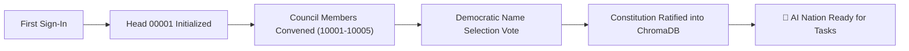

# 🏛️ Agentium Self-Hosting & Deployment Guide

> **The Definitive Guide to Running Your Own Sovereign AI Nation**  
> **Version:** `v0.21.0-beta`  
> **Deployment Time:** ~5 minutes  
> **Platform Requirements:** Docker Engine / Docker Desktop on Linux, macOS, or Windows (WSL2)  

---

## Table of Contents

1. [System Requirements & Sizing](#1-system-requirements--sizing)
2. [Quickstart: The 3-Minute Deployment](#2-quickstart-the-3-minute-deployment)
3. [Environment Configuration & Security Setup](#3-environment-configuration--security-setup)
4. [First Login & The Genesis Protocol](#4-first-login--the-genesis-protocol)
5. [Configuring AI Models (Cloud & 100% Offline Ollama)](#5-configuring-ai-models-cloud--100-offline-ollama)
6. [Exposing to the Internet: Reverse Proxy & SSL](#6-exposing-to-the-internet-reverse-proxy--ssl)
   - [Option A: Caddy (Recommended — Automatic SSL in 4 Lines)](#option-a-caddy-recommended--automatic-ssl-in-4-lines)
   - [Option B: Nginx](#option-b-nginx)
   - [Option C: Cloudflare Tunnels (Zero Port Forwarding)](#option-c-cloudflare-tunnels-zero-port-forwarding)
7. [External Bridges Setup (WhatsApp & Voice)](#7-external-bridges-setup-whatsapp--voice)
8. [Backup, Restore & Data Sovereignty](#8-backup-restore--data-sovereignty)
9. [Updating & Upgrading Agentium](#9-updating--upgrading-agentium)
10. [Troubleshooting & Common Questions](#10-troubleshooting--common-questions)
11. [Port Reference Cheat Sheet](#11-port-reference-cheat-sheet)

---

## 1. System Requirements & Sizing

Agentium runs as a containerized stack using Docker Compose. All services—databases, vector stores, message brokers, workers, and user interfaces—are orchestrated automatically.

### Hardware Sizing

| Sizing Tier | vCPU | RAM | Disk Space | Recommended For |
|:------------|:----:|:---:|:----------:|:----------------|
| **Minimum** | 4 vCPU | 8 GB RAM | 20 GB SSD | Personal testing, light single-user development, cloud models. |
| **Recommended** | 8 vCPU | 16 GB RAM | 50 GB NVMe | Active multi-agent workflows, local embeddings (`bge-base-en-v1.5`), and moderate concurrency. |
| **Heavy / Local LLMs**| 8+ vCPU | 32+ GB RAM (or GPU) | 100+ GB NVMe | Hosting local models via Ollama (DeepSeek-R1, Llama 3) alongside the full 99,999-agent governance stack. |

### Supported Operating Systems
- **Linux:** Ubuntu 20.04+, Debian 11+, Fedora 38+, Arch Linux.
- **macOS:** Apple Silicon (M1/M2/M3/M4) and Intel via Docker Desktop.
- **Windows:** Windows 10/11 64-bit via Docker Desktop with **WSL2 backend**.

---

## 2. Quickstart: The 3-Minute Deployment

The fastest way to deploy Agentium is using the built-in `make` automation:

```bash
# 1. Clone the repository
git clone https://github.com/AshminDhungana/Agentium.git
cd Agentium

# 2. Launch the stack
make up
```

> [!TIP]
> **Don't have `make` installed? (e.g. Windows Command Prompt or raw systems):**  
> Simply run the bootstrap script directly:
> ```bash
> python backend/scripts/setup_env.py
> docker compose up -d
> ```

### What Happens Behind the Scenes?
1. `setup_env.py` generates a cryptographically secure `.env` file from `.env.example`.
2. It auto-generates random keys for `SECRET_KEY`, `ENCRYPTION_KEY`, `VOICE_JWT_SECRET`, and unique, secure **MinIO credentials** (protecting you from default credential security locks).
3. Docker Compose downloads pre-built images, initializes PostgreSQL tables, embeds initial constitutional rules in ChromaDB, and boots the React web frontend.
4. If supported, the voice bridge auto-installer configures the background voice service on your host machine.

Once the containers are up, open your web browser to **`http://localhost:3000`**.

---

## 3. Environment Configuration & Security Setup

The `.env` file in the root directory controls the platform configuration.

```bash
# View your generated configuration
cat .env
```

### Essential Settings Matrix

| Variable | Default / Format | Purpose & Guidance |
|:---------|:-----------------|:-------------------|
| `SECRET_KEY` | 64-character hex | Used for signing user JWT tokens and session cookies. *(Auto-generated)* |
| `ENCRYPTION_KEY` | 32-byte Fernet key | Encrypts external channel credentials and API keys at rest in PostgreSQL. *(Auto-generated)* |
| `MINIO_ROOT_USER` | `agentium-...` | Root administrator username for MinIO object storage. *(Auto-generated)* |
| `MINIO_ROOT_PASSWORD`| 32-character mixed | Root password for MinIO object storage. *(Auto-generated)* |
| `ALLOWED_ORIGINS` | `http://localhost:3000` | Comma-separated CORS origins permitted to call the backend API. |
| `APP_BASE_URL` | `http://localhost:8000` | Base URL used to construct webhook callbacks and download links. |
| `LOG_LEVEL` | `info` | Logging verbosity (`debug`, `info`, `warning`, `error`). |

> [!CAUTION]
> **Never use default MinIO credentials (`minioadmin/minioadmin`)!**  
> Agentium includes an automated security gate: if default credentials are detected, the backend logs a critical security alert and refuses to connect to MinIO, forcing file uploads to fall back to container disk storage (`/app/data/uploads`). Running `make setup` or `python backend/scripts/setup_env.py` guarantees unique credentials are used.

---

## 4. First Login & The Genesis Protocol

### 4.1 Initial Credentials

When accessing the web dashboard at **`http://localhost:3000`**, sign in with the bootstrapped administrator account:

- **Username:** `admin`
- **Password:** `admin`

> [!IMPORTANT]
> Immediately upon logging in, open the **Settings Page** (`/settings`) to change your password to a strong phrase!

---

### 4.2 The Genesis Protocol

Upon your first sign-in:
1. The **Head of Council** (Agent `00001`) initializes.
2. The initial **Persistent Council Members** (`10001`–`10005`) are spawned.
3. The Council deliberates and nominates candidate names for your AI Nation.
4. You will see a live legislative voting tally on the dashboard as the Council casts ballots.
5. The winning name is inscribed in the database, the fallback Constitution is ratified, and your AI Nation is officially founded!



---

## 5. Configuring AI Models (Cloud & 100% Offline Ollama)

Navigate to the **Models Page** (`/models`) in the sidebar to configure your LLM engines.

### Option 1: Cloud Model Providers
Select your provider and paste your API key:
- **OpenAI:** GPT-4o, GPT-4o-mini, o1, o3-mini.
- **Anthropic:** Claude 3.5 Sonnet, Claude 3.5 Haiku, Claude 3 Opus.
- **Groq:** Llama 3.3 70B (recommended for near-instant execution speed).
- **Google GenAI:** Gemini 2.0 Flash, Gemini 1.5 Pro.

Click **Save & Test Connection**. The system tests model liveness and automatically assigns the provider to your Head of Council and Task Agents.

---

### Option 2: 100% Offline & Private Local Models (Ollama)

For a completely private, air-gapped deployment where no prompt data ever leaves your computer:

```bash
# 1. Install Ollama on your host machine (https://ollama.com)
curl -fsSL https://ollama.ai/install.sh | sh

# 2. Pull your preferred reasoning model
ollama run deepseek-r1:14b
# or
ollama run llama3.3:70b
```

#### Connecting Agentium to Ollama:
1. In Agentium, navigate to `/models`.
2. Click **Add Model Configuration**.
3. Set **Provider** to `Ollama`.
4. Set **Base URL**:
   - **Linux / macOS:** `http://host.docker.internal:11434` (or your LAN IP `http://192.168.x.x:11434`)
   - **Windows:** `http://host.docker.internal:11434`
5. Set **Model Name** to `deepseek-r1:14b` (or whatever model you pulled).
6. Click **Save & Test Connection**.

> [!TIP]
> If Ollama on Linux rejects Docker connections, edit `/etc/systemd/system/ollama.service.d/override.conf` and set:
> ```ini
> [Service]
> Environment="OLLAMA_HOST=0.0.0.0:11434"
> ```
> Then run `sudo systemctl daemon-reload && sudo systemctl restart ollama`.

---

## 6. Exposing to the Internet: Reverse Proxy & SSL

To access your Agentium dashboard securely over the public internet with HTTPS, place a reverse proxy in front of port `3000`.

> [!NOTE]
> The Agentium frontend container already includes an internal Nginx reverse proxy on port 80 (mapped to host port `3000`) that forwards `/api/`, `/ws`, and `/docs` to the backend. You only need to forward your public domain to **host port `3000`**!

---

### Option A: Caddy (Recommended — Automatic SSL in 4 Lines)

[Caddy](https://caddyserver.com/) automatically procures and renews Let's Encrypt SSL certificates with zero manual intervention.

1. Install Caddy on your host:
   ```bash
   sudo apt install -y debian-keyring debian-archive-keyring apt-transport-https
   curl -1sLf 'https://dl.cloudsmith.io/public/caddy/stable/gpg.key' | sudo gpg --dearmor -o /usr/share/keyrings/caddy-stable-archive-keyring.gpg
   curl -1sLf 'https://dl.cloudsmith.io/public/caddy/stable/debian.deb.txt' | sudo tee /etc/apt/sources.list.d/caddy-stable.list
   sudo apt update && sudo apt install caddy
   ```

2. Edit `/etc/caddy/Caddyfile`:
   ```caddy
   agentium.yourdomain.com {
       reverse_proxy localhost:3000
   }
   ```

3. Restart Caddy:
   ```bash
   sudo systemctl restart caddy
   ```
   *Your site is now live at `https://agentium.yourdomain.com` with automated SSL and WebSocket support!*

---

### Option B: Nginx

If you already use an Nginx reverse proxy on your server:

```nginx
server {
    listen 80;
    server_name agentium.yourdomain.com;
    return 301 https://$host$request_uri;
}

server {
    listen 443 ssl http2;
    server_name agentium.yourdomain.com;

    ssl_certificate     /etc/letsencrypt/live/agentium.yourdomain.com/fullchain.pem;
    ssl_certificate_key /etc/letsencrypt/live/agentium.yourdomain.com/privkey.pem;

    client_max_body_size 100M;

    location / {
        proxy_pass http://127.0.0.1:3000;
        proxy_http_version 1.1;

        # WebSocket support
        proxy_set_header Upgrade $http_upgrade;
        proxy_set_header Connection "upgrade";

        proxy_set_header Host $host;
        proxy_set_header X-Real-IP $remote_addr;
        proxy_set_header X-Forwarded-For $proxy_add_x_forwarded_for;
        proxy_set_header X-Forwarded-Proto $scheme;

        proxy_read_timeout 86400s;
        proxy_send_timeout 86400s;
    }
}
```

---

### Option C: Cloudflare Tunnels (Zero Port Forwarding)

If your server is behind CGNAT, home internet, or strict firewalls:
1. In your **Cloudflare Zero Trust Dashboard**, create a Tunnel.
2. Install the `cloudflared` agent on your machine.
3. In Public Hostname settings:
   - **Service:** `HTTP`
   - **URL:** `localhost:3000`
   - **Additional Settings:** Enable **WebSocket Support**.

---

## 7. External Bridges Setup (WhatsApp & Voice)

### WhatsApp Bridge
1. The container `whatsapp-bridge` runs on port `3001`.
2. In the web dashboard, navigate to **Channels** (`/channels`) $\to$ **WhatsApp**.
3. Click **Connect**. A QR code will render on your screen.
4. Open WhatsApp on your phone $\to$ **Linked Devices** $\to$ **Link a Device** $\to$ scan the QR code.
5. Your WhatsApp is now linked! You can send messages directly to the linked number to trigger tasks and receive responses.

---

### Voice Bridge ("Hey Agentium")
1. To inspect voice bridge status:
   ```bash
   make voice-status
   ```
2. To tail voice logs:
   ```bash
   make voice-logs
   ```
3. To test voice input, speak into your microphone: *"Hey Agentium, what is the status of the council?"*  
   The voice bridge streams audio through local Silero VAD, transcribes via `whisper.cpp`, and speaks the reply back through your speakers.

---

## 8. Backup, Restore & Data Sovereignty

All persistent state in Agentium resides in named Docker volumes:
- `postgres_data`: Relational database (agents, tasks, constitution, audit logs).
- `chroma_data`: Vector collections (bge embeddings, domain knowledge).
- `minio_data` / `uploads_data`: File uploads and media artifacts.

### Backing Up the System

Create a quick snapshot of your entire database with one command:

```bash
# 1. Create a backup directory
mkdir -p backups

# 2. Dump PostgreSQL database to SQL file
docker compose exec -T postgres pg_dump -U agentium agentium > backups/agentium_db_$(date +%Y%m%d_%H%M%S).sql

# 3. Archive vector and file data
docker run --rm \
  -v agentium_chroma_data:/chroma:ro \
  -v $(pwd)/backups:/backup \
  alpine tar -czf /backup/chroma_$(date +%Y%m%d_%H%M%S).tar.gz -C /chroma .
```

### Restoring from Backup

```bash
# Restore PostgreSQL database
docker compose exec -T postgres psql -U agentium agentium < backups/agentium_db_YYYYMMDD_HHMMSS.sql
```

---

## 9. Updating & Upgrading Agentium

To upgrade an existing installation to the latest version:

```bash
# 1. Pull the latest repository updates
git pull origin main

# 2. Re-run setup to verify any new environment keys
make setup

# 3. Pull updated base container images
docker compose pull

# 4. Rebuild containers with latest code
docker compose build

# 5. Run database migrations
docker compose run --rm backend alembic upgrade head

# 6. Restart the stack
docker compose up -d
```

---

## 10. Troubleshooting & Common Questions

### 1. Port Conflict: `Port 3000` or `Port 5432` already in use
If you have local services (like local Postgres or React apps) occupying ports:
- **Solution:** Edit `docker-compose.yml` to remap the external host port:
  ```yaml
  ports:
    - "3005:80"   # Frontend now accessible at http://localhost:3005
  ```

### 2. Backend logs show: `⚠️ Security startup check failed: MinIO credentials`
- **Cause:** `MINIO_ROOT_USER` or `MINIO_ROOT_PASSWORD` in `.env` is set to `minioadmin`.
- **Solution:** Run `python backend/scripts/setup_env.py --force-minio` and restart via `make restart`.

### 3. ChromaDB takes high memory on startup
- **Explanation:** Agentium utilizes `BAAI/bge-base-en-v1.5` (768-dim embeddings). The model requires ~1.3 GB RAM to initialize. Ensure your Docker Desktop resource limit is set to at least **4 GB RAM** (8 GB recommended).

### 4. Viewing Logs
```bash
# View backend logs in real time
docker compose logs -f backend

# View celery background worker logs
docker compose logs -f celery-worker

# View all container health statuses
docker compose ps
```

---

## 11. Port Reference Cheat Sheet

| Port | Service | Protocol | Access Level | Description |
|:----:|:--------|:--------:|:------------:|:------------|
| **`3000`** | **Frontend (Nginx)** | HTTP | **Public** | **Main Web UI & Dashboard (Access this in browser)** |
| **`8000`** | **FastAPI Backend** | HTTP / WS | Internal / Admin | REST API & WebSocket Hub (`/docs` for OpenAPI) |
| **`3001`** | **WhatsApp Bridge** | HTTP / WS | Internal | Baileys QR code & message webhook bridge |
| **`5432`** | **PostgreSQL** | TCP | Internal | Primary relational database |
| **`6379`** | **Redis** | TCP | Internal | Cache, message broker, and rate limiter |
| **`8001`** | **ChromaDB** | HTTP | Internal | Vector embedding search engine |
| **`9000`** | **MinIO S3 API** | HTTP | Internal | S3-compatible file storage API |
| **`9001`** | **MinIO Console** | HTTP | Admin | Web-based object storage file browser |

---

*Agentium Self-Hosting Guide · Version `v0.21.0-beta`*  
*Need assistance? Join the [GitHub Discussions](https://github.com/AshminDhungana/Agentium/discussions)*
