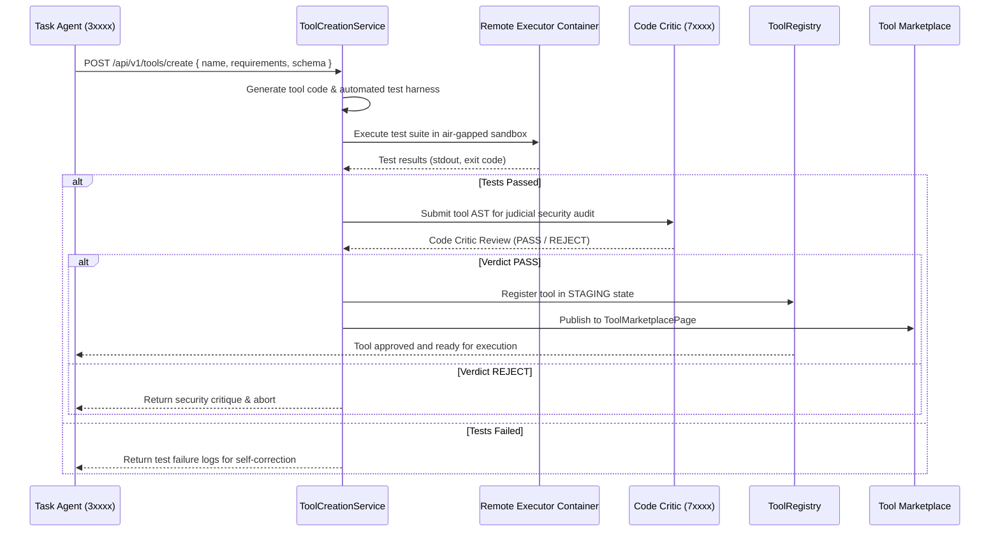

# Tool & Skill Creation — Comprehensive Developer & Agent Guide

> **Developer and Agent Reference for Creating, Testing, and Deploying Tools & Skills in Agentium**  
> **Version:** `v0.21.0-beta`  
> **Target Subsystems:** `backend/tools/`, `backend/core/tool_registry.py`, `backend/services/tool_creation_service.py`, `backend/.agentium/skills/`, `backend/services/skill_manager.py`  

---

## Table of Contents

1. [Mental Model: Tools vs. Skills](#1-mental-model-tools-vs-skills)
2. [Creating a Static Tool (Manual Development)](#2-creating-a-static-tool-manual-development)
   - [2.1 File Location & Class Structure](#21-file-location--class-structure)
   - [2.2 Implementation Guidelines & Best Practices](#22-implementation-guidelines--best-practices)
   - [2.3 Registering in `ToolRegistry`](#23-registering-in-toolregistry)
   - [2.4 Tier Authorization & Capability Security](#24-tier-authorization--capability-security)
   - [2.5 Execution Environments: Host OS vs. Remote Executor Sandbox](#25-execution-environments-host-os-vs-remote-executor-sandbox)
   - [2.6 Unit & Integration Testing](#26-unit--integration-testing)
3. [Autonomous Dynamic Tool Creation (The Tool Factory)](#3-autonomous-dynamic-tool-creation-the-tool-factory)
   - [3.1 Tool Generation Lifecycle](#31-tool-generation-lifecycle)
   - [3.2 Sandbox Verification in `agentium-remote-executor`](#32-sandbox-verification-in-agentium-remote-executor)
   - [3.3 Code Critic (`7xxxx`) Judicial Review](#33-code-critic-7xxxx-judicial-review)
   - [3.4 Staging, Versioning & Publishing to the Tool Marketplace](#34-staging-versioning--publishing-to-the-tool-marketplace)
4. [Creating a Skill (Procedural Knowledge Playbook)](#4-creating-a-skill-procedural-knowledge-playbook)
   - [4.1 Anatomy of a `SKILL.md`](#41-anatomy-of-a-skillmd)
   - [4.2 Markdown-to-ChromaDB Ingestion & Char Limits](#42-markdown-to-chromadb-ingestion--char-limits)
   - [4.3 Skill Seeding & Verification](#43-skill-seeding--verification)
5. [The "Pointing" Pattern: Connecting Tools to Skills](#5-the-pointing-pattern-connecting-tools-to-skills)
6. [End-to-End Checklist](#6-end-to-end-checklist)

---

## 1. Mental Model: Tools vs. Skills

In Agentium, capabilities are divided between **executable actions** (Tools) and **procedural guidance** (Skills):

| Dimension | **Tool** | **Skill** |
|:----------|:---------|:----------|
| **Nature** | Executable Python function/class | Markdown knowledge document with structured frontmatter |
| **Location** | `backend/tools/<name>_tool.py` | `backend/.agentium/skills/<name>/SKILL.md` |
| **Registration**| `backend/core/tool_registry.py` (`register_tool`) | Seeded via `seed_skills.py` into ChromaDB `skills` collection |
| **Agent Interface**| Dispatched via LLM function calling schema (`to_openai_tools`) | Injected into context window via semantic RAG search (`skill_rag.py`) |
| **Authorization**| Gated by agent tier (`0xxxx`–`6xxxx`) and `authorized_tiers` | Discoverable by any agent searching with matching semantic intent |
| **Core Question**| *"Do this action right now."* | *"How, when, and with what precautions should this be done?"* |

A complete capability should ship with **both**: an executable tool that carries out the operation and a companion skill that teaches agents when to invoke it, how to format parameters, and what edge cases to anticipate.

---

## 2. Creating a Static Tool (Manual Development)

### 2.1 File Location & Class Structure

Create your tool module in `backend/tools/<name>_tool.py`. Follow the standard structure used across built-in tools (e.g. `vector_db_tool.py`, `deep_think_tool.py`):

```python
from typing import Any, Dict, List, Optional
import logging

from backend.core.vector_store import get_vector_store

logger = logging.getLogger(__name__)


class MyCustomTool:
    """Description of the tool's responsibilities."""

    TOOL_NAME = "my_custom"
    
    # Authorized agent tiers: Executive (0xxxx), Legislative (1xxxx),
    # Management (2xxxx), Execution Workers (3xxxx-6xxxx).
    # Judiciary Critics (7xxxx-9xxxx) are NEVER given execution tools.
    AUTHORIZED_TIERS = ["0xxxx", "1xxxx", "2xxxx", "3xxxx", "4xxxx", "5xxxx", "6xxxx"]

    def __init__(self) -> None:
        # Lazy dependencies — DO NOT initiate network, DB, or vector connections at import time!
        self._store = None

    @property
    def store(self):
        if self._store is None:
            self._store = get_vector_store()
        return self._store

    async def execute(self, action: str, **kwargs) -> Dict[str, Any]:
        """Single dispatch entry point for all tool actions."""
        try:
            if action == "query":
                return await self._query(**kwargs)
            elif action == "mutate":
                return await self._mutate(**kwargs)
            elif action == "help":
                return self._help()
            else:
                return {"success": False, "error": f"Unknown action: {action}"}
        except Exception as e:
            logger.exception(f"[{self.TOOL_NAME}] Execution error: {e}")
            return {"success": False, "error": str(e)}

    async def _query(self, query_text: str, **kwargs) -> Dict[str, Any]:
        # Execution logic...
        return {"success": True, "results": ["example"]}

    async def _mutate(self, payload: Dict[str, Any], **kwargs) -> Dict[str, Any]:
        # Execution logic...
        return {"success": True, "mutated": True}

    def _help(self) -> Dict[str, Any]:
        """Provides runtime guidance and points to the companion skill."""
        return {
            "success": True,
            "tool": self.TOOL_NAME,
            "actions": ["query", "mutate", "help"],
            "skill_path": f"backend/.agentium/skills/{self.TOOL_NAME}/SKILL.md",
            "usage": "Use action='query' with query_text='...' or action='mutate' with payload={...}."
        }


# Module-level singleton
my_custom_tool = MyCustomTool()
```

---

### 2.2 Implementation Guidelines & Best Practices

1. **Explicit Return Contract:** Always return a dictionary with a boolean `success` key:
   - Success: `{"success": True, "data": ...}`
   - Failure: `{"success": False, "error": "Clear explanation of failure"}`
2. **Single Dispatch Entry Point:** Use `async def execute(self, action: str, **kwargs)`. This keeps the JSON Schema compact for LLM function calling and allows polymorphic actions under one tool definition.
3. **Lazy Initialization:** `tool_registry.py` imports all tool modules at process boot. Never open database sessions, connect to ChromaDB, or establish network sockets in `__init__` or top-level code. Use `@property` getters.
4. **Async-First Execution:** Always use `async def execute`. The registry executor handles coroutines natively.
5. **Context Auto-Injection:** If your `execute()` method declares `db` (SQLAlchemy Session) or `agent_id` (str) as keyword arguments, `tool_creation_service.execute_tool` will automatically inject them at runtime. Always include `**kwargs` to safely absorb extra contextual parameters.
6. **In-Tool Defense in Depth:** In addition to tier checks in the registry, enforce safety guards inside the tool logic (e.g. read-only checks, restricted table allowlists).

---

### 2.3 Registering in `ToolRegistry`

Edit `backend/core/tool_registry.py`:

```python
# 1. Import your singleton at the top of backend/core/tool_registry.py:
from backend.tools.my_custom_tool import my_custom_tool

# 2. Register inside _initialize_tools():
self.register_tool(
    name="my_custom",
    description=(
        "Performs specialized domain querying and mutations. "
        "Full reference is in the companion skill at backend/.agentium/skills/my_custom/SKILL.md."
    ),
    function=my_custom_tool.execute,
    parameters={
        "action": {
            "type": "string",
            "description": "The sub-action to execute: query | mutate | help",
            "enum": ["query", "mutate", "help"]
        },
        "query_text": {
            "type": "string",
            "description": "The search or query string when action='query'",
            "optional": True
        },
        "payload": {
            "type": "object",
            "description": "Mutation dictionary when action='mutate'",
            "optional": True
        }
    },
    authorized_tiers=["0xxxx", "1xxxx", "2xxxx", "3xxxx", "4xxxx", "5xxxx", "6xxxx"],
)
```

#### Parameter Schema Notes
- **Supported Types:** `string`, `integer`, `number`, `boolean`, `array`, `object`.
- **Optional vs. Required:** Parameters marked `"optional": True` are omitted from the JSON Schema `required` list. Parameters without `"optional": True` are strictly required (e.g., `action`).
- **Runtime Pydantic Validation:** The registry automatically constructs a Pydantic 2 model from your parameter dictionary. Calls passing invalid types return structured field-level errors before tool code runs.

---

### 2.4 Tier Authorization & Capability Security

Agentium enforces an immutable hierarchical identity scheme:
- `0xxxx` (Head of Council / Executive): Supreme authority; full tool access.
- `1xxxx` (Council Members / Legislative): Governance, voting, auditing, channel configuration.
- `2xxxx` (Lead Agents / Management): Task delegation, DAG construction, supervisor tools.
- `3xxxx`–`6xxxx` (Task Agents / Execution): Worker agents executing bash, coding, web search, database querying.
- `7xxxx`–`9xxxx` (Judiciary Critics): **NEVER granted tool execution permissions.** Critics act solely as read-only validation judges.

---

### 2.5 Execution Environments: Host OS vs. Remote Executor Sandbox

When building a tool that executes code or shell commands, choose the appropriate execution boundary:

| Execution Environment | Driver | Boundary & Permissions | Target Use Cases |
|:----------------------|:-------|:-----------------------|:-----------------|
| **Host OS Workspace** | `host_os_tool.py`<br/>`HostAccessService` | Direct execution on host under `/host_home/agentium-workspace`. Privileged. | Developer workflows, file generation on host disk, Git operations on the user's workspace. |
| **Sandboxed Remote Executor** | `remote_exec_tool.py`<br/>`agentium-remote-executor` | Isolated Docker container: `read_only: true`, `cap_drop: ALL`, `ALLOW_NETWORK=false`, memory-backed `tmpfs`. | Untrusted Python scripts, generated dynamic tools, external web scrapers, data crunching. |

---

### 2.6 Unit & Integration Testing

#### Unit Test (`backend/tests/unit/test_my_custom_tool.py`)
```python
import pytest
from backend.tools.my_custom_tool import my_custom_tool

@pytest.mark.asyncio
async def test_my_custom_tool_query():
    result = await my_custom_tool.execute(action="query", query_text="test search")
    assert result["success"] is True
    assert "results" in result

@pytest.mark.asyncio
async def test_my_custom_tool_invalid_action():
    result = await my_custom_tool.execute(action="invalid_action")
    assert result["success"] is False
    assert "Unknown action" in result["error"]
```

#### Running Tests Inside Container
```bash
docker compose exec -T backend pytest backend/tests/unit/test_my_custom_tool.py -v
```

---

## 3. Autonomous Dynamic Tool Creation (The Tool Factory)

In addition to static tools written by developers, Agentium features a **Dynamic Tool Creation Factory** in [tool_creation_service.py](file:///e:/Ongoing%20Projects/Agentium/backend/services/tool_creation_service.py) that allows agents to build, test, and publish their own tools at runtime:



### Staging, Versioning & Deprecation
- Newly created dynamic tools enter `STAGING` status.
- Once verified through 5 consecutive successful executions, tools are promoted to `ACTIVE`.
- Tools maintain semantic versions (`tool_version.py`). Deprecated tools transition to `DEPRECATED` and are auto-archived after 30 days of zero invocations.

---

## 4. Creating a Skill (Procedural Knowledge Playbook)

### 4.1 Anatomy of a `SKILL.md`

Create `backend/.agentium/skills/<name>/SKILL.md`:

```markdown
---
name: my_custom
description: >-
  Concise 50–300 character summary. This text is the PRIMARY semantic search target
  for RAG. Mention the tool name and file path: backend/.agentium/skills/my_custom/SKILL.md.
skill_type: integration          # code_generation | analysis | integration | automation | research | testing
domain: ai                       # frontend | backend | devops | data | ai | security | database | general
complexity: intermediate         # beginner | intermediate | advanced
tags: [my-custom, integration, tutorial]
creator_tier: head               # head | council | lead | task
---

# My Custom Capability

In-depth explanation of when to invoke this capability, expected outcomes, and edge case handling.

## Steps

1. **Querying Data:**
   Invoke the `my_custom` tool with:
   ```json
   {
     "action": "query",
     "query_text": "sample query"
   }
   ```
2. **Mutating State:**
   Ensure input validation passes before calling `mutate`.

## Validation & Success Criteria
- Query returns a non-empty list of results.
- Response contains `"success": true`.
- Errors return structured feedback with remediation suggestions.
```

---

### 4.2 Markdown-to-ChromaDB Ingestion & Char Limits

The skill loader in `backend/scripts/seed_skills.py`:
- Parses YAML frontmatter into a typed `SkillSchema`.
- Splits markdown on `##` headers to populate `steps` and `validation_criteria`.
- **2,000-Character ChromaDB Clip Limit:** ChromaDB documents are assembled highest-value-first:
  $$\text{Identity} \longrightarrow \text{Description} \longrightarrow \text{First Steps} \longrightarrow \text{Validation}$$
  Always place critical syntax, parameter names, and security rules in the **earliest steps** to avoid loss if clipped.
- **`__SKILL_DIR__` Token:** Replaced at seed time with the absolute container directory path (`/app/backend/.agentium/skills/<name>`).

---

### 4.3 Skill Seeding & Verification

To seed your skill into the ChromaDB vector database:

```bash
# Seed skills into ChromaDB
make seed-skills

# Or run directly inside container
docker compose exec -T backend python backend/scripts/seed_skills.py --reindex
```

#### Test RAG Retrieval:
```bash
docker compose exec -T backend python -c "
from backend.services.skill_manager import skill_manager
from backend.models.database import SessionLocal

db = SessionLocal()
results = skill_manager.search_skills('how do I use my custom tool', 'task', db)
print('Found skills:', [r['skill_id'] for r in results])
db.close()
"
```

---

## 5. The "Pointing" Pattern: Connecting Tools to Skills

To ensure agents seamlessly discover and utilize your tool, always implement bidirectional discovery:

```
Tool Description / Help Action  ──(Points to)──>  Skill File Path (SKILL.md)
ChromaDB Semantic Search        ──(Points to)──>  Tool Name & Action Schemas
```

1. **In the Tool's Description:** Explicitly state the skill location:  
   *"Full playbook and step-by-step guidance in `backend/.agentium/skills/<name>/SKILL.md`."*
2. **In the Tool's `help` Action:** Return the skill path and summary at runtime when an agent requests help.
3. **In the Skill's Frontmatter:** Write the `description` using the exact phrasing an agent would search for when needing this functionality.
4. **In the Skill's Steps:** Document exact JSON parameters for calling the tool.

---

## 6. End-to-End Checklist

- [ ] `backend/tools/<name>_tool.py` created with `async def execute(action=...)`.
- [ ] Explicit `{"success": True/False}` return structure on all execution paths.
- [ ] Dependencies loaded lazily via `@property` getters.
- [ ] Registered in `backend/core/tool_registry.py` with parameter schema and `authorized_tiers`.
- [ ] Unit tests created in `backend/tests/unit/test_<name>_tool.py` and passing.
- [ ] Companion `backend/.agentium/skills/<name>/SKILL.md` written with valid YAML frontmatter (description 50–300 chars).
- [ ] `make seed-skills` indexes the skill into ChromaDB without errors.
- [ ] Bidirectional pointing pattern implemented: tool references skill path, skill documents tool JSON invocation.
