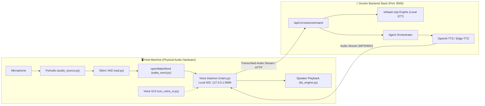

# Voice Bridge Setup & Audio Architecture (Host-Side)

> **Complete Setup and Technical Reference for the Agentium Voice Bridge**  
> **Target Version:** `v0.21.0-beta`  
> **Subsystem Location:** `voice-bridge/`, `scripts/`, `backend/services/audio_service.py`  

---

## Table of Contents

1. [Architectural Overview: Why Host-Side?](#1-architectural-overview-why-host-side)
2. [Subsystem Architecture & File Layout](#2-subsystem-architecture--file-layout)
3. [The Speech Pipeline: Wake-Word, VAD, STT, and TTS](#3-the-speech-pipeline-wake-word-vad-stt-and-tts)
4. [Prerequisites](#4-prerequisites)
5. [Automated Installation (`make up`)](#5-automated-installation-make-up)
6. [OS-Specific Manual Installation](#6-os-specific-manual-installation)
   - [6.1 Windows (PowerShell & Task Scheduler)](#61-windows-powershell--task-scheduler)
   - [6.2 Linux (Systemd User Unit)](#62-linux-systemd-user-unit)
   - [6.3 macOS (LaunchAgent)](#63-macos-launchagent)
7. [Voice Bridge Desktop UI (`run_voice_ui.py`)](#7-voice-bridge-desktop-ui-run_voice_uipy)
8. [Configuration & Environment Variables](#8-configuration--environment-variables)
9. [Verification, Healthchecks & CLI Management](#9-verification-healthchecks--cli-management)
10. [Troubleshooting & Diagnostics](#10-troubleshooting--diagnostics)

---

## 1. Architectural Overview: Why Host-Side?

The **Voice Bridge** transforms Agentium into a real-time conversational AI assistant ("Hey Agentium" $\to$ speech recognition $\to$ agent execution $\to$ spoken audio reply).



### Why Does the Bridge Run on the Host?
Standard Docker containers cannot access host microphones and speakers reliably across platforms (especially on Windows Docker Desktop and macOS hypervisors). Running the bridge as a lightweight Python service directly on the host grants seamless access to hardware audio input/output, while all heavy AI reasoning and database operations remain containerized.

---

## 2. Subsystem Architecture & File Layout

Located in [voice-bridge/](file:///e:/Ongoing%20Projects/Agentium/voice-bridge):

```
voice-bridge/
├── main.py                   # Primary daemon, WebSocket client, HTTP bridge, & local port 9999 server
├── wake_word.py              # openWakeWord engine detecting "Hey Agentium"
├── vad.py                    # Voice Activity Detection (Silero VAD / WebRTC VAD)
├── audio_source.py           # PyAudio stream capture & circular buffer management
├── tts_engine.py             # Audio playback (Piper, Kokoro, pyttsx3, or streamed cloud TTS)
├── run_voice_ui.py           # Optional desktop graphical waveform visualizer
├── install.sh                # Automated installer for Linux and macOS hosts
├── requirements.txt          # Python dependencies (PyAudio, websockets, openwakeword)
├── requirements-ui.txt       # GUI dependencies (Tkinter / PySide if visualizer is run)
├── persona.md                # Default conversational persona for voice interactions
└── assets/                   # Chime and sound effect assets (e.g. wake_chime.wav)
```

---

## 3. The Speech Pipeline: Wake-Word, VAD, STT, and TTS

1. **Wake-Word Detection (`wake_word.py`):**
   - Continuously buffers incoming microphone audio.
   - Evaluates audio against `openWakeWord` ONNX models.
   - When the score exceeds `WAKE_WORD_THRESHOLD` (default: `0.5`), plays `wake_chime.wav` to alert the user that the system is listening.
2. **Voice Activity Detection (`vad.py`):**
   - Detects speech onset and cessation using Silero VAD.
   - Waits for a configurable silence pause (`VAD_SILENCE_MS`, default: 700 ms) before finalizing the audio chunk.
3. **Speech-to-Text (STT):**
   - **Local Engine:** The backend container includes pre-compiled `whisper.cpp` (`/usr/local/bin/whisper-cli`) and the `ggml-base.en.bin` model for low-latency CPU transcription.
   - **Cloud Fallback:** Routes to OpenAI Whisper API when cloud credentials are configured.
4. **Text-to-Speech (TTS) & Playback (`tts_engine.py`):**
   - When the agent emits a response, the backend synthesizes audio.
   - The voice bridge plays the audio buffer through host speakers and resumes passive wake-word monitoring.

---

## 4. Prerequisites

1. The backend container stack must be running (`make up`).
2. **Python 3.10+** installed on the host machine:
   - **Windows:** Python 3.10+ from [python.org](https://www.python.org/downloads/) (ensure "Add python.exe to PATH" is checked).
   - **macOS:** `brew install python portaudio`.
   - **Linux (Ubuntu/Debian):** `sudo apt update && sudo apt install -y python3 python3-venv python3-pip portaudio19-dev libasound2-dev`.

---

## 5. Automated Installation (`make up`)

When you launch Agentium via `make up` or `docker compose up -d`, the companion `voice-autoinstall` container automatically runs:

```bash
make up
```

- **Linux / macOS / WSL2:** The container detects the host environment, installs a virtualenv in `~/.agentium/voice-venv`, configures the systemd user unit or LaunchAgent, and launches the service.
- **Windows (Docker Desktop):** A Linux container cannot execute PowerShell scripts on the Windows host. Instead, it places helper bootstrap scripts in `%USERPROFILE%\.agentium\` and creates a Desktop shortcut: `Install Agentium Voice Bridge.cmd`.

---

## 6. OS-Specific Manual Installation

### 6.1 Windows (PowerShell & Task Scheduler)

Double-click the desktop shortcut **`Install Agentium Voice Bridge.cmd`**, or run PowerShell manually from the repository directory:

```powershell
# Run installation script (requires Administrator privileges for Task Scheduler)
powershell.exe -ExecutionPolicy Bypass -File scripts\setup.ps1
```

#### What `setup.ps1` Does:
1. Creates virtual environment at `%USERPROFILE%\.agentium\voice-venv`.
2. Installs requirements from `voice-bridge\requirements.txt`.
3. Registers a Windows Task Scheduler job named `AgentiumVoiceBridge` configured to start automatically on user login.
4. Starts the daemon and verifies connectivity on `127.0.0.1:9999`.

#### Force Reinstallation:
```powershell
powershell.exe -ExecutionPolicy Bypass -File scripts\setup.ps1 -Force
# Or via Makefile:
make voice-reinstall
```

---

### 6.2 Linux (Systemd User Unit)

```bash
# Run the host installer
bash voice-bridge/install.sh
```

#### What `install.sh` Does:
1. Provisions virtual environment in `~/.agentium/voice-venv`.
2. Creates a systemd user unit at `~/.config/systemd/user/agentium-voice.service`.
3. Enables and starts the user service via `systemctl --user enable --now agentium-voice`.
4. Writes confirmation marker to `~/.agentium/voice-installed.marker`.

> [!TIP]
> To keep the voice service running after logging out of a graphical session on Linux:
> ```bash
> loginctl enable-linger "$USER"
> ```

---

### 6.3 macOS (LaunchAgent)

```bash
# Run the host installer
bash voice-bridge/install.sh
```

#### What `install.sh` Does on macOS:
1. Installs virtualenv in `~/.agentium/voice-venv`.
2. Registers a LaunchAgent at `~/Library/LaunchAgents/com.agentium.voice.plist`.
3. Loads the agent using `launchctl bootstrap gui/$(id -u) ~/Library/LaunchAgents/com.agentium.voice.plist`.
4. Prompts for macOS Microphone privacy permissions.

---

## 7. Voice Bridge Desktop UI (`run_voice_ui.py`)

For operators who prefer visual feedback when interacting with Agentium by voice, a lightweight desktop visualizer is included:

```bash
# Launch visualizer using the voice bridge virtual environment:
# Windows
%USERPROFILE%\.agentium\voice-venv\Scripts\python voice-bridge\run_voice_ui.py

# Linux / macOS
~/.agentium/voice-venv/bin/python voice-bridge/run_voice_ui.py
```

The desktop UI displays real-time audio waveform levels, wake-word activation indicators, transcription text previews, and synthesizer playback status.

---

## 8. Configuration & Environment Variables

All voice bridge runtime settings are configured in `~/.agentium/env.conf` (or overridden via environment variables):

| Variable | Default Value | Purpose & Description |
|:---------|:-------------:|:----------------------|
| `REQUIRE_WAKE_WORD` | `true` | When `false`, the bridge operates in open-mic direct mode without requiring "Hey Agentium". |
| `WAKE_WORD` | `agentium` | Target wake phrase trigger. |
| `WAKE_WORD_MODEL` | *(bundled default)* | Path to custom `.onnx` wake-word model. |
| `WAKE_WORD_THRESHOLD`| `0.5` | Sensitivity threshold (0.0 to 1.0) before triggering activation. |
| `WAKE_CHIME_PATH` | `assets/wake_chime.wav`| Audio chime played immediately upon wake-word detection. |
| `VAD_SILENCE_MS` | `700` | Milliseconds of silence required to designate end of speech. |
| `VOICE_TTS_VOICE` | `af_bella` | Default Kokoro/Piper neural voice identity. |
| `VOICE_PERSONA` | *(from persona.md)* | System prompt instructions guiding voice conversational style. |
| `VOICE_PROACTIVE_ENABLED`| `false` | When `true`, announces high-priority alerts over speaker without prompt. |
| `VOICE_PROACTIVE_COOLDOWN_S`| `300` | Cooldown period between proactive audio alerts. |
| `BACKEND_WS_URL` | `ws://127.0.0.1:8000/ws`| Backend WebSocket event bus URL. |
| `VOICE_JWT_SECRET` | *(from .env)* | Shared secret for signing voice WebSocket session tokens. |

---

## 9. Verification, Healthchecks & CLI Management

The project [Makefile](file:///e:/Ongoing%20Projects/Agentium/Makefile) includes dedicated voice management commands:

```bash
# Check service state and local whisper.cpp status
make voice-status

# Tail real-time bridge output and transcriptions
make voice-logs

# Force full re-installation
make voice-reinstall

# Completely remove voice bridge from host
make uninstall-voice
```

### Manual Port Verification
The bridge exposes an internal status port at `127.0.0.1:9999`:
```bash
# Windows (PowerShell)
Test-NetConnection -ComputerName 127.0.0.1 -Port 9999

# Linux / macOS
(ss -ltnp 2>/dev/null || netstat -ltnp 2>/dev/null) | grep 9999
```

---

## 10. Troubleshooting & Diagnostics

| Symptom | Probable Root Cause | Resolution |
|:--------|:--------------------|:-----------|
| **Windows: No prompt after `make up`** | Container dropped installer but did not auto-execute. | Open `%USERPROFILE%\.agentium\` and double-click `Install Agentium Voice Bridge.cmd`. |
| **"Already installed" error, but bridge is offline** | Stale marker file present after crash or reboot. | Run `make voice-reinstall`, or delete `~/.agentium/voice-installed.marker` and re-run installer. |
| **Microphone capture silent on macOS** | macOS Privacy & Security blocking terminal audio. | Open **System Settings $\to$ Privacy & Security $\to$ Microphone** and ensure Python/Terminal is enabled. |
| **Backend connection refused (`127.0.0.1:8000`)** | Docker container not ready or port mapped differently. | Verify container is healthy via `docker compose ps backend`. On Windows/macOS, ensure bridge resolves to `host.docker.internal:8000`. |
| **Linux: Bridge stops after user logs out** | Systemd user unit terminated on session end. | Enable user persistence: `loginctl enable-linger "$USER"`. |
| **`whisper.cpp` missing inside container** | Base image built without optional offline binary. | The bridge automatically falls back to OpenAI Whisper API if configured in `/models`. |

---

*Agentium Voice Bridge Documentation · Version `v0.21.0-beta`*
