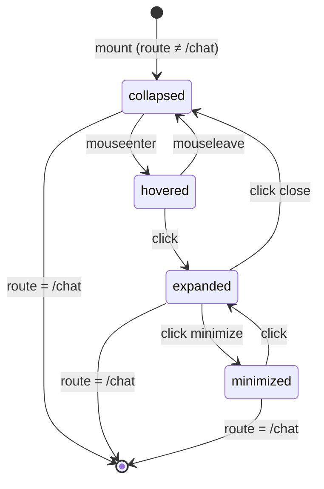

# Floating Chat Widget — Design Specification

**Date:** 2025-07-25  
**Status:** Approved  
**Author:** Agentium Team  
**Related:** #floating-chat-widget

---

## 1. Executive Summary

Add a persistent, floating chat widget that lets users converse with the Head of Council from **any page except `/chat`**. The widget mirrors the ChatPage message history (shared Zustand store), supports voice input/output, and seamlessly hands off voice control to the host-native voice bridge when minimized or closed.

**Key behaviors:**
- **Default:** 8px pulsing dot in bottom-right corner
- **Hover:** Expands to 32×32 chat icon with magnetic cursor-follow
- **Click:** Opens 360×520px popup with full chat + voice
- **Minimize:** Shrinks to 48×48 pill; voice returns to system wake-word
- **Close:** Returns to dot state
- **On `/chat` page:** Widget hidden entirely (ChatPage owns the experience)

---

## 2. Architecture

### 2.1 Component Placement

```
MainLayout (frontend/src/components/layout/MainLayout.tsx)
├── Sidebar
├── TopBar
├── main#main-content
│   └── KeepAliveOutlet  ← ChatPage, Dashboard, etc.
├── VoiceSettingsModal (portal)
├── VoiceModePanel (portal)
└── FloatingChatWidget (NEW — fixed bottom-right, z-50)
```

**Why MainLayout?** Persists across all authenticated routes, survives route changes, no remount on navigation.

### 2.2 State Management

| State | Location | Notes |
|-------|----------|-------|
| Messages | `useChatStore` (Zustand + sessionStorage) | **Shared** with ChatPage — single source of truth |
| Widget UI state | `FloatingChatWidget` local state | `collapsed \| hovered \| expanded \| minimized` |
| Unread count | `useWebSocketStore` | Drives badge on minimized widget |
| Voice mode | `voiceBridgeService.voiceMode` | `'chat' \| 'popup' \| 'system'` |

### 2.3 Voice Ownership Model

The singleton `voiceBridgeService` gains a `voiceMode` property:

```typescript
type VoiceMode = 'chat' | 'popup' | 'system';

class VoiceBridgeService {
  private _voiceMode: VoiceMode = 'system';
  
  setVoiceMode(mode: VoiceMode) {
    this._voiceMode = mode;
    this._updateMicState(); // connect/disconnect mic per mode
  }
}
```

| Route / Widget State | `voiceMode` | Mic Behavior |
|----------------------|-------------|--------------|
| `/chat` (ChatPage mounted) | `'chat'` | ChatPage owns mic; bridge streams to Head |
| Other page, widget **expanded** | `'popup'` | Widget owns mic; bridge streams to Head |
| Other page, widget **minimized/collapsed** | `'system'` | Bridge disconnects mic; host app handles wake-word |

**Transitions:**
- `ChatPage` mount → `setVoiceMode('chat')`
- Widget `expanded` → `setVoiceMode('popup')`
- Widget `minimized`/`collapsed` + route ≠ `/chat` → `setVoiceMode('system')`
- Route change to `/chat` → `setVoiceMode('chat')`

---

## 3. Component Design

### 3.1 File Structure

```
frontend/src/components/chat/
├── FloatingChatWidget.tsx      # Main widget (state machine + layout)
├── FloatingChatWidget.styles.css  # CSS variables for motion tokens
├── ChatHeader.tsx              # Title, voice status, minimize/close
├── MessageList.tsx             # Virtualized message feed
├── ChatInput.tsx               # Text + file + voice input
├── MinimizedWidget.tsx         # 48×48 pill with unread badge
└── index.ts                    # Barrel export
```

### 3.2 State Machine



### 3.3 Props & Types

```typescript
// FloatingChatWidget.tsx — no props (reads route/auth internally)

type WidgetState = 'collapsed' | 'hovered' | 'expanded' | 'minimized';

interface VoiceModeContext {
  mode: 'chat' | 'popup' | 'system';
  setMode: (m: VoiceMode) => void;
}
```

### 3.4 Implementation Approach: Native `<dialog>` Element

Use the native HTML `<dialog>` element for the expanded state — provides built-in accessibility, focus management, and Escape key handling without custom code.

```tsx
// FloatingChatWidget.tsx (expanded state)
<dialog
  ref={dialogRef}
  className="floating-chat-dialog"
  aria-label="Agentium Chat"
  aria-describedby="chat-desc"
  onKeyDown={handleKeyDown}
>
  <p id="chat-desc" className="sr-only">
    Chat with Agentium Head of Council. Messages sync across pages.
  </p>
  {/* Header, MessageList, ChatInput */}
</dialog>

// CSS
.floating-chat-dialog {
  position: fixed;
  bottom: 1rem;
  right: 1rem;
  width: 360px;
  max-height: 520px;
  border: none;
  border-radius: 1rem;
  box-shadow: var(--shadow-2xl);
  padding: 0;
  overflow: hidden;
  /* Animation handled by Motion.dev, not CSS transitions on display */
}
.floating-chat-dialog::backdrop { display: none; } // Non-modal — no backdrop
.floating-chat-dialog:open { display: flex; } // Motion.dev handles entry/exit
```

**Why `<dialog>`?**
- Native Escape key handling (press Escape → fires `close` event)
- Built-in `aria-modal="false"` for non-modal dialogs
- Focus moves to first focusable element on show (configurable via `autofocus`)
- No `tabindex` on dialog element itself (per spec)
- `closedby="any"` enables light dismiss (click outside) if desired later

**Motion.dev integration:** Use `AnimatePresence` with `mode="wait"` to animate entry/exit. The `<dialog>` stays in DOM (controlled by `open` prop), Motion handles opacity/scale transforms.

---

## 4. UI / UX Specification

### 4.1 Visual Design (from ui-ux-pro-max)

| Token | Light | Dark | CSS Variable |
|-------|-------|------|--------------|
| Primary | `#2563EB` | `#3B82F6` | `--color-primary` |
| Surface | `#FFFFFF` | `#161B27` | `--color-surface` |
| Surface Elevated | `#F8FAFC` | `#0F1117` | `--color-surface-elevated` |
| Border | `#E4ECFC` | `#1E2535` | `--color-border` |
| Text Primary | `#0F172A` | `#F1F5F9` | `--color-text-primary` |
| Text Muted | `#64748B` | `#94A3B8` | `--color-text-muted` |
| Accent (Voice On) | `#059669` | `#10B981` | `--color-accent` |
| Destructive | `#DC2626` | `#EF4444` | `--color-destructive` |
| Shadow 2xl | `0 25px 50px -12px rgba(0,0,0,0.25)` | same | `--shadow-2xl` |

**Typography:** Space Grotesk (headings) + DM Sans (body) — loaded via Google Fonts in `index.html`

**Icons:** Lucide React (consistent with existing codebase)

### 4.2 Component Specs

#### Collapsed State (Dot)
- **Size:** 8×8px
- **Position:** `fixed bottom-4 right-4 z-50`
- **Appearance:** Rounded-full, primary color, subtle pulse animation (2s ease-in-out infinite)
- **Hover:** → `hovered` state
- **Click:** → `expanded` state
- **Focus-visible:** 3px primary ring

#### Hovered State (Chat Icon)
- **Size:** 32×32px (w-8 h-8)
- **Appearance:** Rounded-full, primary bg, white MessageCircle icon, shadow-lg
- **Magnetic follow:** Cursor within ~60px pulls icon up to 20px (spring 300/25)
- **Mouse leave:** → `collapsed`
- **Click:** → `expanded`

#### Expanded State (Popup)
- **Size:** 360×520px (max-h-[520px])
- **Position:** `fixed bottom-4 right-4 z-50`
- **Element:** Native `<dialog>` (implicitly `role="dialog"`, `aria-modal="false"`)
- **Container:** `bg-surface-elevated rounded-2xl border border-border shadow-2xl overflow-hidden flex flex-col`
- **Entrance/Exit:** CSS `@starting-style` + transitions (see Motion Section 5.4) — no JS animation needed
- **Open/Close:** `dialog.show()` / `dialog.close()` (non-modal)

**Layout:**
```
┌────────────────────────────────────────┐
│ Header (56px)                          │
├────────────────────────────────────────┤
│ MessageList (flex-1, overflow-y-auto)  │
├────────────────────────────────────────┤
│ ChatInput (auto height, max 150px)     │
└────────────────────────────────────────┘
```

**Header:**
- Left: Bot icon (8×8 rounded-xl gradient) + "Agentium" (semibold)
- Right: VoiceStatusDot (2px pulse when connected) + Minimize + Close
- Minimize → `minimized` state
- Close → `collapsed` state

**MessageList:**
- Virtualized (react-window) — max 100 messages rendered
- Auto-scroll to bottom on new message (unless user scrolled up > 80px)
- Reuse `MarkdownMessage`, `TypingIndicator` from ChatPage

**ChatInput:**
- Textarea (auto-resize, max 150px)
- Left: Paperclip (file upload), Mic (voice)
- Right: Send button (disabled when empty)
- Enter = send, Shift+Enter = newline

#### Minimized State (Pill)
- **Size:** 48×48px (w-12 h-12)
- **Position:** `fixed bottom-4 right-4 z-50`
- **Appearance:** Rounded-xl, primary bg, white MessageCircle, shadow-xl
- **Entrance:** Spring (250/25) from `scale:0, rotate:-90deg`
- **Unread badge:** Top-right, 20×20px, destructive bg, white text, pulse animation
- **Click:** → `expanded`
- **Focus-visible:** 3px primary ring

### 4.3 Mobile / Touch Handling

| Platform | Behavior |
|----------|----------|
| **Desktop (hover capable)** | Full state machine: collapsed → hovered → expanded |
| **Mobile / Touch** | No hover state. Tap on collapsed dot → expanded directly. Tap outside widget (on page) → no auto-close (non-modal). Swipe down on message list → no action (scrolls). |
| **Small viewport (<480px width)** | Widget width = `calc(100vw - 32px)` (16px margins each side). Max height = `80vh`. Position: `bottom-4 left-4 right-4` (centered horizontally). |
| **Landscape mobile** | Max height = `85vh` to leave room for on-screen keyboard. |

---

## 5. Motion Specification (from motion-dev)

### 5.1 Transition Tokens (CSS Variables)

```css
/* FloatingChatWidget.styles.css */
:root {
  --motion-spring-gentle: cubic-bezier(0.22, 1, 0.36, 1);
  --motion-spring-snappy: cubic-bezier(0.34, 1.56, 0.64, 1);
  
  --duration-fast: 150ms;
  --duration-normal: 250ms;
  --duration-slow: 350ms;
  
  --spring-collapsed-hover: 300 25;    /* stiffness damping */
  --spring-expand: 280 22;
  --spring-minimize: 300 25;
  --spring-magnetic: 300 25;
}
```

### 5.2 Per-Transition Specs (Motion.dev for JS-driven states)

| Transition | Duration | Easing | Motion Values |
|------------|----------|--------|---------------|
| `collapsed → hovered` | 200ms | Spring(300,25) | `scale: 1→1.1`, `opacity: 0.6→1` |
| `hovered → collapsed` | 250ms | Spring(300,25) | `scale: 1.1→1`, `opacity: 1→0.6` |
| `hovered → expanded` | 300ms | Spring(280,22) | `opacity: 1`, `scale: 1.1→1`, `y: 0→-8`, `width/height` |
| `expanded → minimized` | 250ms | Spring(300,25) | `scale: 1→0.15`, `opacity: 1→0.8`, `border-radius: 16px→12px` |
| `minimized → expanded` | 280ms | Spring(280,22) | `scale: 0.15→1`, `opacity: 0.8→1` |
| `expanded → collapsed` | 200ms | Spring(300,25) | `scale: 1→0`, `opacity: 1→0.6` |
| Magnetic follow | Continuous | Spring(300,25) | `x`, `y` (max ±20px), `scale: 1+dist*0.002` |
| Pulse (dot) | 2s | easeInOut | `scale: [1,1.3,1]`, `opacity: [0.6,1,0.6]` |
| Badge pulse | 1s | easeInOut | `scale: [1,1.2,1]` |
| Entrance stagger | — | — | Header 0ms, List 50ms, Input 100ms |

### 5.3 Native `<dialog>` CSS Animations (for expanded state)

The native `<dialog>` element supports declarative CSS animations via `@starting-style` and `transition-behavior: allow-discrete`:

```css
/* FloatingChatWidget.styles.css */
dialog {
  /* Base state (closed) */
  opacity: 0;
  transform: scale(0.95) translateY(20px);
  transition: 
    opacity 0.3s var(--motion-spring-gentle),
    transform 0.3s var(--motion-spring-gentle),
    overlay 0.3s allow-discrete,
    display 0.3s allow-discrete;
}

/* Open state */
dialog:open {
  opacity: 1;
  transform: scale(1) translateY(0);
}

/* Starting style for entry animation */
@starting-style {
  dialog:open {
    opacity: 0;
    transform: scale(0.95) translateY(20px);
  }
}

/* Exit animation */
dialog:not(:open) {
  opacity: 0;
  transform: scale(0.95) translateY(20px);
}
```

This replaces JS-driven entrance/exit for the expanded state — the browser handles it natively.

### 5.4 Reduced Motion

All animations guarded by `useReducedMotion()` hook from `motion/react`:

```typescript
const reduceMotion = useReducedMotion();
const transition = reduceMotion ? { duration: 0 } : { type: "spring", stiffness: 280, damping: 22 };
```

When `prefers-reduced-motion: reduce`:
- All spring transitions become instant (`duration: 0`)
- Pulse animations disabled
- Magnetic follow disabled
- State changes immediate
- CSS `@media (prefers-reduced-motion: reduce)` disables `@starting-style` transitions

---

## 6. Voice Integration

### 6.1 VoiceBridgeService Extension

```typescript
// frontend/src/services/voiceBridge.ts (additions)

type VoiceMode = 'chat' | 'popup' | 'system';

class VoiceBridgeService {
  private _voiceMode: VoiceMode = 'system';
  
  setVoiceMode(mode: VoiceMode) {
    if (this._voiceMode === mode) return;
    this._voiceMode = mode;
    this._updateMicState();
    this.statusListeners.forEach(l => l(this.status)); // notify UI
  }
  
  get voiceMode() { return this._voiceMode; }
  
  private _updateMicState() {
    const shouldConnect = this._voiceMode === 'chat' || this._voiceMode === 'popup';
    if (shouldConnect && this.status !== 'connected') {
      this.connect();
    } else if (!shouldConnect && this.status === 'connected') {
      // Keep WS open but mute mic — bridge handles wake-word in 'system' mode
      this.ws?.send(JSON.stringify({ type: 'set_mic', enabled: false }));
    }
  }
}
```

### 6.2 Widget Voice Controls

- **Mic button in ChatInput:** Toggles push-to-talk (existing `localVoice` / OpenAI flow via `voiceApi.transcribe()` + `voiceApi.synthesize()`)
- **VoiceStatusDot in Header:** Green pulse = connected, Gray = disconnected, Amber = connecting (uses `voiceBridgeService.status`)
- **No VoiceModePanel in widget** — user opens Voice Settings via header gear if needed (dispatches `open-voice-settings` event)

### 6.3 Voice Bridge Connection Lifecycle

The voice bridge is a **singleton WebSocket** (`voiceBridgeService`) connecting to `ws://127.0.0.1:9999`. Voice mode switching does NOT reconnect — it sends a `set_mic` message to the bridge:

| Voice Mode | Mic State | Bridge Action |
|------------|-----------|---------------|
| `'chat'` / `'popup'` | `enabled: true` | Bridge streams audio to Head of Council |
| `'system'` | `enabled: false` | Bridge mutes mic; host app handles wake-word ("Hey Agentium") |

```typescript
// In _updateMicState():
this.ws?.send(JSON.stringify({ type: 'set_mic', enabled: shouldConnect }));
```

- **Connection**: Auto-connects when `voiceMode` becomes `'chat'` or `'popup'` and status is not `'connected'`
- **Disconnection**: Only on explicit logout or `voiceBridgeService.disconnect()`
- **Token refresh**: Bridge fetches `/api/v1/auth/voice-token` on connect; retries with exponential backoff

---

## 7. Accessibility (Non-Modal Dialog Pattern)

The widget is a **non-modal dialog** — users can interact with the page behind it. Follows [WAI-ARIA Non-Modal Dialog Pattern](https://www.w3.org/WAI/ARIA/apg/patterns/dialog/).

| Requirement | Implementation |
|-------------|----------------|
| **ARIA Role** | Native `<dialog>` element (implicitly `role="dialog"`, `aria-modal="false"`) |
| **Labeling** | `<dialog aria-label="Agentium Chat" aria-describedby="chat-desc">` with hidden description |
| **Keyboard Navigation** | All interactive elements: `tabIndex={0}`, focus-visible ring (3px primary) |
| **Focus Management** | On expand: move focus to first focusable element (close button). Tab cycles naturally — users CAN tab out to page (non-modal). No focus trap. |
| **Escape Key** | Pressing Escape closes widget (collapses to dot) — native `<dialog>` handles this via `keydown` listener |
| **Reduced Motion** | `useReducedMotion()` disables all springs/pulses; CSS `@media (prefers-reduced-motion: reduce)` disables keyframe animations |
| **Color Contrast** | 4.5:1 minimum (verified via design tokens) |
| **Touch Targets** | Minimum 44×44px (dot expanded via invisible padding; all buttons meet size) |
| **Live Region** | Unread count announced via `aria-live="polite"` on badge; new messages announced via `aria-live="polite"` region in message list |
| **Screen Reader Description** | Hidden `<p id="chat-desc">Chat with Agentium Head of Council. Messages sync across pages.</p>` referenced by `aria-describedby` |

---

## 8. Testing Checklist

### 8.1 Functional
- [ ] Widget hidden on `/chat` route
- [ ] Widget appears on all other authenticated routes
- [ ] State transitions: collapsed ↔ hovered ↔ expanded ↔ minimized
- [ ] Messages sync with ChatPage (same store)
- [ ] Sending message from widget appears in ChatPage and vice versa
- [ ] Voice mode switches: chat ↔ popup ↔ system per spec
- [ ] Minimized widget shows unread badge from websocket store
- [ ] File upload works in widget input
- [ ] Route change to `/chat` collapses widget and sets voiceMode='chat'
- [ ] Route change from `/chat` restores widget to collapsed

### 8.2 Visual / Motion
- [ ] Dot pulse animation (2s loop)
- [ ] Magnetic follow on hover icon
- [ ] Spring entrance/exit on expand/collapse/minimize
- [ ] Staggered entrance (header → list → input)
- [ ] Reduced motion: all animations instant
- [ ] Dark/light mode colors correct
- [ ] Focus rings visible on all interactive elements

### 8.3 Voice
- [ ] Mic button in widget records and sends
- [ ] Voice reply plays in widget (TTS)
- [ ] Voice bridge connects when widget expanded
- [ ] Voice bridge mutes mic when widget minimized
- [ ] ChatPage voice works when on `/chat`
- [ ] No duplicate voice connections

### 8.4 Accessibility
- [ ] Native `<dialog>` used for expanded state
- [ ] `aria-label="Agentium Chat"` and `aria-describedby="chat-desc"` on dialog
- [ ] Hidden description element with `id="chat-desc"`
- [ ] Escape key closes widget (native dialog behavior)
- [ ] Tab navigation works: can tab into widget, through it, and out to page
- [ ] No focus trap (non-modal) — users can tab away
- [ ] `aria-live="polite"` on unread badge and new message region
- [ ] Reduced motion: all animations disabled via `prefers-reduced-motion`
- [ ] Focus-visible rings (3px primary) on all interactive elements
- [ ] Color contrast 4.5:1 minimum in both themes

### 8.5 Mobile / Responsive
- [ ] Touch tap on collapsed dot → expands directly (no hover)
- [ ] Widget width = `calc(100vw - 32px)` on <480px viewports
- [ ] Max height = `80vh` on mobile, `85vh` on landscape
- [ ] Widget centered horizontally on mobile (`left-4 right-4`)
- [ ] Touch targets ≥44×44px on all states
- [ ] No horizontal overflow on small screens
- [ ] On-screen keyboard doesn't cover input (test with virtual keyboard)

### 8.6 Edge Cases
- [ ] WebSocket disconnect/reconnect preserves messages
- [ ] Multiple tabs: widget state independent per tab
- [ ] Session restore: widget remembers last state (collapsed)
- [ ] Small viewport: widget doesn't overflow

---

## 9. Implementation Order

1. **Extend `voiceBridgeService`** — add `voiceMode` + `setVoiceMode()`
2. **Create `FloatingChatWidget` component** with state machine
3. **Build sub-components:** `ChatHeader`, `MessageList`, `ChatInput`, `MinimizedWidget`
4. **Add to `MainLayout`** (after `KeepAliveOutlet`)
5. **Wire voice mode in `ChatPage`** (mount → `setVoiceMode('chat')`)
6. **Wire voice mode in `FloatingChatWidget`** (state changes → `setVoiceMode()`)
7. **Add route listener in `MainLayout`** to hide widget on `/chat`
8. **Styling + motion tokens** (CSS variables + Motion.dev transitions)
9. **Native `<dialog>` element** for expanded state (handles Escape, focus, ARIA)
10. **Accessibility audit** (ARIA, reduced motion, live regions, contrast)
11. **Mobile responsive testing** (viewport <480px, touch targets, keyboard)
12. **E2E tests** (Playwright) covering state machine + voice handoff

---

## 10. Risks & Mitigations

| Risk | Likelihood | Impact | Mitigation |
|------|------------|--------|------------|
| Voice bridge conflict (two owners) | Medium | High | Single `voiceMode` enum; only one mode active; bridge enforces |
| Message duplication (two consumers) | Low | Medium | Shared store — single subscription; dedup via `processedMessageIds` |
| Z-index conflicts with modals | Low | Medium | Widget z-50; modals use z-50 via portal; test layering |
| Performance on low-end (spring animations) | Low | Low | `useReducedMotion` fallback; `will-change: transform` on animated elements |
| Mobile hover state | Medium | Low | Hover state only on `@media (hover: hover)`; touch goes collapsed→expanded directly |

---

## 11. Approval

- [ ] Design reviewed by UI/UX lead
- [ ] Architecture reviewed by backend lead (voice bridge changes)
- [ ] Accessibility reviewed
- [ ] **Ready for implementation** → invoke `writing-plans` skill

---

*End of Spec*